# Capítulo II: Requirements Development and Software Solution Design
## 2.1. Competidores

Para el análisis competitivo de Tata se identificaron tres soluciones digitales relacionadas con el cuidado remoto y la adherencia al tratamiento médico de personas mayores. Se consideraron competidores directos cuyo nucleo del producto sea el recordatorio de medicación con alertas al cuidador, así como un competidor indirecto orientado a la coordinación familiar del cuidado en general.

**Competidor 1: Medisafe**  
Aplicación de recordatorio de medicamentos con más de 10 millones de usuarios a nivel global. Permite programar dosis, registrar la toma y, mediante su función "Medfriend", notificar a un familiar cuando una dosis fue omitida. Cuenta con un plan gratuito limitado y un plan premium mensual/anual con reportes de adherencia ilimitados.

**Competidor 2: MyTherapy**  
Aplicación gratuita desarrollada por la empresa alemana smartpatient GmbH, orientada a recordatorios de medicación y diario de salud (síntomas, mediciones). No requiere suscripción de pago y opera bajo estándares de privacidad GDPR, pero su función de monitoreo remoto para un familiar es limitada frente a soluciones especializadas en cuidado a distancia.

**Competidor 3: Caring Village**  
Plataforma de coordinación de cuidado familiar que integra listas de tareas, calendario compartido, almacenamiento de documentos y recordatorios de medicación básicos dentro de un "círculo de cuidado" con múltiples cuidadores. Su enfoque es más amplio que la sola adherencia a medicamentos, por lo que no está optimizada para la simplicidad de uso que requiere un adulto mayor con baja alfabetización digital.

### 2.1.1. Análisis competitivo

<table>
  <tr>
    <th colspan="2" style="background-color: #f6f8fa; text-align: left;">¿Por qué llevar a cabo este análisis?</th>
    <td colspan="4">Se busca contrastar la propuesta de valor de Tata frente a soluciones existentes de recordatorio de medicación y coordinación de cuidado, identificando vacíos que Tata puede cubrir, particularmente en la combinación de accesibilidad para el adulto mayor y anticipación de olvidos mediante detección de patrones.</td>
  </tr>

  <tr align="center">
    <th width="12%">Perfil / Criterio</th>
    <th width="18%">Subcriterio</th>
    <th width="17.5%">
      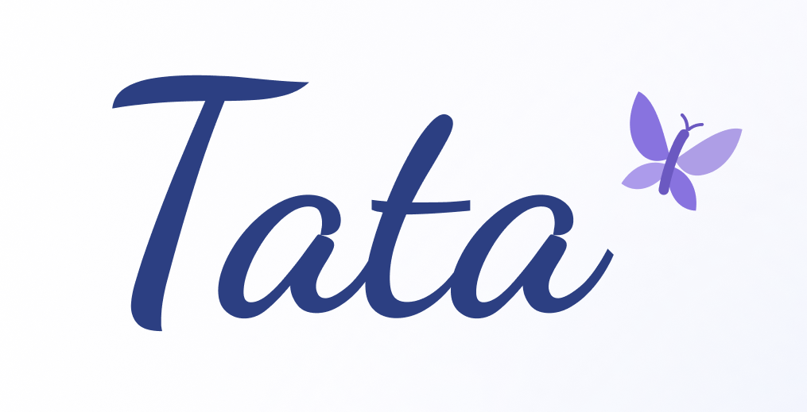 
      <b>Tata (VitaHealth)</b>
    </th>
    <th width="17.5%">
       
      <b>Medisafe</b>
    </th>
    <th width="17.5%">
       
      <b>MyTherapy</b>
    </th>
    <th width="17.5%">
      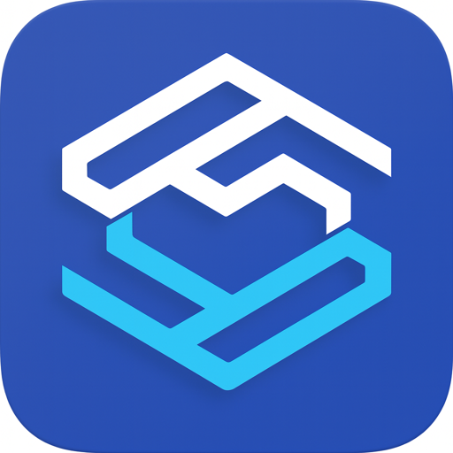 
      <b>Caring Village</b>
    </th>
  </tr>

  <tr>
    <td colspan="2"><b>Overview  Perfil</b></td>
    <td>Aplicación móvil enfocada en la adherencia a medicamentos para adultos mayores con baja alfabetización digital, mediante confirmación por voz o un solo toque, y un panel de monitoreo en tiempo real para la familia.</td>
    <td>Aplicación de recordatorio de medicación con función de alerta al cuidador (Medfriend) ante dosis omitidas.</td>
    <td>Aplicación gratuita de recordatorio de medicación y diario de salud, sin foco específico en cuidadores remotos.</td>
    <td>Plataforma de coordinación del cuidado familiar con múltiples cuidadores, calendario y tareas compartidas.</td>
  </tr>

  <tr>
    <td colspan="2"><b>Ventaja competitiva / ¿Qué valor ofrece a los clientes?</b></td>
    <td>Interfaz ultra simplificada (voz/un toque) diseñada para adultos mayores + anticipación de olvidos mediante detección de patrones.</td>
    <td>Amplia base de usuarios y robusta base de datos sobre interacciones entre medicamentos.</td>
    <td>Gratuita sin límites, enfoque integral en salud (no solo enfocado en medicación).</td>
    <td>Coordinación entre varios cuidadores familiares, no solo un contacto de alerta.</td>
  </tr>

  <tr>
    <td rowspan="2" align="center" style="vertical-align: middle;"><b>Perfil de Marketing</b></td>
    <td><b>Mercado objetivo</b></td>
    <td>Familias limeñas con adultos mayores de 68-85 años que viven solos o con poca compañía.</td>
    <td>Usuarios individuales a nivel global con tratamientos crónicos, con opción de compartir información con un familiar.</td>
    <td>Personas que gestionan su propia medicación y buscan una alternativa gratuita.</td>
    <td>Familias con múltiples cuidadores que coordinan el cuidado integral de un adulto mayor.</td>
  </tr>
  <tr>
    <td><b>Estrategias de marketing</b></td>
    <td>Cercanía local, alianzas estratégicas con clínicas, farmacias y aseguradoras (canal B2B2C).</td>
    <td>Marketing digital masivo y posicionamiento orgánico/pagado en app stores globales.</td>
    <td>Posicionamiento por gratuidad y cumplimiento estricto de privacidad (GDPR).</td>
    <td>Posicionamiento en comunidades de cuidadores familiares (blogs, guías de soporte).</td>
  </tr>

  <tr>
    <td rowspan="3" align="center" style="vertical-align: middle;"><b>Perfil de Producto</b></td>
    <td><b>Productos & Servicios</b></td>
    <td>Aplicación móvil (adulto mayor + familiar) + reconocimiento de voz + detección de patrones de olvido.</td>
    <td>Aplicación móvil de recordatorios + seguimiento de interacciones + reportes de adherencia.</td>
    <td>Aplicación móvil de recordatorios + diario de salud + sincronización con Apple Health / Google Fit.</td>
    <td>Aplicación móvil de coordinación de cuidado + recordatorios básicos + almacenamiento de documentos.</td>
  </tr>
  <tr>
    <td><b>Precios & Costos</b></td>
    <td>Modelo freemium con suscripción mensual para el familiar (plan premium).</td>
    <td>Gratuito (limitado a 2 medicamentos) / Premium a USD 4.99 mensual o USD 39.99 anual.</td>
    <td>Gratis, sin muro de pago.</td>
    <td>Gratis.</td>
  </tr>
  <tr>
    <td><b>Canales de distribución (Web y/o Móvil)</b></td>
    <td>Aplicación móvil nativa (Android/iOS) + Sitio web (Landing Page).</td>
    <td>Aplicación móvil (iOS/Android).</td>
    <td>Aplicación móvil (iOS/Android).</td>
    <td>Aplicación móvil (iOS/Android) + versión web.</td>
  </tr>
  
  <tr>
    <td rowspan="4" align="center" style="vertical-align: middle;"><b>Análisis SWOT</b></td>
    <td><b>Fortalezas</b></td>
    <td>Interfaz diseñada específicamente para baja alfabetización digital (voz/un toque); detección de patrones de olvido como diferenciador único.</td>
    <td>Base de usuarios masiva (+10M) y robustez en el seguimiento de interacciones medicamentosas.</td>
    <td>Gratuidad total sin muro de pago; buen posicionamiento en privacidad de datos (cumplimiento GDPR).</td>
    <td>Coordinación entre múltiples cuidadores familiares, no solo un contacto único de alerta.</td>
  </tr>
  <tr>
    <td><b>Debilidades</b></td>
    <td>Startup nueva sin base de usuarios ni reconocimiento de marca; recursos limitados frente a aplicaciones consolidadas.</td>
    <td>Interfaz no optimizada para adultos mayores con baja alfabetización digital; versión gratuita limitada a 2 medicamentos.</td>
    <td>Monitoreo remoto para el familiar limitado; sin función de anticipación de olvidos.</td>
    <td>Enfoque generalista que diluye la especialización en medicación; no diseñada para uso autónomo del adulto mayor.</td>
  </tr>
  <tr>
    <td><b>Oportunidades</b></td>
    <td>Mercado peruano de salud digital para adultos mayores poco atendido; alianzas B2B2C con clínicas y aseguradoras.</td>
    <td>Expansión a mercados latinoamericanos no explotados.</td>
    <td>Ampliar funciones dirigidas al cuidador a futuro.</td>
    <td>Integrar funciones más específicas de salud y seguimiento clínico.</td>
  </tr>
  <tr>
    <td><b>Amenazas</b></td>
    <td>Aplicaciones globales gratuitas que reducen la disposición a pagar; posible entrada de competidores locales con mayor respaldo.</td>
    <td>Soluciones locales más simples y económicas orientadas específicamente al segmento de adultos mayores.</td>
    <td>Al ser gratuita, presiona a Tata a justificar claramente el valor monetario de su modelo freemium.</td>
    <td>Aplicaciones especializadas como Tata, con foco exclusivo en medicación, pueden captar al segmento que busca esa profundidad.</td>
  </tr>
</table>

### 2.1.2. Estrategias y tácticas frente a competidores

Para posicionar a **Tata** de manera sólida frente a las alternativas del mercado, se establecen estrategias específicas según el perfil de cada competidor, complementadas con una táctica transversal de adquisición local:

* **Frente a Medisafe (Diferenciación por accesibilidad extrema):** Mientras Medisafe se enfoca en el seguimiento clínico avanzado y un alto volumen de usuarios, Tata centrará su propuesta en eliminar barreras de uso. Se aplicará un testeo continuo de la interfaz de confirmación por voz y un solo toque con adultos mayores reales del segmento objetivo, evitando la sobrecarga de funciones que dificulta la adopción autónoma en plataformas complejas.

* **Frente a MyTherapy (Posicionamiento por valor agregado vs. gratuidad):** Ante la ventaja de gratuidad total de MyTherapy, Tata no competirá por precio, sino por el valor diferencial de la detección de patrones de olvido y el panel de monitoreo familiar en tiempo real. Esta propuesta se comunicará claramente en la Landing Page y la app para justificar el modelo *freemium*.

* **Frente a Caring Village (Especialización exclusiva):** Dado que Caring Village se orienta a la coordinación general del cuidado (calendario, tareas y documentos), Tata mantendrá su foco exclusivo en la adherencia a medicamentos. Esta táctica evita la dispersión funcional y atiende de forma directa el problema central identificado en la investigación.

* **Táctica transversal de adquisición (Canal B2B2C local):** Se establecerán alianzas estratégicas con clínicas geriátricas y farmacias en Lima Metropolitana para acelerar la captura de usuarios a través de un canal local que ninguno de los tres competidores internacionales aprovecha actualmente.

## 2.2. Entrevistas

### 2.2.1. Diseño de entrevistas

Para cada segmento objetivo se diseñó una guía de entrevista semiestructurada. Esta se compone de preguntas principales que abordan directamente los objetivos de la investigación y preguntas complementarias que permiten profundizar según las respuestas del entrevistado.

El diseño busca recolectar información de ambos segmentos sobre:
* **Datos demográficos y contexto:** Género, edad, distrito de residencia, estado civil, composición familiar y ocupación.
* **Perfil cualitativo:** Personalidad, habilidades, afinidad por marcas, influencias y dispositivos preferidos.
* **Comportamiento digital:** Canales digitales de interacción y uso de asistentes o comandos de voz.
* **Dominio del problema:** Objetivos, frustraciones y antecedentes o biografía relevante vinculada a la adherencia a la medicación y el cuidado remoto.

---

#### Guía de entrevista - Segmento Adulto Mayor

**Preguntas demográficas y de contexto**  
**1.** ¿Podría contarme un poco sobre usted: su edad, distrito donde vive y con quién vive actualmente?  
**2.** ¿A qué se dedicaba antes de jubilarse, y cómo describiría un día típico suyo actualmente?  

**Preguntas sobre el problema (medicación)**  
**3.** ¿Qué medicamentos toma actualmente y con qué frecuencia?  
**4.** ¿Cómo recuerda usted la hora en que debe tomar cada medicamento?  
**5.** ¿Le ha pasado alguna vez olvidarse de tomar un medicamento? ¿Qué ocurrió después?  
**6.** ¿Alguien de su familia le pregunta o verifica si tomó sus medicamentos? ¿Cómo lo hace (llamada, visita, mensaje)?  

**Preguntas sobre tecnología**  
**7.** ¿Qué tipo de celular usa (básico o smartphone) y qué aplicaciones usa con más frecuencia?  
**8.** ¿Ha usado alguna vez comandos de voz en su celular (como asistentes de voz)? ¿Cómo fue esa experiencia?  
**9.** ¿Qué le resulta difícil o incómodo al usar aplicaciones nuevas en su celular?  

**Preguntas sobre frustraciones y objetivos**  
**10.** ¿Qué es lo que más le preocupa en relación con su salud y su tratamiento médico?  
**11.** ¿Qué le gustaría que fuera más fácil en su día a día respecto al cuidado de su salud?  

---

#### Guía de entrevista - Segmento Familiar

**Preguntas demográficas y de contexto**  
**1.** ¿Podría contarme sobre usted: edad, distrito donde vive, ocupación y composición de su familia?  
**2.** ¿Con qué frecuencia ve o se comunica con su familiar adulto mayor?  

**Preguntas sobre el problema (supervisión remota)**  
**3.** ¿Cómo se entera usted si su familiar tomó su medicación en el horario indicado?  
**4.** ¿Qué hace cuando no está seguro de si la tomó (llama, envía mensaje, pide a alguien que lo visite)?  
**5.** ¿Cuánto tiempo diría que le toma, en promedio, hacer este tipo de seguimiento a la semana?  
**6.** Cuénteme sobre alguna vez en la que se enteró tarde de que su familiar no tomó su medicamento. ¿Qué pasó?  

**Preguntas sobre tecnología**  
**7.** ¿Qué aplicaciones usa habitualmente en su celular (redes sociales, mensajería, salud)?  
**8.** ¿Ha usado alguna aplicación para el cuidado de un familiar? ¿Cuál y qué le pareció?  
**9.** ¿Qué tan cómodo se siente configurando alertas o notificaciones en aplicaciones móviles?  

**Preguntas sobre frustraciones y objetivos**  
**10.** ¿Qué es lo que más le genera ansiedad o preocupación respecto al cuidado de su familiar a distancia?  
**11.** Si pudiera tener una herramienta ideal para este problema, ¿qué es lo primero que le gustaría que le mostrara o le avisara?  

### 2.2.2. Registro de entrevistas

Las entrevistas se realizaron con representantes de los dos segmentos objetivo de Tata. El propósito fue conocer cómo gestionan actualmente la medicación, qué dificultades aparecen durante este proceso y cómo intervienen los familiares cuando el seguimiento se realiza a distancia.

Para cada participante se registraron sus datos principales, una captura de la sesión, la duración de la entrevista y el enlace de acceso. Además, se elaboró un resumen descriptivo con los aspectos más relevantes obtenidos durante la conversación.

#### Segmento 1: Adultos mayores

Este segmento está conformado por adultos mayores que siguen uno o más tratamientos y gestionan directamente sus medicamentos. Las entrevistas buscan conocer sus rutinas actuales, las dificultades que experimentan para recordar o confirmar una toma y su relación con el uso de dispositivos móviles.

<table>
  <tbody>
    <tr>
      <td colspan="4" align="center"><strong>Entrevista N.° 1</strong></td>
    </tr>
    <tr>
      <td colspan="4" align="center">
        
      </td>
    </tr>
    <tr>
      <td colspan="2" align="center"><strong>Información del entrevistado</strong></td>
      <td colspan="2" align="center"><strong>Contexto de la entrevista</strong></td>
    </tr>
    <tr>
      <td><strong>Nombre completo</strong></td>
      <td>Manuel Alberto Torres Huamaní</td>
      <td><strong>Tratamiento o medicación</strong></td>
      <td>Losartán (mañana) y amlodipino (tarde) para hipertensión; celecoxib 200mg ante dolor de columna; atorvastatina para colesterol</td>
    </tr>
    <tr>
      <td><strong>Edad</strong></td>
      <td>64 años</td>
      <td><strong>Gestión actual de las tomas</strong></td>
      <td>Sigue una rutina informal (mañana/tarde) sin recordatorio fijo; frecuentemente no recuerda si ya tomó la dosis</td>
    </tr>
    <tr>
      <td><strong>Distrito</strong></td>
      <td>San Martín de Porres</td>
      <td><strong>Apoyo familiar</strong></td>
      <td>Su único hijo (vive en Los Olivos) lo llama o envía mensajes de forma esporádica para recordarle, sin frecuencia fija</td>
    </tr>
    <tr>
      <td><strong>Ocupación o situación actual</strong></td>
      <td>Jubilado (ex mecánico y conductor); vive solo, es viudo</td>
      <td><strong>Contexto digital</strong></td>
      <td>Smartphone gama media (Honor); usa WhatsApp y Facebook; usa apps de pago de recibos (agua/luz/teléfono) pero evita apps nuevas o complejas; no usa comandos de voz pero los conoce y les tiene buena disposición</td>
    </tr>
    <tr>
      <td colspan="2"><strong>Duración:</strong> Aproximadamente 12 minutos</td>
      <td colspan="2">
        <strong>URL de grabación:</strong>
        <a href="https://upcedupe-my.sharepoint.com/:v:/g/personal/u202415820_upc_edu_pe/IQCWQkzyIJcIRY1bHwUpqqfJAUrFoa-oQ_5i2FY5wuGr_VQ?nav=eyJyZWZlcnJhbEluZm8iOnsicmVmZXJyYWxBcHAiOiJPbmVEcml2ZUZvckJ1c2luZXNzIiwicmVmZXJyYWxBcHBQbGF0Zm9ybSI6IldlYiIsInJlZmVycmFsTW9kZSI6InZpZXciLCJyZWZlcnJhbFZpZXciOiJNeUZpbGVzTGlua0NvcHkifX0&e=Aa1By5">Ver video</a>
      </td>
    </tr>
    <tr>
      <td colspan="4">
        <strong>Resumen de la entrevista</strong>
        
Manuel Alberto Torres Huamaní es un adulto mayor de 64 años, viudo, residente en San Martín de Porres. Vive solo, ya que su único hijo reside en el distrito de Los Olivos y lo visita principalmente los fines de semana, según su disponibilidad laboral. Trabajó la mayor parte de su vida como mecánico y conductor; actualmente no realiza actividad laboral por limitaciones físicas asociadas a la edad, y su rutina diaria se centra en caminatas cortas y permanecer en casa.

        
Es hipertenso y toma losartán en la mañana y amlodipino en la tarde; adicionalmente maneja dolor de columna con celecoxib 200mg ante episodios de dolor, y atorvastatina para el control del colesterol. No cuenta con un método fijo de recordatorio: sigue una rutina informal asociada a los momentos del día, pero reconoce olvidarse con frecuencia de si ya tomó una dosis, dándose cuenta generalmente solo cuando aparecen síntomas físicos (dolor de cabeza asociado al antihipertensivo, mareos asociados a la atorvastatina).

        
El apoyo familiar existente es esporádico: su hijo lo llama o le escribe ocasionalmente para recordarle tomar su medicación, pero sin una frecuencia constante debido a sus propias responsabilidades laborales y familiares. Manuel expresa que, al vivir solo, no existe alguien presente que note si algo sale mal.

        
En cuanto a tecnología, usa un smartphone gama media (Honor) y limita su uso principalmente a WhatsApp y Facebook para comunicarse con familiares y conocidos. Utiliza aplicaciones de pago de servicios (agua, luz, teléfono) por necesidad, pero evita explorar aplicaciones nuevas que perciba como complejas. No ha usado comandos de voz personalmente, pero los conoce por observar a personas más jóvenes de su entorno, y expresa una actitud favorable hacia esta forma de interacción, ya que la percibe como más práctica que escribir.

        
Su principal preocupación de salud es sufrir un evento grave (menciona explícitamente el riesgo de un infarto) por no medicarse correctamente mientras vive solo, sin nadie que lo note a tiempo. Señala además la preocupación de convertirse en una carga para su familia. Como necesidad ideal, describe un mecanismo de aviso simple lo compara con un timbre que no dependa de la disponibilidad de un familiar para recordarle su medicación.

      </td>
    </tr>
  </tbody>
</table>

<table>
  <tbody>
    <tr>
      <td colspan="4" align="center"><strong>Entrevista N.° 2</strong></td>
    </tr>
    <tr>
      <td colspan="4" align="center">
        
      </td>
    </tr>
    <tr>
      <td colspan="2" align="center"><strong>Información del entrevistado</strong></td>
      <td colspan="2" align="center"><strong>Contexto de la entrevista</strong></td>
    </tr>
    <tr>
      <td><strong>Nombre completo</strong></td>
      <td>Rosario Santolalla</td>
      <td><strong>Tratamiento o medicación</strong></td>
      <td>Medicamentos para las crisis de migraña y un medicamento nocturno para poder descansar y dormir.</td>
    </tr>
    <tr>
      <td><strong>Edad</strong></td>
      <td>72 años</td>
      <td><strong>Gestión actual de las tomas</strong></td>
      <td>Tiene en cuenta las pastillas que debe tomar cuando presenta una crisis. En ocasiones ha olvidado el medicamento nocturno.</td>
    </tr>
    <tr>
      <td><strong>Distrito</strong></td>
      <td>Callao</td>
      <td><strong>Apoyo familiar</strong></td>
      <td>Sus hijas conocen sus medicamentos y están pendientes de lo que debe tomar. Se comunican mediante llamadas o de manera presencial</td>
    </tr>
    <tr>
      <td><strong>Ocupación o situación actual</strong></td>
      <td>Jubilada; actualmente se dedica a las labores del hogar</td>
      <td><strong>Contexto digital</strong></td>
      <td>Utiliza principalmente WhatsApp. No tiene experiencia con comandos de voz y algunas aplicaciones nuevas le resultan difíciles cuando no conoce bien cómo funcionan.</td>
    </tr>
    <tr>
      <td colspan="2"><strong>Duración:</strong> 06:35 </td>
      <td colspan="2">
        <strong>URL de grabación:</strong>
        <a href="https://upcedupe-my.sharepoint.com/:v:/g/personal/u20241a195_upc_edu_pe/IQBdCy6U5C1ZSpFyAyOY_7FkAXMOTn4f9aqEPRm3X95WfmI?e=WsgaQA">https://upcedupe-my.sharepoint.com/:v:/g/personal/u20241a195_upc_edu_pe/IQBdCy6U5C1ZSpFyAyOY_7FkAXMOTn4f9aqEPRm3X95WfmI?e=WsgaQA</a>
      </td>
    </tr>
    <tr>
      <td colspan="4">
        <strong>Resumen de la entrevista</strong>
        
Rosario Santolalla Solano (72 años, jubilada, distrito del Callao) vive actualmente con sus hijas. Antes de jubilarse trabajaba como facturadora y actualmente se dedica principalmente a las labores del hogar. Su día a día consiste en realizar sus actividades como ama de casa. En cuanto a su tratamiento, utiliza medicamentos principalmente para controlar sus crisis de migraña y también cuenta con un medicamento que toma por las noches para poder descansar y dormir.
Para recordar sus medicamentos, tiene en cuenta las pastillas que necesita cuando presenta una crisis de migraña. Mencionó que en algunas ocasiones ha olvidado tomar su medicamento nocturno, lo que ocasiona que pase la noche sin poder dormir. Sus hijas conocen los medicamentos que consume y se mantienen al tanto de lo que debe tomar, realizando el seguimiento mediante llamadas o estando pendientes de ella debido a sus necesidades de salud.
En cuanto a su contexto digital, utiliza principalmente WhatsApp. No ha utilizado comandos de voz en su celular y manifestó que algunas aplicaciones nuevas pueden resultarle difíciles cuando no está suficientemente informada sobre cómo funcionan, llegando incluso a cerrarlas o anularlas. Sin embargo, mostró interés en contar con herramientas nuevas que pueda tener a la mano para verificar información y conocer mejor qué debe hacer. Su principal preocupación está relacionada con las crisis de migraña y la necesidad de tener su medicación disponible cuando estas aparecen. Como funcionalidad ideal, le gustaría contar con un programa que le proporcione herramientas e información sobre sus crisis de migraña, de manera que pueda conocer más sobre su condición y tener esta información fácilmente disponible.

      </td>
    </tr>
  </tbody>
</table>

<table>
  <tbody>
    <tr>
      <td colspan="4" align="center"><strong>Entrevista N.° 3</strong></td>
    </tr>
    <tr>
      <td colspan="4" align="center">
        
      </td>
    </tr>
    <tr>
      <td colspan="2" align="center"><strong>Información del entrevistado</strong></td>
      <td colspan="2" align="center"><strong>Contexto de la entrevista</strong></td>
    </tr>
    <tr>
      <td><strong>Nombre completo</strong></td>
      <td>[pendiente]</td>
      <td><strong>Tratamiento o medicación</strong></td>
      <td>[pendiente]</td>
    </tr>
    <tr>
      <td><strong>Edad</strong></td>
      <td>[pendiente]</td>
      <td><strong>Gestión actual de las tomas</strong></td>
      <td>[pendiente]</td>
    </tr>
    <tr>
      <td><strong>Distrito</strong></td>
      <td>[pendiente]</td>
      <td><strong>Apoyo familiar</strong></td>
      <td>[pendiente]</td>
    </tr>
    <tr>
      <td><strong>Ocupación o situación actual</strong></td>
      <td>[pendiente]</td>
      <td><strong>Contexto digital</strong></td>
      <td>[pendiente]</td>
    </tr>
    <tr>
      <td colspan="2"><strong>Duración:</strong> [pendiente]</td>
      <td colspan="2">
        <strong>URL de grabación:</strong>
        <a href="https://example.com/segmento-1-entrevista-3">Ver video</a>
      </td>
    </tr>
    <tr>
      <td colspan="4">
        <strong>Resumen de la entrevista</strong>
        
[pendiente]

      </td>
    </tr>
  </tbody>
</table>

#### Segmento 2: Familiares o cuidadores

Este segmento está conformado por familiares o cuidadores que realizan algún tipo de seguimiento a un adulto mayor, especialmente cuando no pueden acompañarlo presencialmente durante todo el día. Las entrevistas buscan comprender cómo obtienen información sobre la medicación, qué dificultades encuentran y qué situaciones generan mayor preocupación durante el cuidado a distancia.

<table>
  <tbody>
    <tr>
      <td colspan="4" align="center"><strong>Entrevista N.° 1</strong></td>
    </tr>
    <tr>
      <td colspan="4" align="center">
        
      </td>
    </tr>
    <tr>
      <td colspan="2" align="center"><strong>Información del entrevistado</strong></td>
      <td colspan="2" align="center"><strong>Contexto de seguimiento</strong></td>
    </tr>
    <tr>
      <td><strong>Nombre completo</strong></td>
      <td>Valeri Rojas</td>
      <td><strong>Adulto mayor acompañado</strong></td>
      <td>Abuela (enfermedad: diabetes)</td>
    </tr>
    <tr>
      <td><strong>Edad</strong></td>
      <td>22 años</td>
      <td><strong>Frecuencia de contacto</strong></td>
      <td>Diaria (vive en el mismo hogar que su abuela)</td>
    </tr>
    <tr>
      <td><strong>Distrito</strong></td>
      <td>Los Olivos</td>
      <td><strong>Seguimiento actual</strong></td>
      <td>Le pregunta directamente si ya tomó sus medicamentos; si no está en casa, la llama para verificar. Dedica en promedio 10 minutos a la semana a este seguimiento.</td>
    </tr>
    <tr>
      <td><strong>Ocupación</strong></td>
      <td>Estudiante universitaria</td>
      <td><strong>Contexto digital</strong></td>
      <td>Usa habitualmente WhatsApp, Instagram y TikTok. Nunca ha usado una app específica para el cuidado de un familiar; se siente cómoda configurando alertas y notificaciones en apps móviles. Su abuela no usa WhatsApp, solo llamadas.</td>
    </tr>
    <tr>
      <td colspan="2"><strong>Duración:</strong>4:50</td>
      <td colspan="2">
        <strong>URL de grabación:</strong>
        <a href="https://upcedupe-my.sharepoint.com/:v:/g/personal/u202324623_upc_edu_pe/IQAGYnZf_FOeSpr13EuOgvBGAW-DLQJ_IvvwJbMMOnjjoEE?e=2l9JH8&nav=eyJyZWZlcnJhbEluZm8iOnsicmVmZXJyYWxBcHAiOiJTdHJlYW1XZWJBcHAiLCJyZWZlcnJhbFZpZXciOiJTaGFyZURpYWxvZy1MaW5rIiwicmVmZXJyYWxBcHBQbGF0Zm9ybSI6IldlYiIsInJlZmVycmFsTW9kZSI6InZpZXcifX0%3D">Ver video</a>
      </td>
    </tr>
    <tr>
      <td colspan="4">
        <strong>Resumen de la entrevista</strong>
        

          Valeri (22 años, estudiante universitaria, distrito de Los Olivos) vive con sus padres y su abuela, quien tiene diabetes y requiere seguimiento constante de su medicación. Al vivir juntas, la ve y conversa con ella todos los días, y su método actual de seguimiento es preguntarle directamente si ya tomó sus medicamentos o, si no está en casa, llamarla para confirmarlo. Este seguimiento le toma en promedio unos 10 minutos a la semana. Relató un episodio en el que la familia asumió que su abuelita ya había tomado el medicamento y luego se dieron cuenta de que no fue así, lo que generó preocupación y llevó a reforzar las indicaciones del doctor. Su principal fuente de ansiedad es no enterarse a tiempo cuando está fuera de casa y su abuelita olvida tomar la medicación, dado que está relacionada a su condición de diabetes. En cuanto a contexto digital, usa a diario WhatsApp, Instagram y TikTok, nunca ha probado una aplicación de cuidado familiar, y se siente cómoda configurando alertas o notificaciones. Como funcionalidad ideal, mencionó que le gustaría recibir un aviso cuando su abuelita ya tomó sus medicamentos y una alerta si se olvida o se retrasa, señalando que esto sería especialmente útil porque su abuelita no usa WhatsApp, solo llamadas.
        

      </td>
    </tr>
  </tbody>
</table>

<table>
  <tbody>
    <tr>
      <td colspan="4" align="center"><strong>Entrevista N.° 2: Sebastián Vásquez</strong></td>
    </tr>
    <tr>
      <td colspan="4" align="center">
        
      </td>
    </tr>
    <tr>
      <td colspan="2" align="center"><strong>Información del entrevistado</strong></td>
      <td colspan="2" align="center"><strong>Contexto de seguimiento</strong></td>
    </tr>
    <tr>
      <td><strong>Nombre completo</strong></td>
      <td>Sebastián Vásquez</td>
      <td><strong>Adulto mayor acompañado</strong></td>
      <td>Su abuelo</td>
    </tr>
    <tr>
      <td><strong>Edad</strong></td>
      <td>26 años</td>
      <td><strong>Frecuencia de contacto</strong></td>
      <td>Una visita semanal y alrededor de dos llamadas o videollamadas por semana</td>
    </tr>
    <tr>
      <td><strong>Distrito</strong></td>
      <td>Magdalena, Lima</td>
      <td><strong>Seguimiento actual</strong></td>
      <td>Pregunta directamente a su abuelo y normalmente confía en su respuesta</td>
    </tr>
    <tr>
      <td><strong>Ocupación</strong></td>
      <td>Estudiante y supervisor de un pequeño proyecto de software</td>
      <td><strong>Contexto digital</strong></td>
      <td>Utiliza smartphone, WhatsApp, Telegram, banca móvil, Yape, TikTok y llamadas telefónicas</td>
    </tr>
    <tr>
      <td colspan="2"><strong>Duración:</strong> 14:29</td>
      <td colspan="2">
        <strong>URL de grabación:</strong>
        <a href="https://drive.google.com/file/d/1vmsmti_gVNPKoTYMcTZnCLLsb_3lQmc5/view?usp=drive_link">Ver video</a>
      </td>
    </tr>
    <tr>
      <td colspan="4">
        <strong>Resumen de la entrevista</strong>
        
Sebastián tiene 26 años, vive en Magdalena y combina sus estudios con un trabajo que realiza desde casa. Vive solo y se encarga de acompañar a su abuelo debido a que ambos son actualmente los integrantes de su familia que se encuentran en Lima. Su abuelo sufrió una caída aproximadamente dos años atrás y quedó con molestias permanentes en la espalda, por lo que realiza ejercicios de rehabilitación y utiliza medicamentos para el dolor y vitaminas.

        
Intenta visitarlo al menos una vez por semana y también mantiene contacto mediante llamadas o videollamadas, aunque señala que su abuelo presenta poca familiaridad con la tecnología. En relación con los medicamentos, Sebastián no dispone de un mecanismo de seguimiento constante. Normalmente pregunta si realizó la toma y debe confiar en la respuesta que recibe, incluso cuando percibe cierta duda.

        
Durante la entrevista recordó una situación en la que su abuelo afirmó inicialmente haber tomado sus medicamentos, pero después de varias preguntas reconoció que no lo había hecho. Aunque no ocurrió una consecuencia inmediata, la situación generó preocupación dentro de la familia. Sebastián considera conveniente recibir información que reduzca esta incertidumbre y evite depender de consultas constantes para conocer si una toma fue realizada.

        
Su preocupación por el cuidado a distancia también incluye la posibilidad de que su abuelo vuelva a sufrir un accidente cuando se encuentra solo. Al referirse a una herramienta ideal, mencionó que le resultaría útil conocer algunas actividades básicas del adulto mayor y disponer de un mecanismo sencillo de solicitud de ayuda ante una emergencia.

      </td>
    </tr>
  </tbody>
</table>

<table>
  <tbody>
    <tr>
      <td colspan="4" align="center"><strong>Entrevista N.° 3</strong></td>
    </tr>
    <tr>
      <td colspan="4" align="center">
        
      </td>
    </tr>
    <tr>
      <td colspan="2" align="center"><strong>Información del entrevistado</strong></td>
      <td colspan="2" align="center"><strong>Contexto de seguimiento</strong></td>
    </tr>
    <tr>
      <td><strong>Nombre completo</strong></td>
      <td>Marvi Alarcón</td>
      <td><strong>Adulto mayor acompañado</strong></td>
      <td>Su abuela</td>
    </tr>
    <tr>
      <td><strong>Edad</strong></td>
      <td>20 años</td>
      <td><strong>Frecuencia de contacto</strong></td>
      <td>Aproximadamente 2 o 3 veces por mes en persona; cuando no puede visitarla se comunica por llamada o mensaje.</td>
    </tr>
    <tr>
      <td><strong>Distrito</strong></td>
      <td>Comas</td>
      <td><strong>Seguimiento actual</strong></td>
      <td>Le pregunta directamente por llamada o mensaje y trata de recordarle los horarios de medicación. Si no contesta o quedan dudas, contacta a otro familiar cercano para verificar. Dedica en promedio entre 1 y 2 horas a la semana a este seguimiento.</td>
    </tr>
    <tr>
      <td><strong>Ocupación</strong></td>
      <td>Estudiante de Psicología</td>
      <td><strong>Contexto digital</strong></td>
      <td>Usa habitualmente WhatsApp y llamadas para comunicarse con su familia, además de Instagram y YouTube. Nunca ha usado una app específica para el cuidado de un familiar; se siente cómoda configurando alarmas, recordatorios y notificaciones.</td>
    </tr>
    <tr>
      <td colspan="2"><strong>Duración:</strong> 05:00</td>
      <td colspan="2">
        <strong>URL de grabación:</strong>
        <a href="https://upcedupe-my.sharepoint.com/:v:/g/personal/u202324623_upc_edu_pe/IQDpr5ILeBtnSK32ysEfc-RAASL3mfonRwH_TXRCBz-wZF8?e=IYbQDm&nav=eyJyZWZlcnJhbEluZm8iOnsicmVmZXJyYWxBcHAiOiJTdHJlYW1XZWJBcHAiLCJyZWZlcnJhbFZpZXciOiJTaGFyZURpYWxvZy1MaW5rIiwicmVmZXJyYWxBcHBQbGF0Zm9ybSI6IldlYiIsInJlZmVycmFsTW9kZSI6InZpZXcifX0%3D">Ver video</a>
      </td>
    </tr>
    <tr>
      <td colspan="4">
        <strong>Resumen de la entrevista</strong>
        

          Marvi (20 años, estudiante de Psicología, distrito de Comas) vive con sus padres y su hermano, mientras que su abuela vive en otro lugar. La visita aproximadamente 2 o 3 veces al mes y, cuando no puede hacerlo en persona, se comunica por llamada o mensaje. Su método actual de seguimiento es preguntarle directamente si tomó su medicación y recordarle los horarios; cuando no está segura o su abuela no contesta, contacta a otro familiar cercano para que verifique. Este seguimiento le toma entre 1 y 2 horas a la semana, dependiendo de cuántos medicamentos debe tomar su abuela. Relató un episodio en el que su abuela olvidó una dosis por estar realizando otras actividades, y ella se enteró varias horas después, lo que le generó preocupación al no saber cuánto tiempo había pasado, y tuvo que comunicarse con otro familiar para decidir qué hacer. En cuanto a contexto digital, usa WhatsApp y llamadas para hablar con su familia, además de Instagram y YouTube para otros fines; nunca ha usado una aplicación de cuidado familiar, pero se siente cómoda configurando alarmas, recordatorios y notificaciones, y preferiría una app de cuidado dedicada que sea sencilla y sin demasiadas opciones. Su principal fuente de ansiedad es no saber si su abuela tomó correctamente sus medicamentos o si le ocurrió algo, ya que al estar lejos siente que no siempre puede reaccionar rápidamente. Como funcionalidad ideal, mencionó que le gustaría que la app le avise si su familiar tomó o no el medicamento en el horario establecido, y que le llegue una alerta cuando se olvide de tomarlo, para poder saber rápidamente si todo está bien.
        

      </td>
    </tr>
  </tbody>
</table>

<table>
  <tbody>
    <tr>
      <td colspan="4" align="center"><strong>Entrevista N.° 4</strong></td>
    </tr>
    <tr>
      <td colspan="4" align="center">
        
      </td>
    </tr>
    <tr>
      <td colspan="2" align="center"><strong>Información del entrevistado</strong></td>
      <td colspan="2" align="center"><strong>Contexto de seguimiento</strong></td>
    </tr>
    <tr>
      <td><strong>Nombre completo</strong></td>
      <td>Leonardo López</td>
      <td><strong>Adulto mayor acompañado</strong></td>
      <td>Su abuela</td>
    </tr>
    <tr>
      <td><strong>Edad</strong></td>
      <td>23 años</td>
      <td><strong>Frecuencia de contacto</strong></td>
      <td>Frecuente, principalmente cuando está en casa.</td>
    </tr>
    <tr>
      <td><strong>Distrito</strong></td>
      <td>Callao</td>
      <td><strong>Seguimiento actual</strong></td>
      <td>Pregunta directamente si su familiar tomó la medicación y le recuerda durante la tarde</td>
    </tr>
    <tr>
      <td><strong>Ocupación</strong></td>
      <td>Estudiante de Ingenieria de Sistemas</td>
      <td><strong>Contexto digital</strong></td>
      <td>Usa WhatsApp, Instagram, Facebook y YouTube. Se siente cómodo configurando alertas y notificaciones.</td>
    </tr>
    <tr>
      <td colspan="2"><strong>Duración:</strong> 03:47 </td>
      <td colspan="2">
        <strong>URL de grabación:</strong>
        <a href="https://upcedupe-my.sharepoint.com/:v:/g/personal/u20241a195_upc_edu_pe/IQCTICYc0qcaTJq-wuA0bfsPARkNXpr37NWUhfkv5UahKdA?nav=eyJyZWZlcnJhbEluZm8iOnsicmVmZXJyYWxBcHAiOiJTdHJlYW1XZWJBcHAiLCJyZWZlcnJhbFZpZXciOiJTaGFyZURpYWxvZy1MaW5rIiwicmVmZXJyYWxBcHBQbGF0Zm9ybSI6IldlYiIsInJlZmVycmFsTW9kZSI6InZpZXcifX0%3D&e=srf1cK">https://upcedupe-my.sharepoint.com/:v:/g/personal/u20241a195_upc_edu_pe/IQCTICYc0qcaTJq-wuA0bfsPARkNXpr37NWUhfkv5UahKdA?nav=eyJyZWZlcnJhbEluZm8iOnsicmVmZXJyYWxBcHAiOiJTdHJlYW1XZWJBcHAiLCJyZWZlcnJhbFZpZXciOiJTaGFyZURpYWxvZy1MaW5rIiwicmVmZXJyYWxBcHBQbGF0Zm9ybSI6IldlYiIsInJlZmVycmFsTW9kZSI6InZpZXcifX0%3D&e=srf1cK</a>
      </td>
    </tr>
    <tr>
      <td colspan="4">
        <strong>Resumen de la entrevista</strong>
        
 Leonardo López (23 años, estudiante, reside en el Callao) vive con su abuela, su mamá y su papá. Mantiene una comunicación frecuente con su familiar adulto mayor, principalmente cuando se encuentra en casa. Su método actual de seguimiento consiste en preguntarle directamente a su abuela si tomó sus medicamentos y recordarle durante la tarde que debe tomarlos. Este seguimiento le toma aproximadamente 10 minutos al día, dependiendo de si su familiar ha tomado o no sus medicamentos.
Relató que en varias ocasiones su abuela olvidó tomar sus pastillas, especialmente durante la noche mientras estaban comiendo, y se enteraron del olvido después de la comida, momento en el que su abuela terminó tomando la medicación. Debido a estas situaciones, actualmente consideran necesario recordarle cada cierto tiempo durante la tarde. En cuanto a su contexto digital, utiliza principalmente WhatsApp, Instagram, Facebook y YouTube. Nunca ha utilizado una aplicación específica para el cuidado de un familiar, pero se siente cómodo configurando alertas y notificaciones en aplicaciones móviles.
Su principal preocupación respecto al cuidado de su familiar es que no siga una buena alimentación, que olvide tomar sus medicamentos o que no se cuide adecuadamente en general. Como funcionalidad ideal, le gustaría contar con una herramienta que permita saber de alguna manera cuándo su familiar ha tomado sus pastillas y que pueda notificarle esta información, brindándole mayor seguridad sobre el cumplimiento de la medicación.
        

      </td>
    </tr>
  </tbody>
</table>

### 2.2.3. Análisis de entrevistas

El análisis de las entrevistas se organizó por segmento objetivo. Primero se identificaron los principales hallazgos obtenidos de cada participante y luego se contrastaron sus respuestas para reconocer características comunes.

Las características fueron clasificadas como objetivas o subjetivas y su recurrencia será expresada mediante frecuencias y porcentajes. Estos resultados servirán como base para la definición y ajuste de los User Persona de Tata.

#### Segmento 1: Adultos mayores

##### Hallazgos por entrevista

<table>
  <thead>
    <tr>
      <th>Entrevista</th>
      <th>Características objetivas</th>
      <th>Características subjetivas</th>
      <th>Hallazgo principal</th>
    </tr>
  </thead>
  <tbody>
    <tr>
      <td>Entrevista N.° 1</td>
      <td>[pendiente]</td>
      <td>[pendiente]</td>
      <td>[pendiente]</td>
    </tr>
    <tr>
      <td>Entrevista N.° 2</td>
      <td>Tiene 72 años, es jubilada y vive en el Callao con sus hijas. Utiliza medicamentos para las crisis de migraña y uno de ellos lo toma por las noches para poder dormir. Usa principalmente WhatsApp y recibe apoyo de sus hijas para el seguimiento de su medicación.</td>
      <td>Le preocupa principalmente cuando presenta una crisis de migraña. Considera que algunas aplicaciones nuevas son difíciles de utilizar cuando no conoce su funcionamiento. Le gustaría tener herramientas accesibles e información disponible sobre su tratamiento y las crisis de migraña.</td>
      <td>Necesita una herramienta sencilla y fácil de consultar que le permita acceder a información sobre sus crisis de migraña y recordar o verificar las indicaciones de su medicación.</td>
    </tr>
    <tr>
      <td>Entrevista N.° 3</td>
      <td>[pendiente]</td>
      <td>[pendiente]</td>
      <td>[pendiente]</td>
    </tr>
  </tbody>
</table>

##### Características representativas del segmento

<table>
  <thead>
    <tr>
      <th>Tipo</th>
      <th>Característica</th>
      <th>Evidencia</th>
      <th>Frecuencia</th>
      <th>Porcentaje</th>
    </tr>
  </thead>
  <tbody>
    <tr>
      <td>Objetiva</td>
      <td>[pendiente]</td>
      <td>Entrevistas [pendiente]</td>
      <td>[pendiente]</td>
      <td>[pendiente]</td>
    </tr>
    <tr>
      <td>Objetiva</td>
      <td>[pendiente]</td>
      <td>Entrevistas [pendiente]</td>
      <td>[pendiente]</td>
      <td>[pendiente]</td>
    </tr>
    <tr>
      <td>Subjetiva</td>
      <td>[pendiente]</td>
      <td>Entrevistas [pendiente]</td>
      <td>[pendiente]</td>
      <td>[pendiente]</td>
    </tr>
    <tr>
      <td>Subjetiva</td>
      <td>[pendiente]</td>
      <td>Entrevistas [pendiente]</td>
      <td>[pendiente]</td>
      <td>[pendiente]</td>
    </tr>
  </tbody>
</table>

##### Conclusión del segmento 1

[pendiente]

#### Segmento 2: Familiares o cuidadores

##### Hallazgos por entrevista

<table>
  <thead>
    <tr>
      <th>Entrevista</th>
      <th>Características objetivas</th>
      <th>Características subjetivas</th>
      <th>Hallazgo principal</th>
    </tr>
  </thead>
  <tbody>
    <tr>
      <td>Entrevista N.° 1: Valeri Rojas</td>
      <td>22 años, vive en Los Olivos con sus padres y su abuela (con diabetes), estudiante universitaria. Vive en el mismo hogar que su abuela y la ve/conversa con ella todos los días.</td>
      <td>Considera que preguntar directamente no siempre es suficiente: hubo una ocasión en que la familia asumió que su abuela ya había tomado el medicamento y luego se dieron cuenta de que no fue así. Valora recibir un aviso automático de la toma y una alerta ante olvidos o retrasos, sobre todo porque su abuela no usa WhatsApp, solo llamadas.</td>
      <td>Incluso viviendo bajo el mismo techo, el seguimiento depende de la memoria y honestidad de las respuestas del adulto mayor, lo que puede generar falsas certezas sobre si la medicación fue tomada.</td>
    </tr>
    <tr>
      <td>Entrevista N.° 2: Sebastián Vásquez</td>
      <td>26 años, vive en Magdalena, estudia y trabaja desde casa. Acompaña a su abuelo y mantiene contacto mediante visitas, llamadas y videollamadas.</td>
      <td>Considera poco confiable depender únicamente de la respuesta de su abuelo para comprobar una toma. Valora recibir información sin realizar verificaciones constantes.</td>
      <td>El seguimiento a distancia genera incertidumbre porque no existe un mecanismo confiable para conocer si la medicación fue cumplida.</td>
    </tr>
    <tr>
      <td>Entrevista N.° 3: Marvi Alarcón</td>
      <td>20 años, vive en Comas con sus padres y hermano, estudiante de Psicología. Acompaña a su abuela, a quien visita 2 o 3 veces al mes y contacta por llamada o mensaje el resto del tiempo.</td>
      <td>Le genera ansiedad no saber si su abuela tomó correctamente sus medicamentos o si le ocurrió algo, sintiendo que al estar lejos no siempre puede reaccionar rápido. Cuando tiene dudas, recurre a otro familiar cercano para verificar. Preferiría una app de cuidado dedicada, simple y sin demasiadas opciones.</td>
      <td>La distancia física alarga el tiempo de reacción ante un posible olvido y obliga a depender de terceros para confirmar la toma, generando incertidumbre prolongada.</td>
    </tr>
<tr>
      <td>Entrevista N.° 4: Leonardo López</td>
      <td>Tiene 23 años y vive con su abuela, mamá y papá. Mantiene contacto frecuente con su familiar adulto mayor. Actualmente realiza el seguimiento preguntándole si tomó sus medicamentos y recordándole los horarios. Utiliza WhatsApp, Instagram, Facebook y YouTube.</td>
      <td>Le preocupa que su abuela no siga una buena alimentación, olvide tomar sus medicamentos o no se cuide adecuadamente. Considera importante poder saber con certeza si tomó sus pastillas y se siente cómodo configurando alertas y notificaciones.</td>
      <td>Necesita una herramienta que permita confirmar si su familiar tomó su medicación y enviarle una notificación, reduciendo la incertidumbre y facilitando el seguimiento a distancia.</td>
    </tr>
  </tbody>
</table>

##### Características representativas del segmento

<table>
  <thead>
    <tr>
      <th>Tipo</th>
      <th>Característica</th>
      <th>Evidencia</th>
      <th>Frecuencia</th>
      <th>Porcentaje</th>
    </tr>
  </thead>
  <tbody>
    <tr>
      <td>Objetiva</td>
      <td>El seguimiento se realiza mediante visitas y comunicación remota</td>
      <td>Entrevista N.° 2</td>
      <td>[pendiente]</td>
      <td>[pendiente]</td>
    </tr>
    <tr>
      <td>Objetiva</td>
      <td>El familiar utiliza habitualmente aplicaciones móviles</td>
      <td>Entrevista N.° 2</td>
      <td>[pendiente]</td>
      <td>[pendiente]</td>
    </tr>
    <tr>
      <td>Subjetiva</td>
      <td>Existe incertidumbre sobre el cumplimiento de la medicación</td>
      <td>Entrevista N.° 2</td>
      <td>[pendiente]</td>
      <td>[pendiente]</td>
    </tr>
    <tr>
      <td>Subjetiva</td>
      <td>Se valora recibir información sin realizar verificaciones constantes</td>
      <td>Entrevista N.° 2</td>
      <td>[pendiente]</td>
      <td>[pendiente]</td>
    </tr>
    <tr>
      <td>Subjetiva</td>
      <td>Existe preocupación por el cuidado del adulto mayor cuando se encuentra solo</td>
      <td>Entrevista N.° 2</td>
      <td>[pendiente]</td>
      <td>[pendiente]</td>
    </tr>
  </tbody>
</table>

##### Conclusión del segmento 2

[pendiente]

## 2.3. Needfinding

A partir de la información recolectada en el proceso de entrevistas y del análisis competitivo desarrollado previamente, el equipo procedera a realizar el Needfinding, con el objetivo de construir una comprensión profunda y estructurada de los dos segmentos objetivo de Tata. Esta sección incluye la elaboración de los User Personas que representan a cada segmento, el User Task Matrix que consolida las tareas relevantes que estos realizan, los User Journey Maps en su versión As-Is, los Empathy Maps por cada arquetipo, el Big Picture EventStorming del dominio del negocio, y el glosario de Ubiquitous Language que unifica el vocabulario del equipo en torno al dominio del problema.

### 2.3.1. User Personas

**Segmento 1: Adultos mayores**

  

**Segmento 2: Familiares o cuidadores de adultos mayores**

  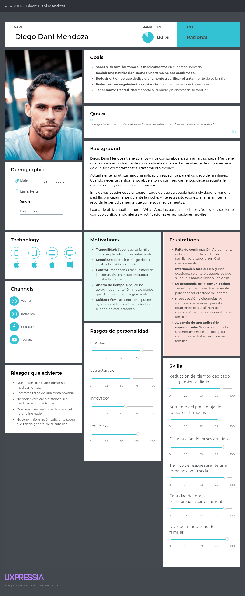

### 2.3.2. User Task Matrix

#### Segmento 1: Adultos mayores

 <table> <thead> <tr> <th>Tarea</th> <th>Frecuencia</th> <th>Importancia</th> </tr> </thead> <tbody> <tr> <td>Recordar los medicamentos que debe tomar</td> <td>Often</td> <td>High</td> </tr> <tr> <td>Identificar cuándo debe tomar un medicamento</td> <td>Often</td> <td>High</td> </tr> <tr> <td>Tener sus medicamentos disponibles cuando los necesita</td> <td>Often</td> <td>High</td> </tr> <tr> <td>Tomar sus medicamentos durante una crisis de salud</td> <td>Sometimes</td> <td>High</td> </tr> <tr> <td>Tomar el medicamento indicado antes de dormir</td> <td>Often</td> <td>High</td> </tr> <tr> <td>Recordar si ya realizó una toma</td> <td>Sometimes</td> <td>High</td> </tr> <tr> <td>Consultar a sus familiares sobre aspectos relacionados con sus medicamentos</td> <td>Sometimes</td> <td>Medium</td> </tr> <tr> <td>Informar a sus familiares sobre su estado de salud</td> <td>Sometimes</td> <td>Medium</td> </tr> <tr> <td>Buscar información sobre sus problemas de salud</td> <td>Sometimes</td> <td>Medium</td> </tr> <tr> <td>Aprender a utilizar nuevas herramientas para el cuidado de su salud</td> <td>Rarely</td> <td>Medium</td> </tr> </tbody> </table> 

#### Segmento 2: Familiares o cuidadores de adultos mayores

 <table> <thead> <tr> <th>Tarea</th> <th>Frecuencia</th> <th>Importancia</th> </tr> </thead> <tbody> <tr> <td>Comunicarse con el adulto mayor para conocer su estado de salud</td> <td>Often</td> <td>High</td> </tr> <tr> <td>Preguntar al adulto mayor si tomó sus medicamentos</td> <td>Often</td> <td>High</td> </tr> <tr> <td>Recordar al adulto mayor que debe tomar sus medicamentos</td> <td>Often</td> <td>High</td> </tr> <tr> <td>Verificar que el adulto mayor haya tomado sus medicamentos</td> <td>Often</td> <td>High</td> </tr> <tr> <td>Realizar seguimiento del tratamiento del adulto mayor</td> <td>Often</td> <td>High</td> </tr> <tr> <td>Detectar cuando el adulto mayor olvida una toma</td> <td>Sometimes</td> <td>High</td> </tr> <tr> <td>Recordar periódicamente los horarios de medicación</td> <td>Often</td> <td>High</td> </tr> <tr> <td>Consultar directamente al adulto mayor cuando existe duda sobre una toma</td> <td>Sometimes</td> <td>Medium</td> </tr> <tr> <td>Dedicar tiempo diario al seguimiento de la medicación</td> <td>Often</td> <td>Medium</td> </tr> <tr> <td>Preocuparse por el cuidado general del adulto mayor cuando no está presente</td> <td>Often</td> <td>High</td> </tr> </tbody> </table> 

#### Análisis del User Task Matrix

Las tareas con mayor frecuencia e importancia para el segmento de adultos mayores están relacionadas con recordar y realizar correctamente sus tomas de medicamentos. Destacan recordar los medicamentos que debe tomar, identificar cuándo debe tomarlos, tenerlos disponibles y realizar las tomas correspondientes, principalmente calificadas como Often y High. La entrevista evidencia que el cumplimiento de la medicación puede estar relacionado con su bienestar, especialmente en situaciones como las crisis de migraña o la toma de medicamentos durante la noche. Asimismo, existe una necesidad de contar con herramientas sencillas que puedan ser comprendidas y utilizadas sin generar dificultades.

Para el segmento de familiares o cuidadores, las tareas de mayor frecuencia e importancia son preguntar si el adulto mayor tomó sus medicamentos, recordarle que debe tomarlos, verificar que la toma se haya realizado y realizar seguimiento del tratamiento. Estas tareas muestran que actualmente el familiar depende principalmente de la comunicación directa con el adulto mayor para conocer si cumplió con su medicación. Además, el entrevistado indicó que dedica aproximadamente 10 minutos diarios a realizar este tipo de seguimiento.

Una de las principales coincidencias entre ambos segmentos es que ambos participan en el cumplimiento y seguimiento de la medicación. El adulto mayor realiza las acciones relacionadas directamente con sus medicamentos, mientras que el familiar participa mediante recordatorios, preguntas y verificación. Por ello, una misma situación puede generar una tarea para ambos usuarios: mientras el adulto mayor necesita recordar y realizar una toma, el familiar necesita comprobar que esta se haya realizado.

La principal diferencia se encuentra en el rol que desempeña cada segmento dentro del proceso. El adulto mayor es quien ejecuta directamente la toma y necesita una forma sencilla de recordar sus medicamentos y horarios. En cambio, el familiar o cuidador cumple un rol de supervisión, dedicando tiempo a comunicarse con el adulto mayor y verificar que el tratamiento se esté siguiendo correctamente.

Finalmente, las tareas identificadas muestran que existe una necesidad de reducir la dependencia de la comunicación verbal para comprobar las tomas. Mientras que actualmente el familiar debe preguntar directamente al adulto mayor y confiar en su respuesta, el adulto mayor necesita una manera sencilla de indicar que ya realizó su toma. Esta relación entre ambos segmentos es fundamental para TATA, ya que permite plantear una solución que facilite el cumplimiento del tratamiento para el adulto mayor y, al mismo tiempo, reduzca la incertidumbre del familiar.

### 2.3.3. User Journey Mapping

#### Segmento 1: Adultos mayores

#### Segmento 2: Familiares o cuidadores de adultos mayores

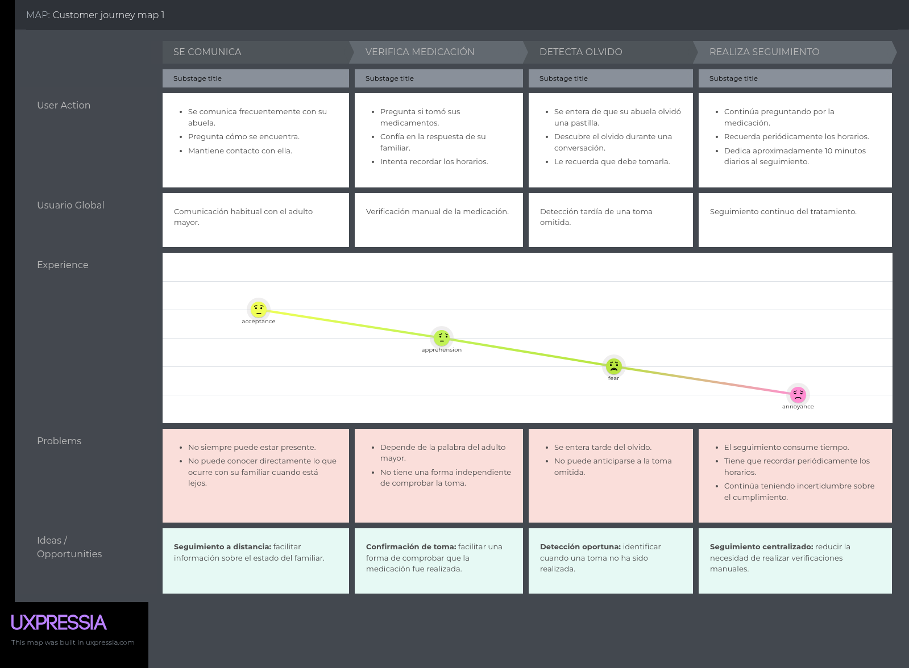

### 2.3.4. Empathy Mapping

#### Segmento 1: Adultos mayores

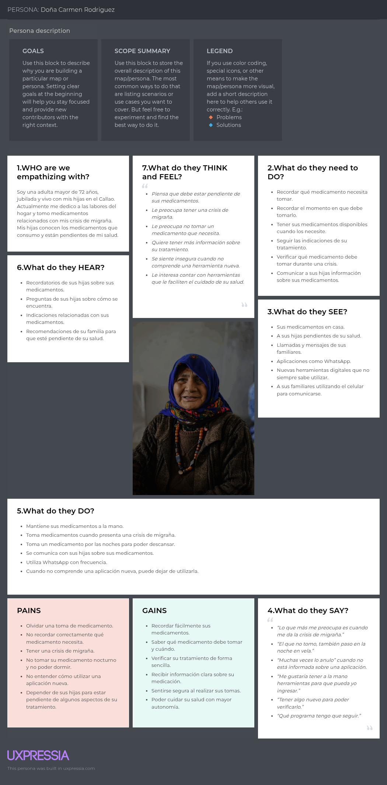

#### Segmento 2: Familiares o cuidadores de adultos mayores

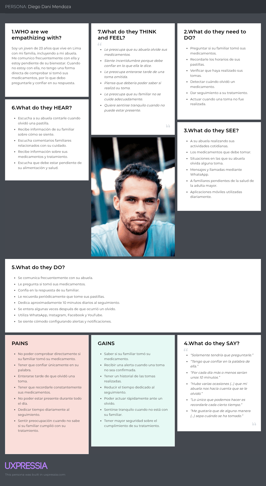

### 2.3.5. Big Picture EventStorming

El Big Picture EventStorming permitió representar de forma general cómo se desarrolla el dominio de Tata, desde el registro y la vinculación de los usuarios hasta el seguimiento de las tomas, la generación de alertas y el análisis de la adherencia. El modelo se construyó principalmente a partir de eventos de dominio expresados como hechos ya ocurridos y organizados según su secuencia dentro del negocio.

Para facilitar su lectura, el dominio se dividió en cuatro grupos principales: **Cuenta y cuidado**, **Tratamiento y toma**, **Omisión, seguimiento y analítica**, y **Continuidad y accesibilidad**. Los eventos principales se representaron mediante notas naranjas, mientras que las barras verticales identifican eventos pivote que marcan cambios relevantes dentro del flujo. También se incorporaron puntos problemáticos para mantener visibles situaciones que requieren mayor análisis o validación durante el desarrollo del proyecto.

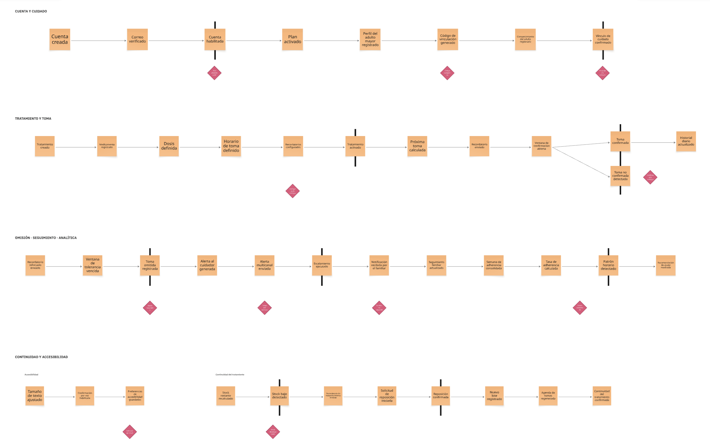

*Figura. Big Picture EventStorming de Tata.*

#### Cuenta y cuidado

Este flujo representa la incorporación inicial de los usuarios al ecosistema de Tata y el establecimiento de la relación de cuidado. Comienza con la creación y verificación de la cuenta del familiar o cuidador, continúa con su habilitación y la activación del plan correspondiente.

Posteriormente, se registra el perfil del adulto mayor y se genera el mecanismo de vinculación entre ambas partes. El flujo culmina cuando se registra el consentimiento y se confirma el vínculo de cuidado. Este último evento resulta importante porque permite continuar con la configuración y seguimiento del tratamiento asociado al adulto mayor.

Los eventos pivote permiten distinguir momentos relevantes dentro del proceso, como la habilitación de la cuenta y la confirmación del vínculo. Asimismo, los puntos problemáticos asociados permiten mantener visibles aspectos que todavía pueden requerir validación, como la seguridad del proceso de vinculación y el consentimiento del adulto mayor.

*Figura. Flujo de cuenta y cuidado.*

#### Tratamiento y toma

Este grupo describe el flujo principal relacionado con la configuración del tratamiento y la ejecución cotidiana de una toma. Inicialmente se registra el tratamiento, el medicamento, la dosis, el horario y los recordatorios necesarios. Cuando la configuración se encuentra completa, el tratamiento pasa a un estado activo y Tata puede calcular las próximas tomas programadas.

Al acercarse el horario establecido, se envía el recordatorio y se abre una ventana para que el adulto mayor registre la confirmación. A partir de este punto aparecen dos resultados principales. Si la toma es confirmada, se registra el evento correspondiente y se actualiza el historial diario. Si no existe confirmación dentro del periodo esperado, el flujo continúa hacia el proceso de gestión de omisiones.

La separación entre **Tratamiento activado** y los eventos correspondientes a una toma concreta permite distinguir la configuración general del tratamiento de su ejecución diaria. De igual forma, la bifurcación entre una toma confirmada y una toma no confirmada representa uno de los principales cambios de comportamiento dentro del dominio.

*Figura. Flujo de tratamiento y toma.*

#### Omisión, seguimiento y analítica

Este flujo representa lo que ocurre cuando una toma permanece sin confirmación y requiere atención adicional. Tata puede emitir un recordatorio reforzado y mantener abierta una ventana de tolerancia. Si el periodo definido finaliza sin una confirmación, la toma se registra como omitida y se genera una alerta dirigida al familiar o cuidador.

La alerta puede continuar mediante los canales configurados y, cuando corresponde, iniciar un proceso de escalamiento. Posteriormente, el familiar recibe información sobre la situación y puede realizar el seguimiento correspondiente. De esta forma, Tata no se limita a recordar una toma, sino que también permite informar al responsable del cuidado cuando se produce una situación relevante.

Los registros generados durante las tomas también alimentan el análisis de adherencia. Con el historial acumulado se pueden consolidar periodos de seguimiento, calcular indicadores e identificar patrones recurrentes, como horarios en los que aparecen retrasos u omisiones con mayor frecuencia. A partir de estos resultados, Tata puede mostrar recomendaciones orientadas a mejorar la continuidad del tratamiento.

*Figura. Flujo de omisión, seguimiento y analítica.*

#### Continuidad y accesibilidad

Este último grupo reúne dos capacidades complementarias del dominio: la accesibilidad de la experiencia y la continuidad del tratamiento.

En cuanto a la accesibilidad, el usuario puede adaptar determinados aspectos de interacción de acuerdo con sus necesidades. Entre los eventos considerados se encuentran el ajuste del tamaño del texto, la habilitación de la confirmación por voz y el almacenamiento de las preferencias de accesibilidad. Estas configuraciones buscan reducir las barreras de interacción para adultos mayores con distintos niveles de familiaridad con dispositivos móviles.

Por otro lado, el flujo de continuidad considera el seguimiento de la disponibilidad de medicamentos. Tata puede recalcular el stock restante y detectar cuándo la cantidad disponible comienza a ser insuficiente. A partir de ello se puede emitir un recordatorio de reabastecimiento e iniciar el registro de la reposición. Una vez confirmada y registrado el nuevo lote, la agenda de tomas puede actualizarse para mantener la continuidad del tratamiento.

Aunque ambos flujos responden a necesidades diferentes, se incluyen dentro de esta vista general porque complementan el objetivo principal de Tata: facilitar una gestión de la medicación que pueda mantenerse en el tiempo y que resulte accesible para el adulto mayor.

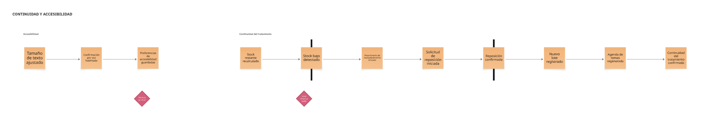

*Figura. Flujos de continuidad y accesibilidad.*

En conjunto, el Big Picture EventStorming permitió identificar una secuencia global que parte de la incorporación y vinculación de los usuarios, continúa con la configuración y ejecución del tratamiento y se extiende hacia el manejo de omisiones, el seguimiento familiar, el análisis de la adherencia y la continuidad del tratamiento. Esta vista general sirve como base para profundizar posteriormente en los procesos del dominio mediante el EventStorming desarrollado en la sección de Strategic-Level Domain-Driven Design.

Enlace a la versión del Big Picture EventStorming: [https://miro.com/app/board/uXjVHq5Jc9w=/](https://miro.com/app/board/uXjVHq5Jc9w=/)

#### 2.3.6. Ubiquitous Language

El Ubiquitous Language se definió a partir de los conceptos identificados durante el análisis del dominio y el desarrollo del EventStorming. Su propósito es establecer un vocabulario común entre los integrantes del equipo y reducir interpretaciones diferentes sobre los elementos que forman parte de Tata. Los términos se redactan en inglés, incluyendo su equivalente en español entre paréntesis, mientras que la definición correspondiente se mantiene en español.

Debido a que un mismo término puede adquirir un significado particular según el contexto en el que se utiliza, el vocabulario se organizó de acuerdo con los Bounded Contexts identificados. Esto permite mantener definiciones precisas dentro de cada parte del dominio y facilita la posterior especificación de reglas, eventos y relaciones.

##### Identidad y suscripción

| Término | Definición |
| --- | --- |
| Account (Cuenta) | Registro de acceso de un usuario en Tata. |
| User (Usuario) | Persona autenticada que utiliza la aplicación. |
| Account status (Estado de cuenta) | Condición que indica si la cuenta se encuentra habilitada. |
| Plan (Plan) | Conjunto de funcionalidades asociado a una modalidad de uso. |
| Subscription (Suscripción) | Relación vigente entre una cuenta y un plan. |
| Consent (Consentimiento) | Autorización registrada para el uso de datos y funcionalidades relacionadas con el cuidado. |
| Verified email (Correo verificado) | Correo cuya propiedad fue confirmada por el usuario. |

##### Vínculo de cuidado

| Término | Definición |
| --- | --- |
| Older adult (Adulto mayor) | Persona cuyo tratamiento es acompañado mediante Tata. |
| Family member (Familiar) | Persona cercana que consulta y acompaña el seguimiento del adulto mayor. |
| Caregiver (Cuidador) | Usuario autorizado para supervisar información relacionada con el adulto mayor. |
| Care link (Vínculo de cuidado) | Relación autorizada entre un cuidador y un adulto mayor. |
| Linking code (Código de vinculación) | Código temporal utilizado para iniciar la asociación entre usuarios. |
| Consent (Consentimiento) | Aceptación del adulto mayor para establecer la relación de cuidado. |
| Emergency contact (Contacto de emergencia) | Información de contacto disponible para situaciones que requieren mayor atención. |

##### Gestión del tratamiento

| Término | Definición |
| --- | --- |
| Treatment (Tratamiento) | Conjunto de reglas que define cómo debe administrarse un medicamento. |
| Medication (Medicamento) | Producto asociado a una pauta de tratamiento. |
| Dose (Dosis) | Cantidad indicada para una toma. |
| Frequency (Frecuencia) | Periodicidad con la que debe realizarse una toma. |
| Intake time (Horario de toma) | Hora programada para administrar una dosis. |
| Instructions (Instrucciones) | Indicaciones asociadas a la administración del medicamento. |
| Reminder (Recordatorio) | Aviso programado relacionado con una toma futura. |
| Active treatment (Tratamiento activo) | Tratamiento completo y habilitado para generar tomas programadas. |

##### Ejecución de tomas

| Término | Definición |
| --- | --- |
| Intake (Toma) | Instancia concreta de una dosis programada. |
| Next intake (Próxima toma) | Siguiente toma pendiente según la programación vigente. |
| Scheduled intake (Toma programada) | Toma asociada a una fecha y hora determinadas. |
| Confirmation window (Ventana de confirmación) | Intervalo disponible para registrar la confirmación de una toma. |
| Confirmation (Confirmación) | Registro realizado por el usuario para indicar que completó una toma. |
| Voice confirmation (Confirmación por voz) | Confirmación registrada a partir de una frase reconocida por el sistema. |
| Tap confirmation (Confirmación por toque) | Confirmación registrada mediante una interacción táctil. |
| Daily history (Historial diario) | Registro de las tomas y sus estados correspondientes a un día. |

##### Omisión y escalamiento

| Término | Definición |
| --- | --- |
| Unconfirmed intake (Toma no confirmada) | Toma que no posee una confirmación dentro de la ventana inicial. |
| Grace period (Tolerancia) | Tiempo adicional disponible antes de considerar una omisión. |
| Pending (Pendiente) | Estado temporal previo a determinar que una toma fue omitida. |
| Omission (Omisión) | Toma que permanece sin confirmación después de finalizar el periodo permitido. |
| Alert (Alerta) | Aviso generado para comunicar una situación que requiere atención del cuidador. |
| Escalation (Escalamiento) | Incremento del nivel de atención cuando una situación continúa sin respuesta. |
| Omission case (Caso de omisión) | Seguimiento de una omisión desde su detección hasta su cierre. |

##### Seguimiento familiar

| Término | Definición |
| --- | --- |
| Family summary (Resumen familiar) | Vista consolidada del estado reciente del adulto mayor. |
| Follow-up (Seguimiento) | Conjunto de acciones realizadas por el familiar o cuidador para acompañar al adulto mayor. |
| Older adult status (Estado del adulto) | Situación reciente obtenida a partir de las tomas, confirmaciones y alertas disponibles. |
| Alert (Alerta) | Situación presentada al familiar porque requiere su atención. |
| Caregiver note (Nota del cuidador) | Registro textual asociado a una intervención o situación observada. |
| Contact (Contacto) | Canal disponible para comunicarse con el adulto mayor. |
| Intervention (Intervención) | Acción realizada por el cuidador ante un estado, alerta o necesidad de seguimiento. |

##### Accesibilidad y preferencias

| Término | Definición |
| --- | --- |
| Text size (Tamaño de texto) | Escala visual aplicada a los textos de la aplicación. |
| Contrast (Contraste) | Nivel de diferenciación visual aplicado a los elementos de la interfaz. |
| Reduced motion (Reducción de movimiento) | Preferencia que disminuye animaciones y transiciones de la aplicación. |
| Voice confirmation (Confirmación por voz) | Preferencia que habilita el uso de la voz como mecanismo de confirmación de una toma. |
| Reading assistance (Ayuda de lectura) | Soporte destinado a facilitar la comprensión del contenido presentado. |
| Quiet hours (Horario de silencio) | Intervalo en el que se restringen determinadas notificaciones no críticas. |
| Notification channel (Canal de notificación) | Medio habilitado para recibir avisos. |
| Preferences (Preferencias) | Conjunto de configuraciones asociadas a la experiencia de un usuario. |

##### Analítica de adherencia

| Término | Definición |
| --- | --- |
| Adherence (Adherencia) | Grado de cumplimiento del tratamiento durante un periodo determinado. |
| Adherence rate (Tasa de adherencia) | Porcentaje de tomas cumplidas respecto de las tomas esperadas durante un periodo. |
| Late intake (Toma tardía) | Toma confirmada después de su horario previsto, pero dentro del periodo considerado válido. |
| Omission (Omisión) | Toma que no fue confirmada dentro del periodo establecido. |
| Time pattern (Patrón horario) | Tendencia recurrente asociada a determinadas franjas de tiempo. |
| Omission risk (Riesgo de omisión) | Estimación de la posibilidad de que se produzcan futuras omisiones. |
| Insight (Insight) | Hallazgo obtenido a partir del análisis del historial de adherencia. |
| Recommendation (Recomendación) | Consejo orientativo generado a partir de los resultados del análisis. |

##### Inventario y reposición

| Término | Definición |
| --- | --- |
| Inventory (Inventario) | Cantidad disponible de un medicamento. |
| Remaining stock (Stock restante) | Número de unidades disponibles en un momento determinado. |
| Low stock (Stock bajo) | Estado alcanzado cuando las unidades disponibles llegan al umbral establecido. |
| Replenishment threshold (Umbral de reposición) | Cantidad mínima que provoca la generación de un aviso de reabastecimiento. |
| Batch (Lote) | Conjunto de unidades incorporadas al inventario durante una reposición. |
| Replenishment request (Solicitud de reposición) | Registro de la necesidad de reabastecer un medicamento. |
| Continuity (Continuidad) | Condición en la que el tratamiento puede mantenerse sin interrupciones por falta de medicamento. |
| Restocking (Reabastecimiento) | Incremento del stock disponible después de una reposición. |

Algunos términos aparecen en más de un contexto, como **Consent (Consentimiento)**, **Voice confirmation (Confirmación por voz)**, **Omission (Omisión)** y **Alert (Alerta)**. Esta repetición responde a que su significado depende de la responsabilidad del contexto. Por ejemplo, una omisión (omission) representa el estado de una toma no confirmada dentro de **Omisión y escalamiento**, mientras que en **Analítica de adherencia** se utiliza como un dato histórico para calcular indicadores y detectar patrones. Mantener estas diferencias permite utilizar el mismo vocabulario de manera consistente sin mezclar responsabilidades entre los modelos del dominio.

## 2.4. Requirements specification

Durante la etapa de investigación, el equipo pudo confirmar algo que ya se intuía desde el planteamiento inicial del proyecto: muchos adultos mayores tienen dificultades para llevar un control constante de su medicación, y sus familiares, al no vivir con ellos o no tener cómo verificarlo, terminan preocupados sin una forma real de saber si todo está bien. A partir de esos hallazgos, en esta sección se definen los requisitos de **Tata**, buscando que cada funcionalidad responda a una necesidad concreta detectada en las entrevistas y no simplemente a una idea aislada del equipo.
 
Para ordenar este trabajo, la sección se divide en cuatro partes:
 
- **To-Be Scenario Mapping**, donde se compara cómo se vive hoy el problema (As-Is) frente a cómo debería sentirse la experiencia una vez que la app esté funcionando (To-Be).
- **User Stories**, con las funcionalidades descritas desde la perspectiva de cada usuario, tanto el adulto mayor como el familiar que lo acompaña.
- **Impact Map**, que conecta el objetivo del negocio con los actores y los cambios de comportamiento que se busca lograr en ellos.
- **Product Backlog**, donde finalmente se ordenan y priorizan las historias de usuario e historias técnicas que se van a desarrollar.

### 2.4.1. User Stories

A partir de los requisitos identificados durante la investigación y el modelado del dominio, el equipo tradujo las necesidades de los segmentos objetivo en historias de usuario agrupadas en Epics. Las historias consideran las funciones destinadas al adulto mayor, al familiar o cuidador y al visitante del Landing Page.

También se incorporaron Technical Stories para las capacidades que no presentan una interacción directa con el usuario final, como servicios REST, procesamiento automático, almacenamiento local e integraciones externas. Finalmente, se definieron Spike Stories para aquellas funcionalidades que requieren reducir incertidumbre técnica antes de su implementación.

Cada User Story y Technical Story mantiene el formato Story ID, User, Priority y Epic. La descripción sigue la estructura Como, quiero, para y los criterios de aceptación utilizan Given, When y Then mediante sus equivalentes Dado, Cuando y Entonces.

#### Epics identificadas

| Epic ID | Nombre | Descripción breve |
| --- | --- | --- |
| EPIC-01 | Autenticación y Vinculación de Cuentas | Gestiona las cuentas del familiar y adulto mayor, su acceso, verificación y relación de cuidado. |
| EPIC-02 | Gestión de Medicamentos y Tratamientos | Permite registrar medicamentos y definir la pauta que determina dosis, frecuencia, horarios e instrucciones. |
| EPIC-03 | Recordatorios y Confirmación de Tomas | Gestiona la agenda de tomas, recordatorios, ventanas de confirmación y registro de cumplimiento. |
| EPIC-04 | Monitoreo, Alertas y Seguimiento Familiar | Permite al familiar conocer el estado de las tomas, recibir alertas relevantes y registrar acciones de seguimiento. |
| EPIC-05 | Analítica de Adherencia y Patrones | Consolida el historial de tomas, calcula adherencia e identifica tendencias recurrentes. |
| EPIC-06 | Accesibilidad y Preferencias | Permite adaptar la experiencia a las necesidades del usuario y configurar determinadas preferencias de interacción. |
| EPIC-07 | Inventario y Reposición | Permite controlar la disponibilidad de medicamentos y registrar su reposición. |
| EPIC-08 | Planes y Suscripción | Gestiona el plan asociado al familiar y las funcionalidades disponibles según la suscripción. |
| EPIC-09 | Landing Page y Captación | Presenta Tata, su propuesta de valor, funcionalidades, planes y medios para continuar con el producto. |

#### User Stories

<table>
<tr><th>Story ID</th><th>User</th><th>Priority</th><th>Epic</th></tr>
<tr><td>US-01</td><td>Adulto mayor</td><td>Alta</td><td>EPIC-01</td></tr>
<tr><td colspan="4"><strong>Title:</strong> Ingreso simplificado a la aplicación</td></tr>
<tr><td colspan="4"><strong>Description</strong> Como adulto mayor, quiero ingresar a la aplicación mediante un PIN corto, para acceder sin recordar una contraseña compleja.</td></tr>
<tr><td colspan="4"><strong>Acceptance Criteria</strong> 
1. Dado que el adulto mayor tiene un perfil habilitado y todavía no cuenta con un PIN, cuando registra cuatro dígitos válidos, entonces el sistema guarda su credencial de acceso. 
2. Dado que el adulto mayor posee un PIN registrado, cuando ingresa el valor correcto, entonces el sistema inicia su sesión. 
3. Dado que se producen intentos incorrectos consecutivos, cuando se alcanza el límite configurado, entonces el sistema restringe temporalmente nuevos intentos.
</td></tr>
</table>

<table>
<tr><th>Story ID</th><th>User</th><th>Priority</th><th>Epic</th></tr>
<tr><td>US-02</td><td>Familiar</td><td>Alta</td><td>EPIC-01</td></tr>
<tr><td colspan="4"><strong>Title:</strong> Vinculación con la cuenta del adulto mayor</td></tr>
<tr><td colspan="4"><strong>Description</strong> Como familiar, quiero vincular mi cuenta con la de un adulto mayor mediante un código, para realizar su seguimiento desde mi cuenta.</td></tr>
<tr><td colspan="4"><strong>Acceptance Criteria</strong> 
1. Dado que existe un adulto mayor registrado, cuando se solicita una vinculación, entonces el sistema genera un código temporal asociado a su perfil. 
2. Dado que el familiar ingresa un código vigente, cuando el adulto mayor acepta la vinculación, entonces el sistema registra la relación de cuidado. 
3. Dado que el código ha expirado o ya fue utilizado, cuando se intenta utilizar nuevamente, entonces el sistema rechaza la vinculación.
</td></tr>
</table>

<table>
<tr><th>Story ID</th><th>User</th><th>Priority</th><th>Epic</th></tr>
<tr><td>US-03</td><td>Familiar</td><td>Alta</td><td>EPIC-02</td></tr>
<tr><td colspan="4"><strong>Title:</strong> Registro de un nuevo medicamento</td></tr>
<tr><td colspan="4"><strong>Description</strong> Como familiar, quiero registrar un medicamento del adulto mayor, para incorporarlo a su tratamiento.</td></tr>
<tr><td colspan="4"><strong>Acceptance Criteria</strong> 
1. Dado que el familiar se encuentra vinculado al adulto mayor, cuando registra los datos obligatorios de un medicamento, entonces el sistema almacena el medicamento asociado al adulto. 
2. Dado que falta información obligatoria, cuando el familiar intenta registrar el medicamento, entonces el sistema rechaza la operación.
</td></tr>
</table>

<table>
<tr><th>Story ID</th><th>User</th><th>Priority</th><th>Epic</th></tr>
<tr><td>US-04</td><td>Familiar</td><td>Media</td><td>EPIC-02</td></tr>
<tr><td colspan="4"><strong>Title:</strong> Edición y desactivación de un medicamento</td></tr>
<tr><td colspan="4"><strong>Description</strong> Como familiar, quiero modificar o desactivar un medicamento registrado, para mantener actualizado el tratamiento sin perder su historial.</td></tr>
<tr><td colspan="4"><strong>Acceptance Criteria</strong> 
1. Dado que existe un medicamento activo, cuando el familiar modifica sus datos, entonces el sistema conserva la nueva información para las programaciones futuras. 
2. Dado que existe un medicamento activo, cuando el familiar lo desactiva, entonces no se generan nuevas tomas y se conserva el historial previo.
</td></tr>
</table>

<table>
<tr><th>Story ID</th><th>User</th><th>Priority</th><th>Epic</th></tr>
<tr><td>US-05</td><td>Adulto mayor</td><td>Alta</td><td>EPIC-03</td></tr>
<tr><td colspan="4"><strong>Title:</strong> Recordatorio de toma de medicamento</td></tr>
<tr><td colspan="4"><strong>Description</strong> Como adulto mayor, quiero recibir un recordatorio cuando corresponde una toma, para disminuir la posibilidad de olvidarla.</td></tr>
<tr><td colspan="4"><strong>Acceptance Criteria</strong> 
1. Dado que existe una toma programada, cuando se alcanza su horario, entonces el sistema genera el recordatorio correspondiente. 
2. Dado que la toma ya fue confirmada antes de la ejecución del recordatorio, cuando llega el horario programado, entonces el sistema evita generar un recordatorio innecesario.
</td></tr>
</table>

<table>
<tr><th>Story ID</th><th>User</th><th>Priority</th><th>Epic</th></tr>
<tr><td>US-06</td><td>Adulto mayor</td><td>Alta</td><td>EPIC-03</td></tr>
<tr><td colspan="4"><strong>Title:</strong> Confirmación accesible de una toma</td></tr>
<tr><td colspan="4"><strong>Description</strong> Como adulto mayor, quiero confirmar una toma mediante una acción sencilla por toque o por voz, para registrar su realización sin escribir información.</td></tr>
<tr><td colspan="4"><strong>Acceptance Criteria</strong> 
1. Dado que existe una toma pendiente, cuando el adulto mayor confirma mediante interacción táctil, entonces el sistema registra la toma como confirmada. 
2. Dado que existe una toma pendiente, cuando una confirmación de voz es reconocida y validada, entonces el sistema registra la toma como confirmada. 
3. Dado que la toma ya fue confirmada, cuando se intenta confirmarla nuevamente, entonces el sistema evita crear un segundo registro.
</td></tr>
</table>

<table>
<tr><th>Story ID</th><th>User</th><th>Priority</th><th>Epic</th></tr>
<tr><td>US-07</td><td>Familiar</td><td>Alta</td><td>EPIC-04</td></tr>
<tr><td colspan="4"><strong>Title:</strong> Alerta ante una toma no confirmada</td></tr>
<tr><td colspan="4"><strong>Description</strong> Como familiar, quiero recibir una alerta cuando una toma permanece sin confirmar o es registrada como omitida, para intervenir cuando sea necesario.</td></tr>
<tr><td colspan="4"><strong>Acceptance Criteria</strong> 
1. Dado que una toma supera el periodo de confirmación establecido, cuando el sistema detecta la falta de respuesta, entonces genera una alerta asociada al adulto mayor. 
2. Dado que una toma es registrada como omitida, cuando existe un familiar vinculado con notificaciones habilitadas, entonces el sistema solicita el envío de la alerta correspondiente.
</td></tr>
</table>

<table>
<tr><th>Story ID</th><th>User</th><th>Priority</th><th>Epic</th></tr>
<tr><td>US-08</td><td>Familiar</td><td>Media</td><td>EPIC-05</td></tr>
<tr><td colspan="4"><strong>Title:</strong> Resumen semanal de adherencia</td></tr>
<tr><td colspan="4"><strong>Description</strong> Como familiar, quiero consultar un resumen semanal de adherencia, para comprender el nivel general de cumplimiento del tratamiento.</td></tr>
<tr><td colspan="4"><strong>Acceptance Criteria</strong> 
1. Dado que existen tomas programadas durante el periodo, cuando el familiar consulta el resumen semanal, entonces el sistema calcula las tomas confirmadas, tardías y omitidas. 
2. Dado que no existen tomas durante el periodo, cuando se solicita el resumen, entonces el sistema informa que no existen datos suficientes para calcular adherencia.
</td></tr>
</table>

<table>
<tr><th>Story ID</th><th>User</th><th>Priority</th><th>Epic</th></tr>
<tr><td>US-09</td><td>Familiar</td><td>Media</td><td>EPIC-05</td></tr>
<tr><td colspan="4"><strong>Title:</strong> Alerta de patrón de olvido recurrente</td></tr>
<tr><td colspan="4"><strong>Description</strong> Como familiar, quiero conocer cuando se detecta un patrón recurrente de omisiones, para revisar los recordatorios y realizar un seguimiento más oportuno.</td></tr>
<tr><td colspan="4"><strong>Acceptance Criteria</strong> 
1. Dado que el historial cumple el criterio configurado de recurrencia, cuando el sistema analiza las tomas, entonces registra un patrón asociado al horario o medicamento correspondiente. 
2. Dado que existe un patrón identificado, cuando el familiar consulta sus insights, entonces el sistema presenta la información que sustenta el hallazgo.
</td></tr>
</table>

<table>
<tr><th>Story ID</th><th>User</th><th>Priority</th><th>Epic</th></tr>
<tr><td>US-10</td><td>Familiar</td><td>Alta</td><td>EPIC-01</td></tr>
<tr><td colspan="4"><strong>Title:</strong> Registro de cuenta del familiar</td></tr>
<tr><td colspan="4"><strong>Description</strong> Como familiar, quiero crear una cuenta en Tata, para administrar el seguimiento de un adulto mayor.</td></tr>
<tr><td colspan="4"><strong>Acceptance Criteria</strong> 
1. Dado que el familiar proporciona los datos requeridos, cuando confirma el registro, entonces el sistema crea una cuenta pendiente de verificación. 
2. Dado que el correo ya pertenece a una cuenta existente, cuando se intenta registrar nuevamente, entonces el sistema evita crear una cuenta duplicada.
</td></tr>
</table>

<table>
<tr><th>Story ID</th><th>User</th><th>Priority</th><th>Epic</th></tr>
<tr><td>US-11</td><td>Familiar</td><td>Alta</td><td>EPIC-01</td></tr>
<tr><td colspan="4"><strong>Title:</strong> Verificación del correo del familiar</td></tr>
<tr><td colspan="4"><strong>Description</strong> Como familiar, quiero verificar mi correo, para habilitar mi cuenta y continuar con el proceso de vinculación.</td></tr>
<tr><td colspan="4"><strong>Acceptance Criteria</strong> 
1. Dado que existe una cuenta pendiente, cuando el familiar utiliza una verificación vigente, entonces el sistema registra el correo como verificado. 
2. Dado que la verificación ha expirado, cuando se intenta utilizar, entonces el sistema rechaza la operación y permite solicitar una nueva.
</td></tr>
</table>

<table>
<tr><th>Story ID</th><th>User</th><th>Priority</th><th>Epic</th></tr>
<tr><td>US-12</td><td>Familiar</td><td>Alta</td><td>EPIC-01</td></tr>
<tr><td colspan="4"><strong>Title:</strong> Registro del perfil del adulto mayor</td></tr>
<tr><td colspan="4"><strong>Description</strong> Como familiar, quiero registrar los datos básicos del adulto mayor, para preparar su perfil de cuidado dentro de Tata.</td></tr>
<tr><td colspan="4"><strong>Acceptance Criteria</strong> 
1. Dado que el familiar posee una cuenta habilitada, cuando registra los datos requeridos del adulto mayor, entonces el sistema crea su perfil. 
2. Dado que se proporciona un contacto de emergencia válido, cuando se completa el perfil, entonces el sistema lo asocia al adulto mayor.
</td></tr>
</table>

<table>
<tr><th>Story ID</th><th>User</th><th>Priority</th><th>Epic</th></tr>
<tr><td>US-13</td><td>Adulto mayor</td><td>Alta</td><td>EPIC-01</td></tr>
<tr><td colspan="4"><strong>Title:</strong> Consentimiento para establecer el vínculo de cuidado</td></tr>
<tr><td colspan="4"><strong>Description</strong> Como adulto mayor, quiero aceptar la relación de cuidado con un familiar, para autorizar el acceso a la información necesaria para mi seguimiento.</td></tr>
<tr><td colspan="4"><strong>Acceptance Criteria</strong> 
1. Dado que existe una solicitud de vinculación vigente, cuando el adulto mayor registra su aceptación, entonces el sistema almacena el consentimiento asociado. 
2. Dado que no existe consentimiento registrado, cuando el familiar intenta acceder al seguimiento del adulto, entonces el sistema mantiene restringido dicho acceso.
</td></tr>
</table>

<table>
<tr><th>Story ID</th><th>User</th><th>Priority</th><th>Epic</th></tr>
<tr><td>US-14</td><td>Familiar</td><td>Alta</td><td>EPIC-02</td></tr>
<tr><td colspan="4"><strong>Title:</strong> Creación de un tratamiento</td></tr>
<tr><td colspan="4"><strong>Description</strong> Como familiar, quiero crear un tratamiento para el adulto mayor, para agrupar los medicamentos y pautas que debe seguir.</td></tr>
<tr><td colspan="4"><strong>Acceptance Criteria</strong> 
1. Dado que existe un vínculo activo, cuando el familiar crea un tratamiento, entonces el sistema lo asocia al adulto mayor. 
2. Dado que el tratamiento aún no contiene una pauta completa, cuando se crea, entonces permanece inactivo hasta completar su configuración.
</td></tr>
</table>

<table>
<tr><th>Story ID</th><th>User</th><th>Priority</th><th>Epic</th></tr>
<tr><td>US-15</td><td>Familiar</td><td>Alta</td><td>EPIC-02</td></tr>
<tr><td colspan="4"><strong>Title:</strong> Definición de dosis y frecuencia</td></tr>
<tr><td colspan="4"><strong>Description</strong> Como familiar, quiero definir la dosis y frecuencia de un medicamento, para representar correctamente su pauta de administración.</td></tr>
<tr><td colspan="4"><strong>Acceptance Criteria</strong> 
1. Dado que existe un medicamento dentro de un tratamiento, cuando se registra una dosis y frecuencia válidas, entonces el sistema conserva la pauta. 
2. Dado que la información proporcionada es incompleta, cuando se intenta guardar la pauta, entonces el sistema rechaza la configuración.
</td></tr>
</table>

<table>
<tr><th>Story ID</th><th>User</th><th>Priority</th><th>Epic</th></tr>
<tr><td>US-16</td><td>Familiar</td><td>Alta</td><td>EPIC-02</td></tr>
<tr><td colspan="4"><strong>Title:</strong> Configuración de horarios e instrucciones</td></tr>
<tr><td colspan="4"><strong>Description</strong> Como familiar, quiero definir los horarios e instrucciones de un medicamento, para que cada toma contenga la información necesaria.</td></tr>
<tr><td colspan="4"><strong>Acceptance Criteria</strong> 
1. Dado que existe una pauta registrada, cuando el familiar añade uno o más horarios, entonces el sistema los asocia al medicamento. 
2. Dado que se registran instrucciones complementarias, cuando se genera una toma, entonces estas permanecen asociadas a la programación correspondiente.
</td></tr>
</table>

<table>
<tr><th>Story ID</th><th>User</th><th>Priority</th><th>Epic</th></tr>
<tr><td>US-17</td><td>Familiar</td><td>Alta</td><td>EPIC-02</td></tr>
<tr><td colspan="4"><strong>Title:</strong> Configuración de recordatorios</td></tr>
<tr><td colspan="4"><strong>Description</strong> Como familiar, quiero configurar los recordatorios de un tratamiento, para establecer cómo se avisará al adulto mayor antes de una toma.</td></tr>
<tr><td colspan="4"><strong>Acceptance Criteria</strong> 
1. Dado que existe un tratamiento configurado, cuando el familiar habilita sus recordatorios, entonces el sistema registra la configuración correspondiente. 
2. Dado que los recordatorios son modificados, cuando existen tomas futuras, entonces la nueva configuración se aplica a las programaciones pendientes.
</td></tr>
</table>

<table>
<tr><th>Story ID</th><th>User</th><th>Priority</th><th>Epic</th></tr>
<tr><td>US-18</td><td>Familiar</td><td>Alta</td><td>EPIC-02</td></tr>
<tr><td colspan="4"><strong>Title:</strong> Activación y pausa de un tratamiento</td></tr>
<tr><td colspan="4"><strong>Description</strong> Como familiar, quiero activar o pausar un tratamiento, para controlar cuándo debe generar nuevas tomas.</td></tr>
<tr><td colspan="4"><strong>Acceptance Criteria</strong> 
1. Dado que un tratamiento contiene la información obligatoria, cuando el familiar lo activa, entonces el sistema permite generar sus tomas futuras. 
2. Dado que el tratamiento está activo, cuando el familiar lo pausa, entonces el sistema deja de generar nuevas tomas sin eliminar el historial existente.
</td></tr>
</table>

<table>
<tr><th>Story ID</th><th>User</th><th>Priority</th><th>Epic</th></tr>
<tr><td>US-19</td><td>Familiar</td><td>Media</td><td>EPIC-02</td></tr>
<tr><td colspan="4"><strong>Title:</strong> Consulta del detalle de un tratamiento</td></tr>
<tr><td colspan="4"><strong>Description</strong> Como familiar, quiero consultar la pauta completa de un tratamiento, para verificar la configuración vigente del adulto mayor.</td></tr>
<tr><td colspan="4"><strong>Acceptance Criteria</strong> 
1. Dado que existe un tratamiento registrado, cuando el familiar consulta su detalle, entonces el sistema proporciona medicamentos, dosis, frecuencia, horarios, instrucciones y estado. 
2. Dado que el tratamiento no pertenece a un adulto mayor vinculado al familiar, cuando se intenta consultarlo, entonces el sistema rechaza el acceso.
</td></tr>
</table>

<table>
<tr><th>Story ID</th><th>User</th><th>Priority</th><th>Epic</th></tr>
<tr><td>US-20</td><td>Adulto mayor</td><td>Alta</td><td>EPIC-03</td></tr>
<tr><td colspan="4"><strong>Title:</strong> Consulta de la próxima toma</td></tr>
<tr><td colspan="4"><strong>Description</strong> Como adulto mayor, quiero conocer cuál es mi próxima toma, para saber qué medicamento debo tomar y cuándo.</td></tr>
<tr><td colspan="4"><strong>Acceptance Criteria</strong> 
1. Dado que existen tomas futuras, cuando el adulto mayor consulta su próxima toma, entonces el sistema devuelve la más cercana según la programación. 
2. Dado que no existen tomas pendientes, cuando se realiza la consulta, entonces el sistema informa que no hay una próxima toma programada.
</td></tr>
</table>

<table>
<tr><th>Story ID</th><th>User</th><th>Priority</th><th>Epic</th></tr>
<tr><td>US-21</td><td>Adulto mayor</td><td>Media</td><td>EPIC-03</td></tr>
<tr><td colspan="4"><strong>Title:</strong> Consulta del detalle de una toma</td></tr>
<tr><td colspan="4"><strong>Description</strong> Como adulto mayor, quiero consultar los datos de una toma, para recordar la dosis y las instrucciones asociadas.</td></tr>
<tr><td colspan="4"><strong>Acceptance Criteria</strong> 
1. Dado que existe una toma programada, cuando se consulta su detalle, entonces el sistema proporciona medicamento, dosis, horario e instrucciones disponibles. 
2. Dado que la toma ya posee un estado, cuando se consulta, entonces el sistema informa si está pendiente, confirmada, tardía u omitida.
</td></tr>
</table>

<table>
<tr><th>Story ID</th><th>User</th><th>Priority</th><th>Epic</th></tr>
<tr><td>US-22</td><td>Adulto mayor</td><td>Alta</td><td>EPIC-03</td></tr>
<tr><td colspan="4"><strong>Title:</strong> Recordatorio reforzado por falta de confirmación</td></tr>
<tr><td colspan="4"><strong>Description</strong> Como adulto mayor, quiero recibir un nuevo recordatorio cuando una toma continúa pendiente, para tener otra oportunidad de recordar la medicación.</td></tr>
<tr><td colspan="4"><strong>Acceptance Criteria</strong> 
1. Dado que el primer recordatorio fue enviado y la toma continúa pendiente, cuando se alcanza el intervalo configurado, entonces el sistema genera un recordatorio reforzado. 
2. Dado que la toma ya fue confirmada, cuando llega el momento del refuerzo, entonces el sistema no genera otro recordatorio.
</td></tr>
</table>

<table>
<tr><th>Story ID</th><th>User</th><th>Priority</th><th>Epic</th></tr>
<tr><td>US-23</td><td>Adulto mayor</td><td>Alta</td><td>EPIC-03</td></tr>
<tr><td colspan="4"><strong>Title:</strong> Confirmación dentro del periodo de tolerancia</td></tr>
<tr><td colspan="4"><strong>Description</strong> Como adulto mayor, quiero poder confirmar una toma durante el periodo de tolerancia, para registrar correctamente una toma realizada con retraso.</td></tr>
<tr><td colspan="4"><strong>Acceptance Criteria</strong> 
1. Dado que la hora programada ya pasó y la tolerancia continúa vigente, cuando se registra la confirmación, entonces el sistema clasifica la toma según el retraso correspondiente. 
2. Dado que el periodo permitido terminó y la toma fue registrada como omitida, cuando se intenta una confirmación posterior, entonces el sistema no reemplaza automáticamente la omisión.
</td></tr>
</table>

<table>
<tr><th>Story ID</th><th>User</th><th>Priority</th><th>Epic</th></tr>
<tr><td>US-24</td><td>Adulto mayor</td><td>Alta</td><td>EPIC-03</td></tr>
<tr><td colspan="4"><strong>Title:</strong> Consulta de agenda diaria de tomas</td></tr>
<tr><td colspan="4"><strong>Description</strong> Como adulto mayor, quiero consultar las tomas programadas para el día, para conocer mi rutina de medicación.</td></tr>
<tr><td colspan="4"><strong>Acceptance Criteria</strong> 
1. Dado que existen tomas en la fecha consultada, cuando el adulto mayor solicita su agenda, entonces el sistema devuelve las tomas ordenadas cronológicamente. 
2. Dado que algunas tomas ya poseen un resultado, cuando se consulta la agenda, entonces cada toma conserva su estado correspondiente.
</td></tr>
</table>

<table>
<tr><th>Story ID</th><th>User</th><th>Priority</th><th>Epic</th></tr>
<tr><td>US-25</td><td>Familiar</td><td>Alta</td><td>EPIC-04</td></tr>
<tr><td colspan="4"><strong>Title:</strong> Consulta del estado reciente del adulto mayor</td></tr>
<tr><td colspan="4"><strong>Description</strong> Como familiar, quiero consultar el estado reciente de las tomas del adulto mayor, para conocer su situación sin tener que llamarlo constantemente.</td></tr>
<tr><td colspan="4"><strong>Acceptance Criteria</strong> 
1. Dado que existe un vínculo de cuidado activo, cuando el familiar consulta el estado del adulto, entonces el sistema proporciona la próxima toma y los últimos resultados registrados. 
2. Dado que existe una alerta activa, cuando se consulta el estado, entonces el sistema incluye la situación pendiente de atención.
</td></tr>
</table>

<table>
<tr><th>Story ID</th><th>User</th><th>Priority</th><th>Epic</th></tr>
<tr><td>US-26</td><td>Familiar</td><td>Alta</td><td>EPIC-04</td></tr>
<tr><td colspan="4"><strong>Title:</strong> Consulta del historial reciente de tomas</td></tr>
<tr><td colspan="4"><strong>Description</strong> Como familiar, quiero revisar las tomas recientes del adulto mayor, para identificar confirmaciones, retrasos u omisiones.</td></tr>
<tr><td colspan="4"><strong>Acceptance Criteria</strong> 
1. Dado que existen tomas registradas, cuando el familiar consulta el historial reciente, entonces el sistema devuelve las tomas con fecha, medicamento y estado. 
2. Dado que no existen registros dentro del periodo solicitado, cuando se realiza la consulta, entonces el sistema informa la ausencia de resultados.
</td></tr>
</table>

<table>
<tr><th>Story ID</th><th>User</th><th>Priority</th><th>Epic</th></tr>
<tr><td>US-27</td><td>Familiar</td><td>Alta</td><td>EPIC-04</td></tr>
<tr><td colspan="4"><strong>Title:</strong> Consulta del detalle de una alerta</td></tr>
<tr><td colspan="4"><strong>Description</strong> Como familiar, quiero consultar el detalle de una alerta, para comprender qué toma requiere mi atención.</td></tr>
<tr><td colspan="4"><strong>Acceptance Criteria</strong> 
1. Dado que existe una alerta asociada a una toma, cuando el familiar consulta su detalle, entonces el sistema proporciona medicamento, horario, estado y motivo de la alerta. 
2. Dado que la alerta presenta acciones de seguimiento registradas, cuando se consulta nuevamente, entonces el sistema conserva la información correspondiente.
</td></tr>
</table>

<table>
<tr><th>Story ID</th><th>User</th><th>Priority</th><th>Epic</th></tr>
<tr><td>US-28</td><td>Familiar</td><td>Media</td><td>EPIC-04</td></tr>
<tr><td colspan="4"><strong>Title:</strong> Configuración de preferencias de notificación</td></tr>
<tr><td colspan="4"><strong>Description</strong> Como familiar, quiero seleccionar qué avisos deseo recibir, para mantener un seguimiento útil sin recibir notificaciones innecesarias.</td></tr>
<tr><td colspan="4"><strong>Acceptance Criteria</strong> 
1. Dado que el familiar posee un vínculo activo, cuando modifica las categorías de notificación permitidas, entonces el sistema guarda sus preferencias. 
2. Dado que ocurre un evento no habilitado por el familiar y no corresponde a una alerta crítica, cuando se evalúa el envío, entonces el sistema respeta la preferencia configurada.
</td></tr>
</table>

<table>
<tr><th>Story ID</th><th>User</th><th>Priority</th><th>Epic</th></tr>
<tr><td>US-29</td><td>Familiar</td><td>Media</td><td>EPIC-04</td></tr>
<tr><td colspan="4"><strong>Title:</strong> Contacto con el adulto mayor ante una alerta</td></tr>
<tr><td colspan="4"><strong>Description</strong> Como familiar, quiero utilizar el contacto registrado del adulto mayor cuando existe una alerta, para comunicarme con él y verificar la situación.</td></tr>
<tr><td colspan="4"><strong>Acceptance Criteria</strong> 
1. Dado que existe un contacto disponible, cuando el familiar decide comunicarse ante una alerta, entonces el sistema proporciona el canal de contacto correspondiente. 
2. Dado que no existe información de contacto válida, cuando se solicita la acción, entonces el sistema informa que el contacto no se encuentra disponible.
</td></tr>
</table>

<table>
<tr><th>Story ID</th><th>User</th><th>Priority</th><th>Epic</th></tr>
<tr><td>US-30</td><td>Familiar</td><td>Baja</td><td>EPIC-04</td></tr>
<tr><td colspan="4"><strong>Title:</strong> Registro de una nota de seguimiento</td></tr>
<tr><td colspan="4"><strong>Description</strong> Como familiar, quiero registrar una nota sobre una intervención, para conservar información relevante sobre el seguimiento realizado.</td></tr>
<tr><td colspan="4"><strong>Acceptance Criteria</strong> 
1. Dado que existe un vínculo activo, cuando el familiar registra una nota válida, entonces el sistema la almacena con la fecha y el usuario responsable. 
2. Dado que existe una nota registrada, cuando se consulta el seguimiento correspondiente, entonces la nota permanece disponible.
</td></tr>
</table>

<table>
<tr><th>Story ID</th><th>User</th><th>Priority</th><th>Epic</th></tr>
<tr><td>US-31</td><td>Familiar</td><td>Media</td><td>EPIC-04</td></tr>
<tr><td colspan="4"><strong>Title:</strong> Actualización del seguimiento de una alerta</td></tr>
<tr><td colspan="4"><strong>Description</strong> Como familiar, quiero registrar que una alerta fue atendida, para diferenciar las situaciones resueltas de aquellas que todavía requieren intervención.</td></tr>
<tr><td colspan="4"><strong>Acceptance Criteria</strong> 
1. Dado que existe una alerta abierta, cuando el familiar registra una intervención, entonces el sistema actualiza su seguimiento. 
2. Dado que la situación se considera atendida, cuando el familiar registra su cierre, entonces la alerta deja de aparecer como pendiente sin eliminar su historial.
</td></tr>
</table>

<table>
<tr><th>Story ID</th><th>User</th><th>Priority</th><th>Epic</th></tr>
<tr><td>US-32</td><td>Familiar</td><td>Media</td><td>EPIC-05</td></tr>
<tr><td colspan="4"><strong>Title:</strong> Consulta del historial de adherencia</td></tr>
<tr><td colspan="4"><strong>Description</strong> Como familiar, quiero consultar la adherencia de distintos periodos, para observar cómo evoluciona el cumplimiento del tratamiento.</td></tr>
<tr><td colspan="4"><strong>Acceptance Criteria</strong> 
1. Dado que existe historial suficiente, cuando el familiar selecciona un periodo válido, entonces el sistema calcula los indicadores correspondientes. 
2. Dado que se consultan periodos diferentes, cuando existen registros para ambos, entonces cada resultado se calcula utilizando únicamente las tomas de su periodo.
</td></tr>
</table>

<table>
<tr><th>Story ID</th><th>User</th><th>Priority</th><th>Epic</th></tr>
<tr><td>US-33</td><td>Familiar</td><td>Media</td><td>EPIC-05</td></tr>
<tr><td colspan="4"><strong>Title:</strong> Identificación de tomas tardías y omitidas</td></tr>
<tr><td colspan="4"><strong>Description</strong> Como familiar, quiero distinguir las tomas tardías y omitidas dentro del historial, para comprender mejor dónde aparecen dificultades de adherencia.</td></tr>
<tr><td colspan="4"><strong>Acceptance Criteria</strong> 
1. Dado que una toma se confirma después del horario programado pero dentro del periodo permitido, cuando se procesa su resultado, entonces el sistema la clasifica como tardía. 
2. Dado que una toma termina el periodo permitido sin confirmación, cuando se procesa su estado, entonces el sistema la clasifica como omitida.
</td></tr>
</table>

<table>
<tr><th>Story ID</th><th>User</th><th>Priority</th><th>Epic</th></tr>
<tr><td>US-34</td><td>Familiar</td><td>Media</td><td>EPIC-05</td></tr>
<tr><td colspan="4"><strong>Title:</strong> Recomendaciones a partir de patrones de adherencia</td></tr>
<tr><td colspan="4"><strong>Description</strong> Como familiar, quiero recibir recomendaciones orientativas a partir de patrones de adherencia, para mejorar la forma en que realizo el seguimiento.</td></tr>
<tr><td colspan="4"><strong>Acceptance Criteria</strong> 
1. Dado que existe un patrón con evidencia suficiente, cuando el sistema genera una recomendación, entonces esta se relaciona con recordatorios, horarios o seguimiento y no modifica indicaciones médicas. 
2. Dado que no existe evidencia suficiente, cuando se ejecuta el análisis, entonces el sistema evita presentar una recomendación concluyente.
</td></tr>
</table>

<table>
<tr><th>Story ID</th><th>User</th><th>Priority</th><th>Epic</th></tr>
<tr><td>US-35</td><td>Adulto mayor</td><td>Media</td><td>EPIC-06</td></tr>
<tr><td colspan="4"><strong>Title:</strong> Ajuste del tamaño de texto</td></tr>
<tr><td colspan="4"><strong>Description</strong> Como adulto mayor, quiero aumentar el tamaño del texto, para leer la información con mayor facilidad.</td></tr>
<tr><td colspan="4"><strong>Acceptance Criteria</strong> 
1. Dado que el adulto mayor modifica el tamaño de texto permitido, cuando guarda la preferencia, entonces el sistema conserva el valor seleccionado. 
2. Dado que existe una preferencia guardada, cuando el usuario vuelve a utilizar la aplicación, entonces el sistema aplica dicha configuración.
</td></tr>
</table>

<table>
<tr><th>Story ID</th><th>User</th><th>Priority</th><th>Epic</th></tr>
<tr><td>US-36</td><td>Adulto mayor</td><td>Media</td><td>EPIC-06</td></tr>
<tr><td colspan="4"><strong>Title:</strong> Activación de mayor contraste</td></tr>
<tr><td colspan="4"><strong>Description</strong> Como adulto mayor, quiero utilizar una configuración de mayor contraste, para distinguir mejor la información presentada.</td></tr>
<tr><td colspan="4"><strong>Acceptance Criteria</strong> 
1. Dado que la configuración de contraste está disponible, cuando el adulto mayor la activa, entonces el sistema conserva la preferencia. 
2. Dado que la preferencia se encuentra activa, cuando el usuario inicia una nueva sesión, entonces el sistema mantiene la configuración.
</td></tr>
</table>

<table>
<tr><th>Story ID</th><th>User</th><th>Priority</th><th>Epic</th></tr>
<tr><td>US-37</td><td>Adulto mayor</td><td>Baja</td><td>EPIC-06</td></tr>
<tr><td colspan="4"><strong>Title:</strong> Reducción de movimiento</td></tr>
<tr><td colspan="4"><strong>Description</strong> Como adulto mayor, quiero reducir animaciones y movimientos no esenciales, para utilizar Tata con menos distracciones visuales.</td></tr>
<tr><td colspan="4"><strong>Acceptance Criteria</strong> 
1. Dado que el usuario habilita la reducción de movimiento, cuando el sistema presenta transiciones no esenciales, entonces utiliza una alternativa reducida. 
2. Dado que la preferencia fue guardada, cuando el usuario vuelve a ingresar, entonces el sistema mantiene la configuración seleccionada.
</td></tr>
</table>

<table>
<tr><th>Story ID</th><th>User</th><th>Priority</th><th>Epic</th></tr>
<tr><td>US-38</td><td>Adulto mayor</td><td>Media</td><td>EPIC-06</td></tr>
<tr><td colspan="4"><strong>Title:</strong> Activación de ayuda de lectura</td></tr>
<tr><td colspan="4"><strong>Description</strong> Como adulto mayor, quiero disponer de ayuda para comprender la información relevante de mis tomas, para reducir dificultades de lectura.</td></tr>
<tr><td colspan="4"><strong>Acceptance Criteria</strong> 
1. Dado que la ayuda de lectura está habilitada, cuando existe contenido compatible, entonces el sistema proporciona el apoyo correspondiente. 
2. Dado que la ayuda se encuentra deshabilitada, cuando se consulta la misma información, entonces el sistema mantiene el comportamiento estándar.
</td></tr>
</table>

<table>
<tr><th>Story ID</th><th>User</th><th>Priority</th><th>Epic</th></tr>
<tr><td>US-39</td><td>Familiar</td><td>Media</td><td>EPIC-06</td></tr>
<tr><td colspan="4"><strong>Title:</strong> Configuración de horario de silencio y canales</td></tr>
<tr><td colspan="4"><strong>Description</strong> Como familiar, quiero definir horarios de silencio y canales de aviso, para adaptar las notificaciones no críticas a mi disponibilidad.</td></tr>
<tr><td colspan="4"><strong>Acceptance Criteria</strong> 
1. Dado que el familiar configura un horario de silencio válido, cuando se genera un aviso no crítico dentro de dicho periodo, entonces el sistema respeta la configuración. 
2. Dado que el familiar habilita o deshabilita un canal disponible, cuando se genera una notificación compatible, entonces el sistema utiliza únicamente los canales permitidos.
</td></tr>
</table>

<table>
<tr><th>Story ID</th><th>User</th><th>Priority</th><th>Epic</th></tr>
<tr><td>US-40</td><td>Familiar</td><td>Media</td><td>EPIC-07</td></tr>
<tr><td colspan="4"><strong>Title:</strong> Registro de inventario inicial</td></tr>
<tr><td colspan="4"><strong>Description</strong> Como familiar, quiero registrar la cantidad disponible de un medicamento, para comenzar a controlar su stock.</td></tr>
<tr><td colspan="4"><strong>Acceptance Criteria</strong> 
1. Dado que existe un medicamento activo, cuando el familiar registra una cantidad inicial válida, entonces el sistema crea su inventario. 
2. Dado que se intenta registrar una cantidad inválida, cuando se procesa la operación, entonces el sistema rechaza el valor.
</td></tr>
</table>

<table>
<tr><th>Story ID</th><th>User</th><th>Priority</th><th>Epic</th></tr>
<tr><td>US-41</td><td>Familiar</td><td>Media</td><td>EPIC-07</td></tr>
<tr><td colspan="4"><strong>Title:</strong> Consulta de stock restante</td></tr>
<tr><td colspan="4"><strong>Description</strong> Como familiar, quiero conocer el stock restante de un medicamento, para estimar cuándo será necesario reponerlo.</td></tr>
<tr><td colspan="4"><strong>Acceptance Criteria</strong> 
1. Dado que existe un inventario registrado, cuando el familiar consulta el medicamento, entonces el sistema proporciona la cantidad restante calculada. 
2. Dado que existe una pauta activa, cuando se consulta el stock, entonces el sistema puede estimar los días de disponibilidad a partir de la información registrada.
</td></tr>
</table>

<table>
<tr><th>Story ID</th><th>User</th><th>Priority</th><th>Epic</th></tr>
<tr><td>US-42</td><td>Familiar</td><td>Alta</td><td>EPIC-07</td></tr>
<tr><td colspan="4"><strong>Title:</strong> Aviso de stock bajo</td></tr>
<tr><td colspan="4"><strong>Description</strong> Como familiar, quiero recibir un aviso cuando un medicamento se aproxima al umbral de reposición, para evitar interrupciones por falta de stock.</td></tr>
<tr><td colspan="4"><strong>Acceptance Criteria</strong> 
1. Dado que el stock alcanza o queda por debajo del umbral configurado, cuando el sistema recalcula el inventario, entonces genera un aviso de reposición. 
2. Dado que el stock vuelve a superar el umbral después de una reposición, cuando se recalcula el inventario, entonces el sistema deja de considerarlo bajo.
</td></tr>
</table>

<table>
<tr><th>Story ID</th><th>User</th><th>Priority</th><th>Epic</th></tr>
<tr><td>US-43</td><td>Familiar</td><td>Media</td><td>EPIC-07</td></tr>
<tr><td colspan="4"><strong>Title:</strong> Registro de reposición de medicamento</td></tr>
<tr><td colspan="4"><strong>Description</strong> Como familiar, quiero registrar una reposición y la cantidad incorporada, para actualizar el inventario disponible.</td></tr>
<tr><td colspan="4"><strong>Acceptance Criteria</strong> 
1. Dado que existe un medicamento con inventario, cuando el familiar registra una reposición válida, entonces el sistema incrementa el stock disponible. 
2. Dado que la reposición incluye información de un nuevo lote, cuando se confirma el registro, entonces el sistema conserva dicha información junto con el movimiento.
</td></tr>
</table>

<table>
<tr><th>Story ID</th><th>User</th><th>Priority</th><th>Epic</th></tr>
<tr><td>US-44</td><td>Familiar</td><td>Baja</td><td>EPIC-08</td></tr>
<tr><td colspan="4"><strong>Title:</strong> Consulta del plan actual</td></tr>
<tr><td colspan="4"><strong>Description</strong> Como familiar, quiero consultar el plan asociado a mi cuenta, para conocer las funcionalidades disponibles en Tata.</td></tr>
<tr><td colspan="4"><strong>Acceptance Criteria</strong> 
1. Dado que la cuenta posee un plan asociado, cuando el familiar consulta su suscripción, entonces el sistema proporciona el plan y su estado. 
2. Dado que una funcionalidad depende del plan contratado, cuando se consulta la suscripción, entonces el sistema informa si dicha capacidad se encuentra disponible.
</td></tr>
</table>

<table>
<tr><th>Story ID</th><th>User</th><th>Priority</th><th>Epic</th></tr>
<tr><td>US-45</td><td>Familiar</td><td>Media</td><td>EPIC-08</td></tr>
<tr><td colspan="4"><strong>Title:</strong> Activación o cambio de suscripción</td></tr>
<tr><td colspan="4"><strong>Description</strong> Como familiar, quiero seleccionar o cambiar mi plan, para utilizar la modalidad de Tata que mejor se adapte a mis necesidades.</td></tr>
<tr><td colspan="4"><strong>Acceptance Criteria</strong> 
1. Dado que existen planes disponibles, cuando el familiar selecciona uno válido, entonces el sistema registra la suscripción asociada a su cuenta. 
2. Dado que la suscripción cambia de plan, cuando la operación es confirmada, entonces el sistema actualiza las capacidades asociadas.
</td></tr>
</table>

<table>
<tr><th>Story ID</th><th>User</th><th>Priority</th><th>Epic</th></tr>
<tr><td>US-46</td><td>Visitante</td><td>Alta</td><td>EPIC-09</td></tr>
<tr><td colspan="4"><strong>Title:</strong> Consulta de la propuesta de valor de Tata</td></tr>
<tr><td colspan="4"><strong>Description</strong> Como visitante, quiero conocer el problema que aborda Tata y sus principales beneficios, para evaluar si la solución es relevante para mi familia.</td></tr>
<tr><td colspan="4"><strong>Acceptance Criteria</strong> 
1. Dado que el visitante accede al Landing Page, cuando se carga el contenido principal, entonces se presenta la propuesta de valor de Tata. 
2. Dado que el visitante revisa la información del producto, cuando continúa explorando el contenido, entonces puede reconocer a qué segmentos está dirigida la solución.
</td></tr>
</table>

<table>
<tr><th>Story ID</th><th>User</th><th>Priority</th><th>Epic</th></tr>
<tr><td>US-47</td><td>Visitante</td><td>Media</td><td>EPIC-09</td></tr>
<tr><td colspan="4"><strong>Title:</strong> Consulta de funcionalidades principales</td></tr>
<tr><td colspan="4"><strong>Description</strong> Como visitante, quiero conocer las principales funcionalidades de Tata, para comprender cómo facilita la adherencia y el seguimiento familiar.</td></tr>
<tr><td colspan="4"><strong>Acceptance Criteria</strong> 
1. Dado que el visitante consulta la información del producto, cuando revisa sus funcionalidades, entonces se presentan las capacidades principales de Tata. 
2. Dado que existen funcionalidades destinadas a diferentes segmentos, cuando son descritas, entonces el contenido diferencia las relacionadas con el adulto mayor y el familiar.
</td></tr>
</table>

<table>
<tr><th>Story ID</th><th>User</th><th>Priority</th><th>Epic</th></tr>
<tr><td>US-48</td><td>Visitante</td><td>Media</td><td>EPIC-09</td></tr>
<tr><td colspan="4"><strong>Title:</strong> Comparación de planes disponibles</td></tr>
<tr><td colspan="4"><strong>Description</strong> Como visitante, quiero conocer las alternativas de suscripción de Tata, para comparar sus beneficios antes de registrarme.</td></tr>
<tr><td colspan="4"><strong>Acceptance Criteria</strong> 
1. Dado que existen planes disponibles, cuando el visitante consulta la información comercial, entonces se muestran sus principales diferencias. 
2. Dado que una funcionalidad pertenece únicamente a una modalidad específica, cuando se comparan los planes, entonces dicha diferencia queda identificada.
</td></tr>
</table>

<table>
<tr><th>Story ID</th><th>User</th><th>Priority</th><th>Epic</th></tr>
<tr><td>US-49</td><td>Visitante</td><td>Alta</td><td>EPIC-09</td></tr>
<tr><td colspan="4"><strong>Title:</strong> Continuación hacia registro o contacto</td></tr>
<tr><td colspan="4"><strong>Description</strong> Como visitante, quiero disponer de una forma de continuar hacia el registro, descarga o contacto, para comenzar a utilizar Tata o solicitar más información.</td></tr>
<tr><td colspan="4"><strong>Acceptance Criteria</strong> 
1. Dado que el visitante decide continuar con Tata, cuando selecciona una alternativa disponible, entonces el sistema lo dirige al destino correspondiente. 
2. Dado que una alternativa externa no se encuentra disponible, cuando se intenta acceder a ella, entonces el sistema evita dirigir al visitante hacia un recurso inválido.
</td></tr>
</table>

<table>
<tr><th>Story ID</th><th>User</th><th>Priority</th><th>Epic</th></tr>
<tr><td>US-50</td><td>Visitante</td><td>Alta</td><td>EPIC-09</td></tr>
<tr><td colspan="4"><strong>Title:</strong> Acceso adaptable al Landing Page</td></tr>
<tr><td colspan="4"><strong>Description</strong> Como visitante, quiero consultar el Landing Page desde distintos tamaños de pantalla, para acceder a la información sin perder contenido relevante.</td></tr>
<tr><td colspan="4"><strong>Acceptance Criteria</strong> 
1. Dado que el visitante utiliza un dispositivo móvil o de escritorio, cuando accede al Landing Page, entonces el contenido permanece disponible y comprensible. 
2. Dado que el visitante navega mediante teclado o tecnologías de asistencia compatibles, cuando interactúa con elementos funcionales, entonces puede acceder a las acciones disponibles.
</td></tr>
</table>

#### Technical Stories

Las Technical Stories representan capacidades que soportan las funcionalidades del producto sin corresponder directamente a una interacción de los segmentos objetivo. Cuando una historia expone un servicio REST, los criterios consideran los principales escenarios de request y response.

<table>
<tr><th>Story ID</th><th>User</th><th>Priority</th><th>Epic</th></tr>
<tr><td>TS-01</td><td>Developer</td><td>Alta</td><td>EPIC-01</td></tr>
<tr><td colspan="4"><strong>Title:</strong> Servicio de autenticación mediante PIN</td></tr>
<tr><td colspan="4"><strong>Description</strong> Como developer, quiero implementar la validación del PIN del adulto mayor, para autenticar sus solicitudes de manera controlada.</td></tr>
<tr><td colspan="4"><strong>Acceptance Criteria</strong> 
1. Dado un request con una credencial válida, cuando se procesa la autenticación, entonces el servicio responde 200 y genera una sesión válida. 
2. Dado un request con una credencial incorrecta, cuando se procesa la autenticación, entonces el servicio responde 401 y no genera una sesión.
</td></tr>
</table>

<table>
<tr><th>Story ID</th><th>User</th><th>Priority</th><th>Epic</th></tr>
<tr><td>TS-02</td><td>Developer</td><td>Alta</td><td>EPIC-01</td></tr>
<tr><td colspan="4"><strong>Title:</strong> API de vinculación de cuidado</td></tr>
<tr><td colspan="4"><strong>Description</strong> Como developer, quiero implementar las operaciones necesarias para crear y validar una vinculación entre familiar y adulto mayor, para mantener la relación de cuidado.</td></tr>
<tr><td colspan="4"><strong>Acceptance Criteria</strong> 
1. Dado un código vigente y un consentimiento válido, cuando se confirma la vinculación, entonces la API persiste la relación y responde con el recurso creado. 
2. Dado un código inválido o expirado, cuando se solicita la vinculación, entonces la API rechaza la operación sin crear la relación.
</td></tr>
</table>

<table>
<tr><th>Story ID</th><th>User</th><th>Priority</th><th>Epic</th></tr>
<tr><td>TS-03</td><td>Developer</td><td>Alta</td><td>EPIC-02</td></tr>
<tr><td colspan="4"><strong>Title:</strong> API de medicamentos y tratamientos</td></tr>
<tr><td colspan="4"><strong>Description</strong> Como developer, quiero proporcionar operaciones REST para medicamentos y tratamientos, para persistir la configuración administrada desde la aplicación del familiar.</td></tr>
<tr><td colspan="4"><strong>Acceptance Criteria</strong> 
1. Dado un request válido de creación, cuando se registra un medicamento o tratamiento, entonces la API persiste el recurso y responde 201. 
2. Dado un recurso existente, cuando se solicita su actualización o desactivación, entonces la API conserva el cambio y responde correctamente. 
3. Dado un identificador inexistente, cuando se intenta modificar el recurso, entonces la API responde 404.
</td></tr>
</table>

<table>
<tr><th>Story ID</th><th>User</th><th>Priority</th><th>Epic</th></tr>
<tr><td>TS-04</td><td>Developer</td><td>Alta</td><td>EPIC-03</td></tr>
<tr><td colspan="4"><strong>Title:</strong> API de confirmación de tomas</td></tr>
<tr><td colspan="4"><strong>Description</strong> Como developer, quiero implementar una operación que registre la confirmación de una toma, para actualizar su estado de forma idempotente.</td></tr>
<tr><td colspan="4"><strong>Acceptance Criteria</strong> 
1. Dado un request válido para una toma pendiente, cuando se registra la confirmación, entonces la API actualiza su estado y responde 200. 
2. Dado que la toma ya posee una confirmación, cuando se recibe nuevamente la misma operación, entonces la API evita crear un registro duplicado.
</td></tr>
</table>

<table>
<tr><th>Story ID</th><th>User</th><th>Priority</th><th>Epic</th></tr>
<tr><td>TS-05</td><td>Developer</td><td>Alta</td><td>EPIC-04</td></tr>
<tr><td colspan="4"><strong>Title:</strong> Proceso automático de tomas sin confirmar</td></tr>
<tr><td colspan="4"><strong>Description</strong> Como developer, quiero ejecutar un proceso que evalúe las tomas pendientes, para identificar vencimientos, registrar omisiones y generar los eventos correspondientes.</td></tr>
<tr><td colspan="4"><strong>Acceptance Criteria</strong> 
1. Dado que una toma supera el periodo permitido sin confirmación, cuando el proceso automático la evalúa, entonces actualiza su estado según las reglas vigentes. 
2. Dado que la misma toma ya fue procesada, cuando el proceso vuelve a ejecutarse, entonces no genera una segunda omisión ni una segunda transición equivalente.
</td></tr>
</table>

<table>
<tr><th>Story ID</th><th>User</th><th>Priority</th><th>Epic</th></tr>
<tr><td>TS-06</td><td>Developer</td><td>Alta</td><td>EPIC-04</td></tr>
<tr><td colspan="4"><strong>Title:</strong> Integración del servicio de notificaciones push</td></tr>
<tr><td colspan="4"><strong>Description</strong> Como developer, quiero integrar un servicio de notificaciones push, para entregar recordatorios y alertas a los dispositivos registrados.</td></tr>
<tr><td colspan="4"><strong>Acceptance Criteria</strong> 
1. Dado que existe un dispositivo registrado y un evento notificable, cuando se solicita el envío, entonces la integración entrega la solicitud al proveedor configurado. 
2. Dado que el proveedor rechaza el envío o el dispositivo ya no es válido, cuando se procesa la respuesta, entonces el sistema registra el resultado sin interrumpir el proceso principal.
</td></tr>
</table>

<table>
<tr><th>Story ID</th><th>User</th><th>Priority</th><th>Epic</th></tr>
<tr><td>TS-07</td><td>Developer</td><td>Alta</td><td>EPIC-01</td></tr>
<tr><td colspan="4"><strong>Title:</strong> API de cuenta y sesión del familiar</td></tr>
<tr><td colspan="4"><strong>Description</strong> Como developer, quiero implementar el registro, verificación e inicio de sesión del familiar, para proporcionar acceso autenticado a sus recursos.</td></tr>
<tr><td colspan="4"><strong>Acceptance Criteria</strong> 
1. Dado un request de registro válido, cuando se procesa, entonces la API crea la cuenta pendiente de verificación. 
2. Dadas credenciales válidas de una cuenta habilitada, cuando se solicita iniciar sesión, entonces la API genera una sesión válida.
</td></tr>
</table>

<table>
<tr><th>Story ID</th><th>User</th><th>Priority</th><th>Epic</th></tr>
<tr><td>TS-08</td><td>Developer</td><td>Alta</td><td>EPIC-03</td></tr>
<tr><td colspan="4"><strong>Title:</strong> Servicio de generación de agenda de tomas</td></tr>
<tr><td colspan="4"><strong>Description</strong> Como developer, quiero generar las tomas futuras a partir de los tratamientos activos, para mantener la agenda de medicación actualizada.</td></tr>
<tr><td colspan="4"><strong>Acceptance Criteria</strong> 
1. Dado un tratamiento activo con una pauta válida, cuando se procesa la programación, entonces el servicio genera las tomas futuras correspondientes. 
2. Dado que una pauta cambia, cuando se regenera la programación, entonces se actualizan únicamente las tomas futuras que todavía no poseen un resultado definitivo.
</td></tr>
</table>

<table>
<tr><th>Story ID</th><th>User</th><th>Priority</th><th>Epic</th></tr>
<tr><td>TS-09</td><td>Developer</td><td>Alta</td><td>EPIC-04</td></tr>
<tr><td colspan="4"><strong>Title:</strong> API de resumen familiar e historial</td></tr>
<tr><td colspan="4"><strong>Description</strong> Como developer, quiero proporcionar el estado reciente, historial y alertas del adulto mayor, para soportar las consultas de seguimiento del familiar.</td></tr>
<tr><td colspan="4"><strong>Acceptance Criteria</strong> 
1. Dado un vínculo activo, cuando se consulta el resumen del adulto mayor, entonces la API responde con sus datos recientes autorizados. 
2. Dado que el solicitante no posee un vínculo válido, cuando intenta consultar dichos datos, entonces la API rechaza el acceso.
</td></tr>
</table>

<table>
<tr><th>Story ID</th><th>User</th><th>Priority</th><th>Epic</th></tr>
<tr><td>TS-10</td><td>Developer</td><td>Media</td><td>EPIC-05</td></tr>
<tr><td colspan="4"><strong>Title:</strong> Servicio de cálculo de adherencia y detección de patrones</td></tr>
<tr><td colspan="4"><strong>Description</strong> Como developer, quiero analizar el historial de tomas, para calcular indicadores e identificar patrones de adherencia.</td></tr>
<tr><td colspan="4"><strong>Acceptance Criteria</strong> 
1. Dado un periodo con tomas registradas, cuando se ejecuta el cálculo, entonces el servicio obtiene indicadores a partir de confirmaciones, retrasos y omisiones. 
2. Dado que el historial cumple los criterios configurados de recurrencia, cuando se procesa el análisis, entonces el servicio registra el patrón identificado.
</td></tr>
</table>

<table>
<tr><th>Story ID</th><th>User</th><th>Priority</th><th>Epic</th></tr>
<tr><td>TS-11</td><td>Developer</td><td>Alta</td><td>EPIC-03</td></tr>
<tr><td colspan="4"><strong>Title:</strong> Integración de reconocimiento de voz</td></tr>
<tr><td colspan="4"><strong>Description</strong> Como developer, quiero integrar el mecanismo seleccionado de reconocimiento de voz, para convertir una confirmación hablada en información utilizable por Tata.</td></tr>
<tr><td colspan="4"><strong>Acceptance Criteria</strong> 
1. Dado un audio válido, cuando se procesa mediante la alternativa seleccionada, entonces la integración devuelve la transcripción y la información disponible sobre su reconocimiento. 
2. Dado que la entrada no puede reconocerse con suficiente confiabilidad, cuando finaliza el procesamiento, entonces el sistema no registra automáticamente una toma como confirmada.
</td></tr>
</table>

<table>
<tr><th>Story ID</th><th>User</th><th>Priority</th><th>Epic</th></tr>
<tr><td>TS-12</td><td>Developer</td><td>Media</td><td>EPIC-07</td></tr>
<tr><td colspan="4"><strong>Title:</strong> API de inventario y reposición</td></tr>
<tr><td colspan="4"><strong>Description</strong> Como developer, quiero proporcionar operaciones de inventario y reposición, para mantener el stock asociado a cada medicamento.</td></tr>
<tr><td colspan="4"><strong>Acceptance Criteria</strong> 
1. Dado un medicamento válido, cuando se registra un inventario o una reposición, entonces la API persiste el movimiento y actualiza el stock. 
2. Dado que el stock alcanza el umbral configurado, cuando se recalcula la disponibilidad, entonces el servicio genera la condición de stock bajo.
</td></tr>
</table>

<table>
<tr><th>Story ID</th><th>User</th><th>Priority</th><th>Epic</th></tr>
<tr><td>TS-13</td><td>Developer</td><td>Alta</td><td>EPIC-03</td></tr>
<tr><td colspan="4"><strong>Title:</strong> Almacenamiento local y sincronización de información esencial</td></tr>
<tr><td colspan="4"><strong>Description</strong> Como developer, quiero conservar localmente la información necesaria para la experiencia móvil y sincronizarla cuando exista conectividad, para mantener continuidad ante interrupciones temporales de red.</td></tr>
<tr><td colspan="4"><strong>Acceptance Criteria</strong> 
1. Dado que la aplicación pierde conectividad después de haber sincronizado información esencial, cuando el usuario consulta dichos datos, entonces la aplicación puede recuperar la información local disponible. 
2. Dado que existen cambios pendientes y se restablece la conectividad, cuando se ejecuta la sincronización, entonces el sistema procesa los cambios evitando duplicados.
</td></tr>
</table>

<table>
<tr><th>Story ID</th><th>User</th><th>Priority</th><th>Epic</th></tr>
<tr><td>TS-14</td><td>Developer</td><td>Media</td><td>EPIC-08</td></tr>
<tr><td colspan="4"><strong>Title:</strong> API de planes y suscripciones</td></tr>
<tr><td colspan="4"><strong>Description</strong> Como developer, quiero gestionar planes y suscripciones mediante el backend, para determinar las capacidades disponibles para cada cuenta.</td></tr>
<tr><td colspan="4"><strong>Acceptance Criteria</strong> 
1. Dado que existen planes configurados, cuando se consulta el catálogo, entonces la API responde con sus características vigentes. 
2. Dada una cuenta con una suscripción válida, cuando se consulta su estado, entonces la API proporciona el plan y las capacidades asociadas.
</td></tr>
</table>

#### Spike Stories

##### Spike 1: Investigación de reconocimiento de voz para confirmación de tomas

**Contexto**

La confirmación mediante voz busca reducir la necesidad de interacción táctil o escritura para el adulto mayor. El equipo necesita determinar qué alternativa proporciona una integración viable y un nivel de reconocimiento suficiente en español.

**Spike Story**

Como equipo de desarrollo, quiero investigar y prototipar alternativas de reconocimiento de voz, para seleccionar una opción viable para la confirmación de tomas.

**Criterios de Aceptación**

1. Dado que existen distintas alternativas de reconocimiento de voz, cuando se investigan al menos dos opciones, entonces el equipo documenta sus ventajas, restricciones, costos y requisitos de integración.
2. Dado que se selecciona una alternativa candidata, cuando se desarrolla un prototipo, entonces este procesa distintas frases de confirmación en español.
3. Dado que se completan las pruebas, cuando el equipo analiza sus resultados, entonces registra la alternativa recomendada y sus limitaciones.

**Timebox:** 8 horas.

##### Spike 2: Investigación de detección de patrones de olvido

**Contexto**

Tata busca identificar tendencias recurrentes dentro del historial de tomas. Antes de implementar esta capacidad es necesario determinar si un enfoque estadístico basado en reglas o una técnica de clasificación sencilla resulta adecuada para el alcance del proyecto.

**Spike Story**

Como equipo de desarrollo, quiero investigar y prototipar alternativas para detectar patrones de omisión, para seleccionar un enfoque comprensible y viable para Tata.

**Criterios de Aceptación**

1. Dado que existen distintas alternativas de análisis, cuando se comparan al menos un enfoque basado en reglas y otro basado en clasificación, entonces se documentan sus diferencias y complejidad.
2. Dado un conjunto de datos de prueba con confirmaciones y omisiones, cuando se ejecuta el prototipo, entonces este identifica los patrones conocidos incluidos en los datos.
3. Dado que se obtienen resultados, cuando se finaliza el análisis, entonces el equipo registra el enfoque recomendado y sus limitaciones.

**Timebox:** 8 horas.

##### Spike 3: Investigación de recordatorios y ejecución en segundo plano

**Contexto**

Los recordatorios constituyen una capacidad central de Tata y deben continuar funcionando bajo las restricciones propias de los sistemas operativos móviles. El equipo necesita evaluar cómo manejar programaciones y notificaciones cuando la aplicación no se encuentra activa.

**Spike Story**

Como equipo de desarrollo, quiero investigar los mecanismos disponibles para programar recordatorios y ejecutar tareas necesarias en segundo plano, para seleccionar una estrategia confiable para las aplicaciones móviles de Tata.

**Criterios de Aceptación**

1. Dado que Android y la alternativa multiplataforma presentan mecanismos distintos de ejecución en segundo plano, cuando se revisa su documentación, entonces se registran restricciones y alternativas aplicables.
2. Dado que se selecciona una estrategia candidata, cuando se realiza una prueba con la aplicación cerrada, entonces el equipo documenta el comportamiento observado.
3. Dado que finalizan las pruebas, cuando se comparan los resultados, entonces se registra la estrategia recomendada para el proyecto.

**Timebox:** 8 horas.

### 2.4.2. Impact Mapping

El Impact Mapping permitió relacionar los objetivos de negocio de Tata con los cambios esperados en el comportamiento de sus segmentos objetivo. Para ello se utilizaron los User Persona definidos previamente, identificando los impactos que pueden contribuir al cumplimiento de cada objetivo, los entregables necesarios para producir dichos impactos y las User Stories relacionadas.

#### Impact Mapping: Doña Carmen Rodríguez

El primer Impact Map corresponde al segmento de adultos mayores y utiliza a Doña Carmen Rodríguez como User Persona. El objetivo se orienta a reducir las tomas que permanecen sin confirmar mediante recordatorios, consulta de la agenda, mecanismos accesibles de confirmación y configuraciones que faciliten el uso de la aplicación.

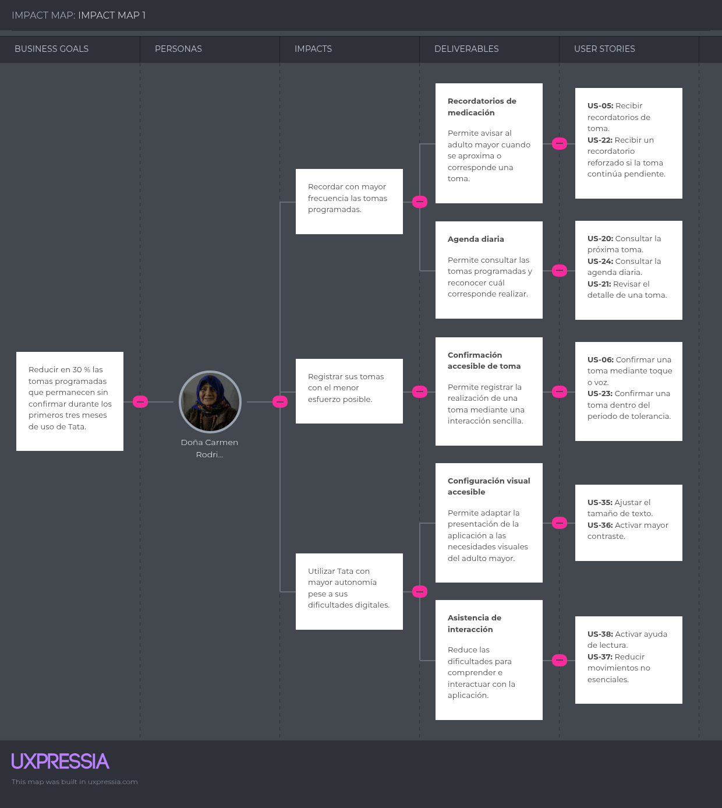

*Figura. Impact Mapping correspondiente al User Persona Doña Carmen Rodríguez.*

El mapa muestra que el cumplimiento del objetivo no depende de una sola funcionalidad. Los recordatorios buscan disminuir los olvidos, mientras que la agenda permite anticipar las próximas tomas. La confirmación accesible facilita registrar la acción realizada y las configuraciones de accesibilidad reducen las barreras de interacción que podrían dificultar el uso autónomo de Tata.

#### Impact Mapping: Diego Dani Mendoza

El segundo Impact Map corresponde al segmento de familiares o cuidadores y utiliza a Diego Dani Mendoza como User Persona. En este caso, el objetivo se concentra en incrementar el uso del seguimiento remoto y disminuir la dependencia de verificaciones manuales constantes.

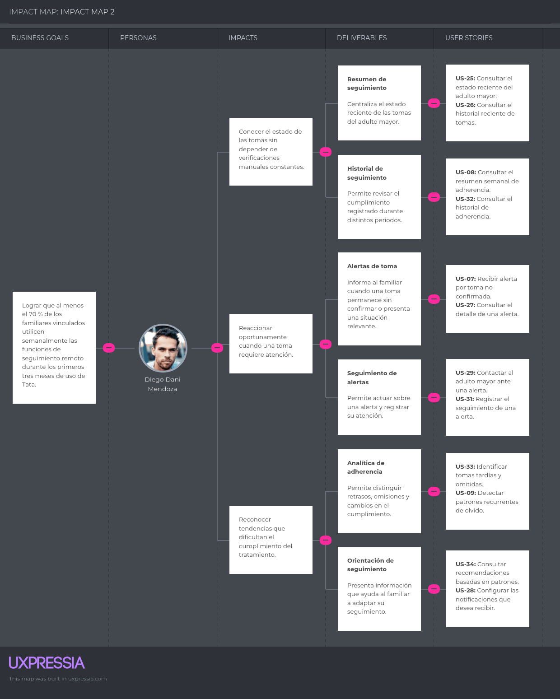

*Figura. Impact Mapping correspondiente al User Persona Diego Dani Mendoza.*

En este mapa, los impactos se concentran en reducir la incertidumbre del familiar durante el seguimiento remoto. El resumen y el historial permiten consultar información sin depender exclusivamente de llamadas, mientras que las alertas facilitan identificar situaciones que requieren atención. La analítica complementa este seguimiento mediante la identificación de retrasos, omisiones y patrones recurrentes que pueden orientar futuras acciones.

### 2.4.3. Product Backlog

El Product Backlog de Tata organiza los requisitos funcionales y técnicos identificados para el producto. La prioridad se estableció considerando primero el valor que cada funcionalidad proporciona a los segmentos objetivo y no únicamente el orden técnico requerido para su implementación.

Las estimaciones utilizan Story Points de 1, 2, 3, 5 y 8. La columna Sprint representa una asignación inicial que podrá revisarse posteriormente durante los Sprint Planning según la capacidad del equipo, los resultados de las iteraciones previas y las dependencias encontradas durante el desarrollo.

Las historias correspondientes al Landing Page se incluyen desde el Sprint 1. Las Technical Stories y Spike Stories se mantienen dentro del mismo Product Backlog porque representan trabajo necesario para habilitar funcionalidades del producto o reducir incertidumbre técnica.

| # Orden | Story ID | Título | Epic | Story Points | Sprint |
| ---: | --- | --- | --- | ---: | --- |
| 1 | US-05 | Recordatorio de toma de medicamento | EPIC-03 | 3 | Sprint 1 |
| 2 | US-06 | Confirmación accesible de una toma | EPIC-03 | 5 | Sprint 2 |
| 3 | US-03 | Registro de un nuevo medicamento | EPIC-02 | 5 | Sprint 1 |
| 4 | US-02 | Vinculación con la cuenta del adulto mayor | EPIC-01 | 5 | Sprint 1 |
| 5 | US-07 | Alerta ante una toma no confirmada | EPIC-04 | 5 | Sprint 2 |
| 6 | US-25 | Consulta del estado reciente del adulto mayor | EPIC-04 | 3 | Sprint 2 |
| 7 | US-14 | Creación de un tratamiento | EPIC-02 | 3 | Sprint 1 |
| 8 | US-15 | Definición de dosis y frecuencia | EPIC-02 | 3 | Sprint 1 |
| 9 | US-16 | Configuración de horarios e instrucciones | EPIC-02 | 3 | Sprint 1 |
| 10 | US-17 | Configuración de recordatorios | EPIC-02 | 3 | Sprint 1 |
| 11 | US-20 | Consulta de la próxima toma | EPIC-03 | 2 | Sprint 1 |
| 12 | US-24 | Consulta de agenda diaria de tomas | EPIC-03 | 3 | Sprint 2 |
| 13 | US-26 | Consulta del historial reciente de tomas | EPIC-04 | 3 | Sprint 2 |
| 14 | US-08 | Resumen semanal de adherencia | EPIC-05 | 3 | Sprint 3 |
| 15 | US-27 | Consulta del detalle de una alerta | EPIC-04 | 2 | Sprint 2 |
| 16 | US-22 | Recordatorio reforzado por falta de confirmación | EPIC-03 | 3 | Sprint 2 |
| 17 | US-23 | Confirmación dentro del periodo de tolerancia | EPIC-03 | 3 | Sprint 2 |
| 18 | US-18 | Activación y pausa de un tratamiento | EPIC-02 | 3 | Sprint 2 |
| 19 | US-04 | Edición y desactivación de un medicamento | EPIC-02 | 3 | Sprint 2 |
| 20 | US-21 | Consulta del detalle de una toma | EPIC-03 | 2 | Sprint 2 |
| 21 | US-19 | Consulta del detalle de un tratamiento | EPIC-02 | 2 | Sprint 2 |
| 22 | US-09 | Alerta de patrón de olvido recurrente | EPIC-05 | 5 | Sprint 3 |
| 23 | US-32 | Consulta del historial de adherencia | EPIC-05 | 3 | Sprint 3 |
| 24 | US-33 | Identificación de tomas tardías y omitidas | EPIC-05 | 3 | Sprint 3 |
| 25 | US-34 | Recomendaciones a partir de patrones | EPIC-05 | 5 | Sprint 3 |
| 26 | US-29 | Contacto con el adulto mayor ante una alerta | EPIC-04 | 2 | Sprint 2 |
| 27 | US-31 | Actualización del seguimiento de una alerta | EPIC-04 | 3 | Sprint 3 |
| 28 | US-28 | Configuración de preferencias de notificación | EPIC-04 | 3 | Sprint 3 |
| 29 | US-35 | Ajuste del tamaño de texto | EPIC-06 | 2 | Sprint 2 |
| 30 | US-36 | Activación de mayor contraste | EPIC-06 | 2 | Sprint 2 |
| 31 | US-38 | Activación de ayuda de lectura | EPIC-06 | 3 | Sprint 3 |
| 32 | US-39 | Configuración de horario de silencio y canales | EPIC-06 | 3 | Sprint 3 |
| 33 | US-37 | Reducción de movimiento | EPIC-06 | 2 | Sprint 3 |
| 34 | US-42 | Aviso de stock bajo | EPIC-07 | 3 | Sprint 4 |
| 35 | US-41 | Consulta de stock restante | EPIC-07 | 2 | Sprint 4 |
| 36 | US-40 | Registro de inventario inicial | EPIC-07 | 3 | Sprint 4 |
| 37 | US-43 | Registro de reposición de medicamento | EPIC-07 | 3 | Sprint 4 |
| 38 | US-46 | Consulta de la propuesta de valor de Tata | EPIC-09 | 2 | Sprint 1 |
| 39 | US-47 | Consulta de funcionalidades principales | EPIC-09 | 2 | Sprint 1 |
| 40 | US-49 | Continuación hacia registro o contacto | EPIC-09 | 2 | Sprint 1 |
| 41 | US-50 | Acceso adaptable al Landing Page | EPIC-09 | 3 | Sprint 1 |
| 42 | US-48 | Comparación de planes disponibles | EPIC-09 | 2 | Sprint 1 |
| 43 | US-10 | Registro de cuenta del familiar | EPIC-01 | 3 | Sprint 1 |
| 44 | US-11 | Verificación del correo del familiar | EPIC-01 | 2 | Sprint 1 |
| 45 | US-01 | Ingreso simplificado a la aplicación | EPIC-01 | 3 | Sprint 1 |
| 46 | US-12 | Registro del perfil del adulto mayor | EPIC-01 | 3 | Sprint 1 |
| 47 | US-13 | Consentimiento para establecer el vínculo | EPIC-01 | 3 | Sprint 1 |
| 48 | US-44 | Consulta del plan actual | EPIC-08 | 2 | Sprint 4 |
| 49 | US-45 | Activación o cambio de suscripción | EPIC-08 | 5 | Sprint 4 |
| 50 | US-30 | Registro de una nota de seguimiento | EPIC-04 | 2 | Sprint 4 |
| 51 | TS-03 | API de medicamentos y tratamientos | EPIC-02 | 5 | Sprint 1 |
| 52 | TS-08 | Servicio de generación de agenda de tomas | EPIC-03 | 5 | Sprint 1 |
| 53 | TS-04 | API de confirmación de tomas | EPIC-03 | 5 | Sprint 2 |
| 54 | TS-02 | API de vinculación de cuidado | EPIC-01 | 5 | Sprint 1 |
| 55 | TS-09 | API de resumen familiar e historial | EPIC-04 | 5 | Sprint 2 |
| 56 | TS-05 | Proceso automático de tomas sin confirmar | EPIC-04 | 5 | Sprint 2 |
| 57 | TS-06 | Integración del servicio de notificaciones push | EPIC-04 | 5 | Sprint 2 |
| 58 | TS-11 | Integración de reconocimiento de voz | EPIC-03 | 5 | Sprint 2 |
| 59 | TS-13 | Almacenamiento local y sincronización | EPIC-03 | 8 | Sprint 2 |
| 60 | TS-10 | Servicio de cálculo de adherencia y patrones | EPIC-05 | 8 | Sprint 3 |
| 61 | TS-07 | API de cuenta y sesión del familiar | EPIC-01 | 5 | Sprint 1 |
| 62 | TS-01 | Servicio de autenticación mediante PIN | EPIC-01 | 3 | Sprint 1 |
| 63 | TS-12 | API de inventario y reposición | EPIC-07 | 5 | Sprint 4 |
| 64 | TS-14 | API de planes y suscripciones | EPIC-08 | 5 | Sprint 4 |
| 65 | SP-01 | Investigación de reconocimiento de voz | EPIC-03 | 3 | Sprint 1 |
| 66 | SP-03 | Investigación de ejecución en segundo plano | EPIC-03 | 3 | Sprint 1 |
| 67 | SP-02 | Investigación de detección de patrones de olvido | EPIC-05 | 5 | Sprint 2 |

#### Evidencia del Product Backlog

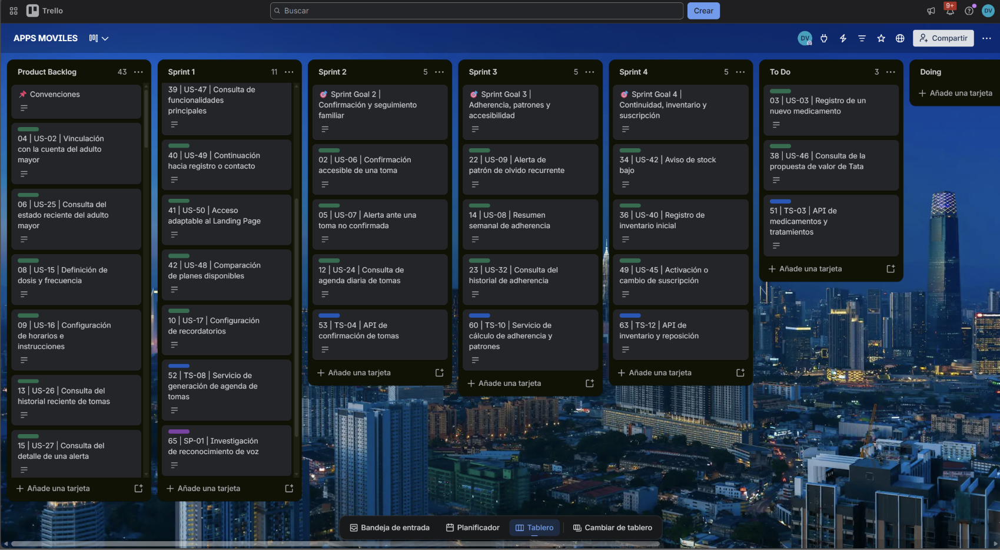

*Figura. Product Backlog de Tata.*

Enlace público al Product Backlog: https://trello.com/b/wuHmMypU/apps-moviles

### 2.5. Strategic-Level Domain-Driven Design

El Strategic-Level Domain-Driven Design se utilizó para organizar el dominio de Tata a partir de las responsabilidades, reglas y conceptos identificados durante las etapas anteriores del proyecto. El objetivo de esta etapa no es definir todavía componentes físicos de software, sino establecer límites conceptuales que permitan mantener modelos coherentes y reducir el acoplamiento entre distintas áreas del dominio.

Para ello, se profundizó el EventStorming desarrollado previamente, incorporando actores, comandos, políticas, modelos de lectura, sistemas externos y agregados. A partir de estos elementos se identificaron candidatos a Bounded Context, se analizaron los mensajes relevantes que atraviesan sus límites y se documentó la responsabilidad interna de cada contexto mediante Bounded Context Canvases.

Este análisis permite pasar de una representación general del comportamiento de Tata hacia una estructura estratégica del dominio que posteriormente servirá como base para el Context Mapping y las decisiones de arquitectura de software.

### 2.5.1. EventStorming

El EventStorming se utilizó para profundizar los procesos identificados previamente en el Big Picture EventStorming. Mientras el Big Picture permitió observar de forma global qué ocurre dentro del dominio de Tata, esta etapa incorporó mayor detalle sobre las acciones que originan los eventos, las reglas que reaccionan ante ellos y los conceptos responsables de mantener el estado y las reglas del negocio.

El modelado se desarrolló de manera progresiva. Inicialmente se organizaron los eventos de dominio según su secuencia temporal y se identificaron puntos problemáticos y eventos pivote. Posteriormente se incorporaron comandos y actores para representar qué acciones originan cada cambio dentro del dominio.

A medida que el modelo fue refinado, se añadieron políticas para representar comportamientos automáticos, modelos de lectura para identificar la información requerida antes de ejecutar determinadas acciones y sistemas externos que participan en los distintos procesos. Finalmente, los comandos y eventos relacionados se organizaron alrededor de agregados, lo que permitió comenzar a reconocer responsabilidades y límites conceptuales dentro del dominio.

*Figura. EventStorming del dominio de Tata.*

Enlace a la versión del EventStorming: [https://miro.com/app/board/uXjVHq5Jc9w=/](https://miro.com/app/board/uXjVHq5Jc9w=/)

#### Evolución del EventStorming

La construcción progresiva del EventStorming permitió aumentar el nivel de detalle sin perder la secuencia principal del dominio. Los primeros pasos estuvieron orientados a comprender el comportamiento y sus principales problemas, mientras que las etapas posteriores incorporaron los elementos necesarios para analizar las reglas y responsabilidades involucradas.

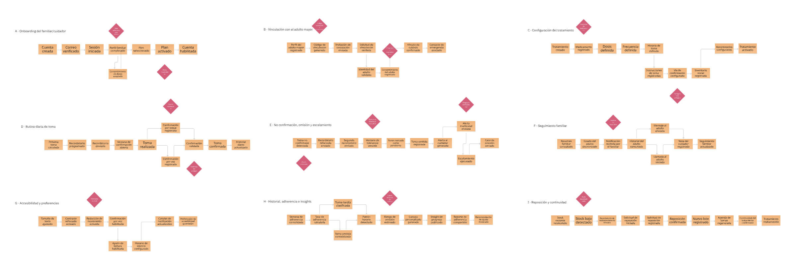

*Figura. Evolución del EventStorming de Tata Pain Points.*

*Figura. Evolución del EventStorming de Tata Commands.*

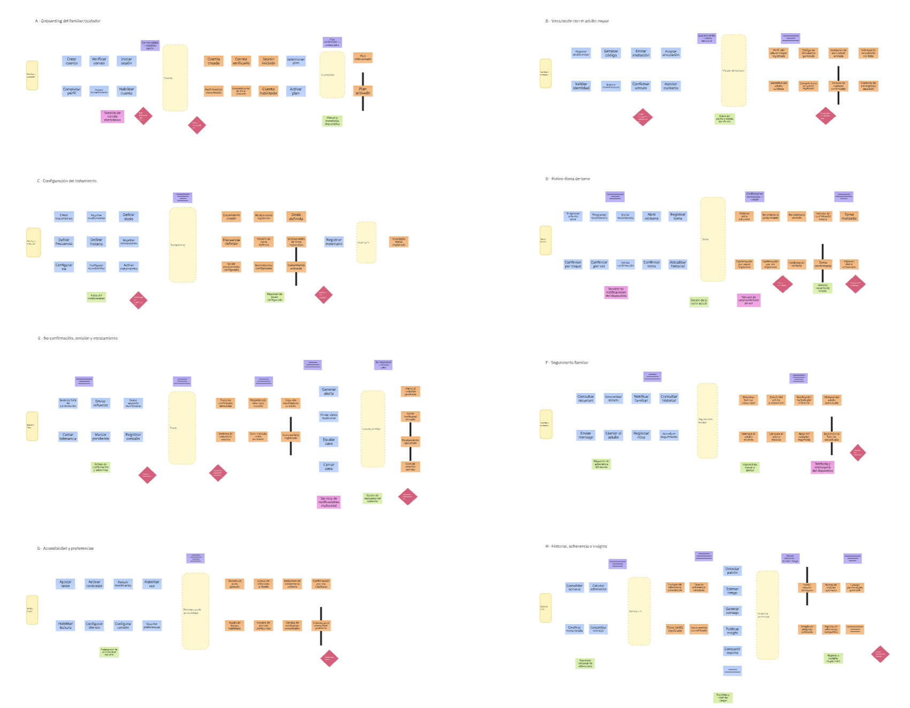

*Figura. Evolución del EventStorming de Tata Aggregates.*

#### 2.5.1.1. Candidate Context Discovery

A partir del EventStorming refinado se analizaron grupos de eventos, comandos, políticas y agregados que compartían un mismo lenguaje y conjunto de responsabilidades. El propósito fue identificar áreas del dominio que requieren mantener un modelo propio y cuyos conceptos pueden evolucionar de forma relativamente independiente.

La agrupación no se realizó únicamente por proximidad dentro del tablero. Se consideraron principalmente las responsabilidades asumidas por cada conjunto de elementos, las reglas que gobiernan su comportamiento y los cambios de significado que aparecen al pasar de un proceso a otro.

Por ejemplo, **Gestión del tratamiento** administra la definición del medicamento, dosis, frecuencia y horario, mientras que **Ejecución de tomas** administra cada instancia concreta generada a partir de esa configuración. Aunque ambos contextos trabajan con información relacionada, responden a preguntas diferentes dentro del dominio y poseen ciclos de vida distintos.

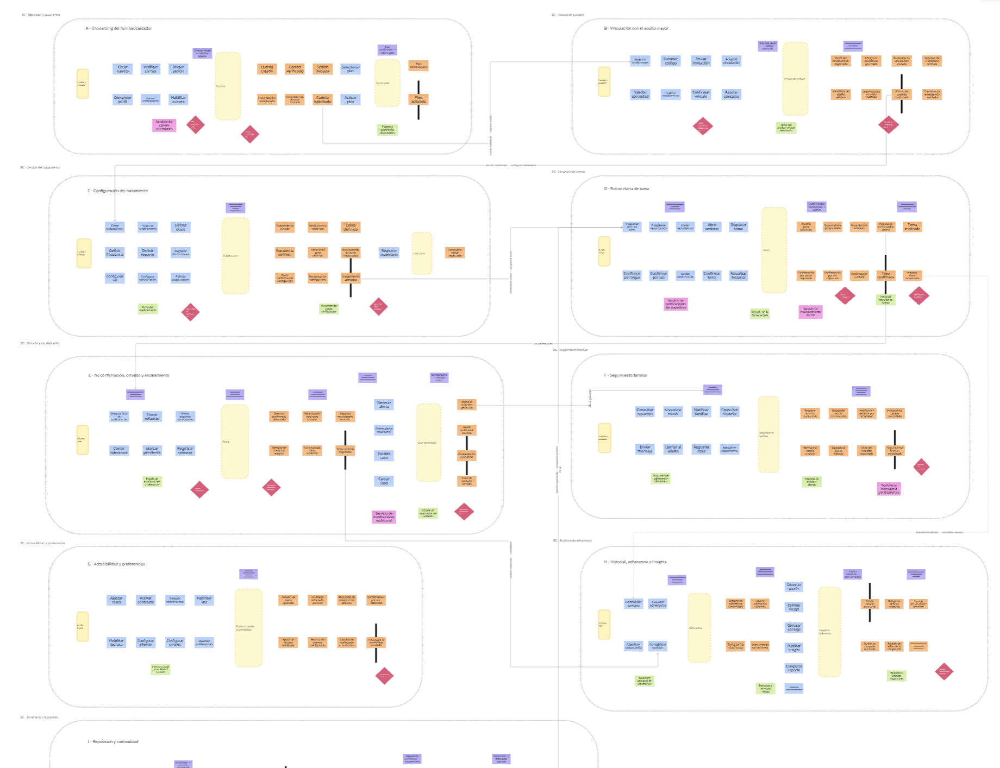

*Figura. Descubrimiento de candidatos a Bounded Context.*

Enlace a la version de Eventstorming Bounded Context: [https://miro.com/app/board/uXjVHq5Jc9w=/](https://miro.com/app/board/uXjVHq5Jc9w=/)

Como resultado se identificaron los siguientes candidatos:

| Candidate Context | Responsabilidad principal |
| --- | --- |
| Identidad y suscripción | Gestionar la existencia, acceso y habilitación de los usuarios |
| Vínculo de cuidado | Administrar la relación autorizada entre familiar y adulto mayor |
| Gestión del tratamiento | Definir medicamentos, dosis, horarios e instrucciones |
| Ejecución de tomas | Gestionar cada toma programada y su confirmación |
| Omisión y escalamiento | Administrar tomas no confirmadas, alertas y escalamiento |
| Seguimiento familiar | Presentar información y registrar las intervenciones del cuidador |
| Accesibilidad y preferencias | Adaptar la interacción y las preferencias del usuario |
| Analítica de adherencia | Calcular indicadores, patrones e insights de adherencia |
| Inventario y reposición | Mantener la disponibilidad y continuidad de los medicamentos |

Estos límites se consideran candidatos dentro de esta etapa y no implican que cada contexto deba implementarse posteriormente como un microservicio independiente.

#### 2.5.1.2. Domain Message Flows Modeling

El Domain Message Flows Modeling se utilizó para representar las interacciones que ocurren entre los actores, Bounded Contexts y sistemas externos que participan en los principales procesos de Tata. A diferencia del EventStorming, donde se estudia el comportamiento interno del dominio mediante eventos, comandos y políticas, en esta etapa el interés se centra en los mensajes que atraviesan los límites previamente identificados.

El modelado se desarrolló a partir de escenarios concretos del dominio. Cada escenario representa una situación relevante de uso y muestra la secuencia de mensajes intercambiados entre sus participantes. Los mensajes se clasificaron como **Commands**, cuando solicitan la ejecución de una acción; **Events**, cuando comunican un hecho que ya ocurrió; y **Queries**, cuando un participante requiere información para continuar con una decisión o proceso.

Para mantener los diagramas legibles, cada escenario fue modelado de manera independiente. Las relaciones representan dependencias conceptuales del dominio y no establecen todavía el mecanismo técnico mediante el cual se implementará la comunicación.

##### Registro y vinculación del adulto mayor

Este escenario representa el proceso mediante el cual un familiar o cuidador ingresa a Tata y establece una relación de cuidado con un adulto mayor. El flujo comienza con la creación y verificación de la cuenta, continúa con el registro del adulto mayor y finaliza cuando la vinculación es aceptada y confirmada.

En este proceso participan principalmente **Identidad y suscripción** y **Vínculo de cuidado**. El primero administra el estado de la cuenta, mientras que el segundo mantiene la relación autorizada entre ambos usuarios. El servicio de correo interviene como sistema externo durante la verificación de la cuenta.

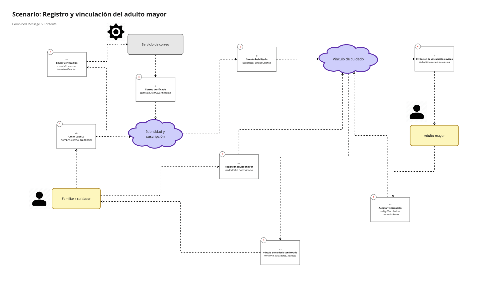

*Figura. Domain Message Flow para el registro y vinculación del adulto mayor.*

##### Configuración y activación del tratamiento

Este escenario describe la configuración inicial de un tratamiento asociado al adulto mayor. El familiar registra el medicamento y define los datos necesarios para su administración, como la dosis, frecuencia, horario e instrucciones de toma.

Antes de realizar determinadas operaciones, **Gestión del tratamiento** puede consultar a **Vínculo de cuidado** para verificar que el familiar se encuentre autorizado para administrar la información del adulto mayor. Una vez completa la configuración, la activación del tratamiento genera información necesaria para que **Ejecución de tomas** pueda comenzar a programar las tomas correspondientes.

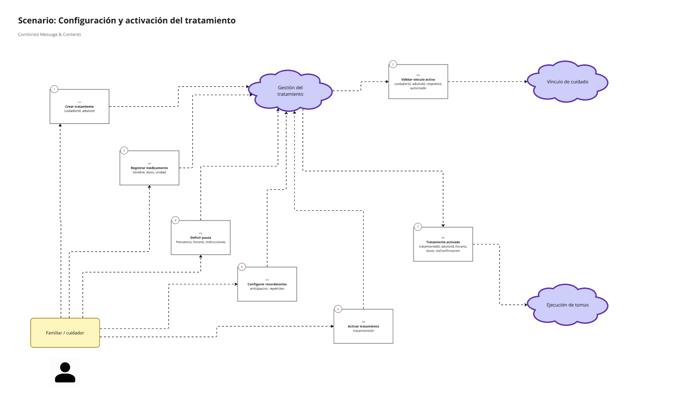

*Figura. Domain Message Flow para la configuración y activación del tratamiento.*

##### Confirmación de una toma mediante un toque

Este escenario representa el camino esperado cuando el adulto mayor recibe un recordatorio y confirma correctamente una toma mediante interacción táctil.

El adulto puede consultar la próxima toma programada y posteriormente registrar su confirmación. Una vez aceptada, **Ejecución de tomas** comunica el resultado a otros contextos interesados. **Analítica de adherencia** utiliza el evento para actualizar las métricas del adulto, mientras que **Seguimiento familiar** puede utilizarlo para actualizar el estado mostrado al familiar o cuidador.

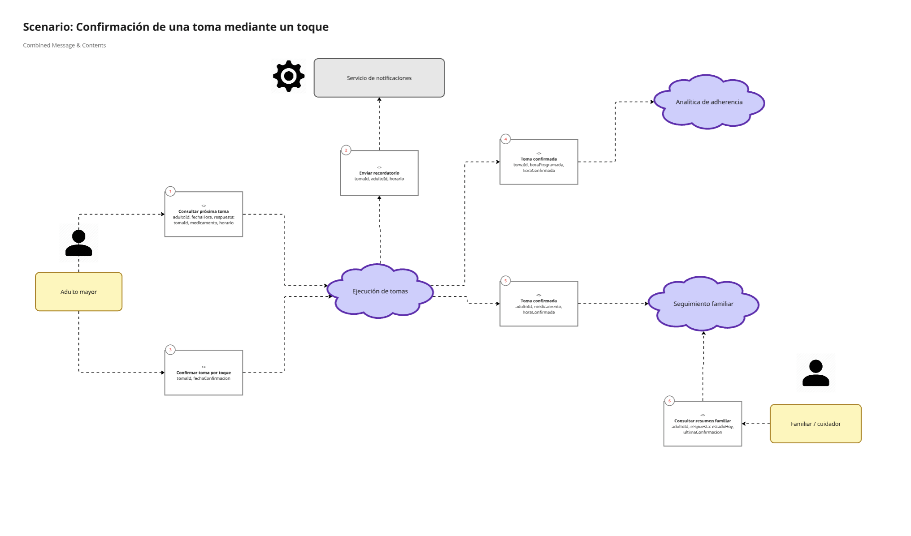

*Figura. Domain Message Flow para la confirmación de una toma mediante un toque.*

##### Confirmación de una toma mediante voz

Este escenario representa la alternativa accesible mediante la cual el adulto mayor puede registrar la confirmación utilizando su voz. En este flujo, **Ejecución de tomas** coordina la interacción con un servicio externo de reconocimiento de voz para procesar el audio recibido.

Si la transcripción puede ser validada, se registra la confirmación y se generan los mismos eventos de dominio empleados por el flujo táctil. De esta manera, el método utilizado para interactuar puede variar sin modificar el significado principal del evento **Toma confirmada** para los demás contextos.

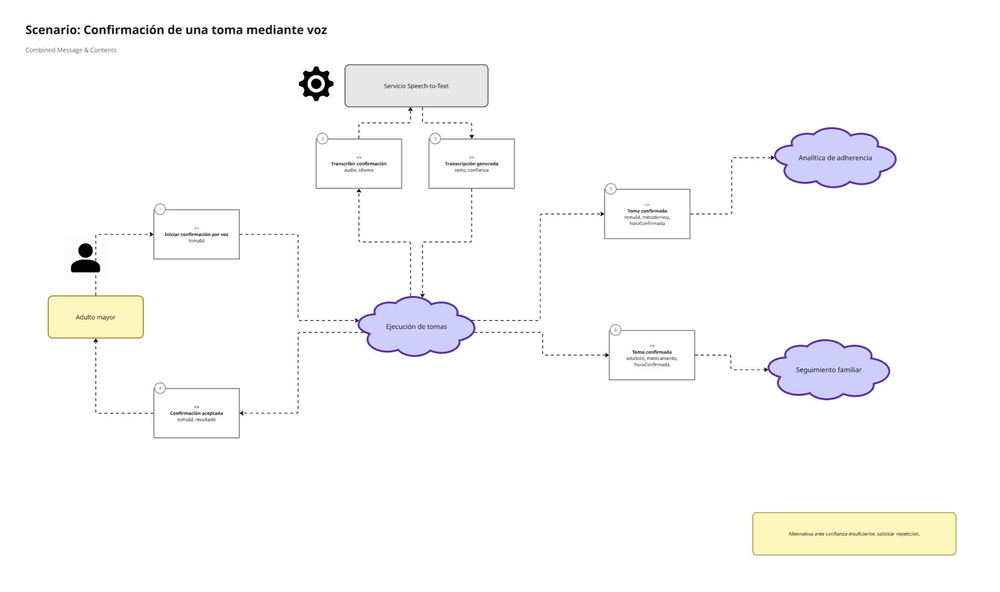

*Figura. Domain Message Flow para la confirmación de una toma mediante voz.*

##### Toma no confirmada, omisión y escalamiento

Este escenario representa el flujo alternativo que se inicia cuando el adulto mayor no confirma una toma dentro del periodo esperado.

Al finalizar la ventana inicial, **Ejecución de tomas** comunica la ausencia de confirmación a **Omisión y escalamiento**. Este contexto administra los recordatorios reforzados y la ventana de tolerancia. Si el tiempo establecido concluye sin una respuesta, se registra la omisión y se genera una alerta.

La omisión también es comunicada a **Analítica de adherencia**, mientras que **Seguimiento familiar** recibe la información necesaria para advertir al familiar o cuidador. Los servicios externos de notificación permiten posteriormente entregar la alerta mediante los canales habilitados.

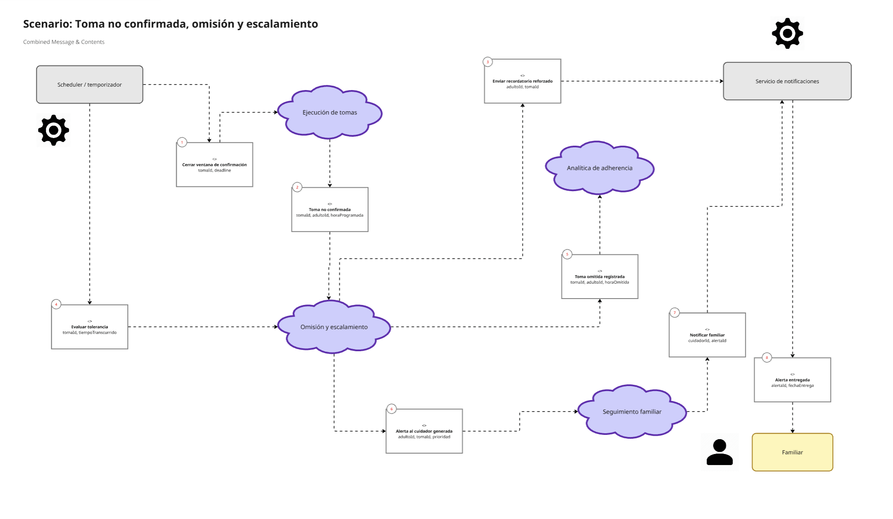

*Figura. Domain Message Flow para una toma no confirmada, omisión y escalamiento.*

##### Seguimiento familiar ante una alerta

Este escenario describe las acciones disponibles para el familiar después de recibir información sobre una situación que requiere atención. El familiar puede consultar el resumen del adulto mayor, revisar las tomas recientes y acceder a los indicadores de adherencia disponibles.

**Seguimiento familiar** reúne información proporcionada por otros contextos sin asumir sus responsabilidades internas. Cuando el familiar necesita intervenir, puede registrar una nota, iniciar una llamada o utilizar otro canal disponible para comunicarse con el adulto mayor.

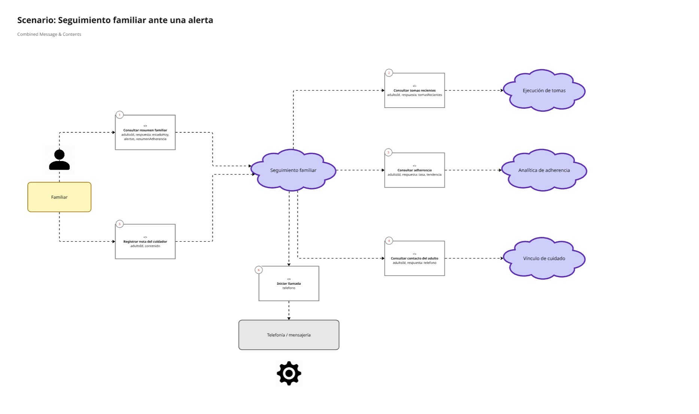

*Figura. Domain Message Flow para el seguimiento familiar ante una alerta.*

##### Consolidación de adherencia y detección de patrones

Este escenario representa el procesamiento de los resultados acumulados durante la ejecución de las tomas. **Analítica de adherencia** recibe información acerca de las tomas confirmadas, tardías u omitidas y la utiliza para consolidar periodos de seguimiento.

A partir de estos registros se calculan indicadores de adherencia y se pueden identificar patrones recurrentes relacionados con determinados horarios o periodos. Los resultados relevantes son publicados para que **Seguimiento familiar** pueda mostrarlos posteriormente al cuidador sin tener que reproducir internamente la lógica analítica.

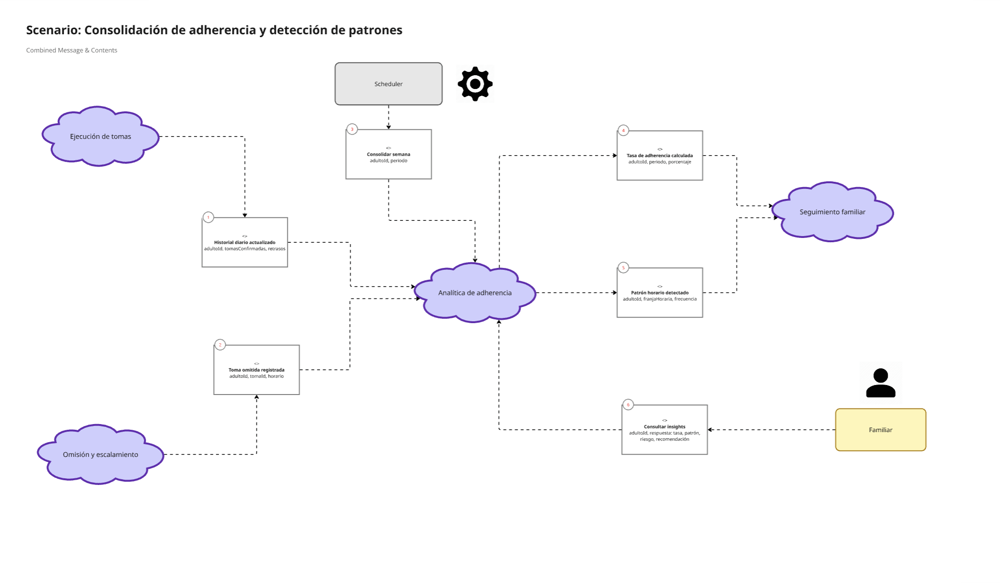

*Figura. Domain Message Flow para la consolidación de adherencia y detección de patrones.*

##### Reposición y continuidad del tratamiento

Este escenario representa el seguimiento del stock disponible de un medicamento y las acciones relacionadas con su reposición. **Inventario y reposición** permite consultar las unidades restantes y detectar situaciones en las que el medicamento puede agotarse antes de las próximas tomas.

Cuando se alcanza el umbral definido, se puede generar un aviso al familiar. Después de registrar una reposición o un nuevo lote, el contexto comunica los cambios necesarios para mantener actualizada la planificación de futuras tomas y conservar la continuidad del tratamiento.

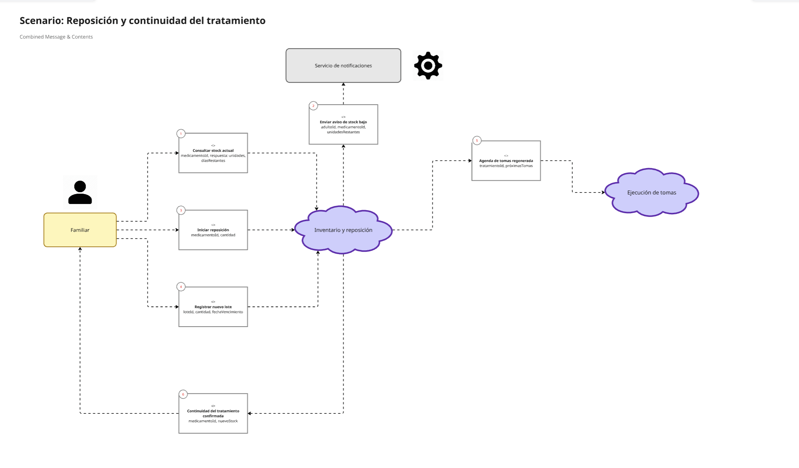

*Figura. Domain Message Flow para la reposición y continuidad del tratamiento.*

En conjunto, los escenarios permitieron identificar los principales intercambios de información entre los límites del dominio de Tata. El modelado muestra que los Bounded Contexts colaboran mediante mensajes específicos sin compartir directamente sus reglas internas. Este resultado también sirve como entrada para documentar con mayor precisión las responsabilidades, mensajes y dependencias de cada contexto mediante los Bounded Context Canvases.

Enlace a la version del Domain Message Flow: [https://miro.com/app/board/uXjVHq5Jc9w=/](https://miro.com/app/board/uXjVHq5Jc9w=/)

#### 2.5.1.3. Bounded Context Canvases

Los Bounded Context Canvases se utilizaron para documentar individualmente los contextos identificados durante el Candidate Context Discovery. Mientras el EventStorming permitió reconocer los posibles límites y el Domain Message Flows Modeling mostró las interacciones entre ellos, los canvases permitieron precisar el propósito y las responsabilidades que corresponden a cada contexto.

Cada canvas documenta su descripción, clasificación estratégica, características del modelo, decisiones de negocio y términos principales del Ubiquitous Language. Asimismo, se especifican los Commands, Events y Queries que el contexto consume o produce, además de sus principales proveedores y consumidores de información.

Esta representación permitió revisar que cada contexto mantuviera responsabilidades coherentes y que las colaboraciones necesarias pudieran realizarse mediante mensajes explícitos, evitando que diferentes áreas del dominio dependieran de los detalles internos de otras.

##### Identidad y suscripción

El Bounded Context **Identidad y suscripción** concentra las responsabilidades relacionadas con la existencia y habilitación de una cuenta dentro de Tata. Incluye la creación del usuario, la verificación de su información básica y el estado del plan asociado.

Sus reglas determinan cuándo una cuenta puede considerarse habilitada y qué información puede ser utilizada posteriormente por otros contextos. Entre los conceptos principales de su lenguaje se encuentran **Cuenta**, **Usuario**, **Plan**, **Suscripción**, **Consentimiento** y **Estado de cuenta**.

Una de sus principales salidas es el evento **Cuenta habilitada**, que permite que el contexto de Vínculo de cuidado continúe con el registro de la relación entre el familiar y el adulto mayor.

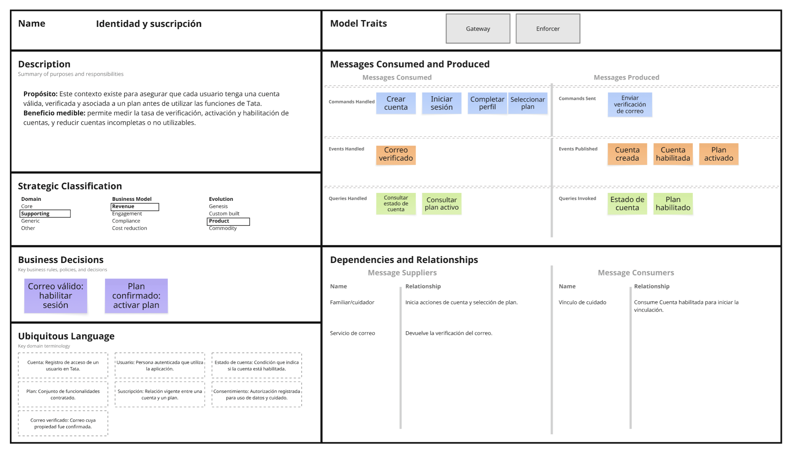

*Figura. Bounded Context Canvas de Identidad y suscripción.*

##### Vínculo de cuidado

El contexto **Vínculo de cuidado** administra la relación autorizada entre el adulto mayor y el familiar o cuidador encargado de su seguimiento.

Su modelo mantiene información relacionada con el adulto mayor, los códigos de vinculación, el consentimiento y el estado de la relación. Entre sus principales decisiones se encuentra validar que una cuenta pueda iniciar una vinculación y que el consentimiento requerido haya sido registrado antes de habilitar el seguimiento.

El evento **Vínculo de cuidado confirmado** representa uno de sus resultados más importantes, ya que permite que otros contextos reconozcan que el familiar posee una relación válida con el adulto mayor.

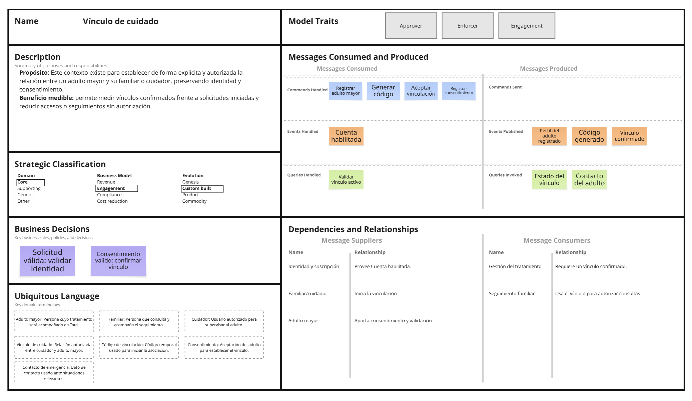

*Figura. Bounded Context Canvas de Vínculo de cuidado.*

##### Gestión del tratamiento

El contexto **Gestión del tratamiento** mantiene la definición operativa del tratamiento del adulto mayor. Dentro de este límite se gestionan el medicamento, la dosis, frecuencia, horario, instrucciones y configuración de recordatorios.

Su responsabilidad termina en definir **qué tratamiento debe seguirse**. No administra cada ejecución concreta de una dosis, ya que esa responsabilidad pertenece a Ejecución de tomas.

Cuando la configuración requerida se encuentra completa, el contexto puede publicar el evento **Tratamiento activado**, que proporciona la información necesaria para generar las futuras tomas.

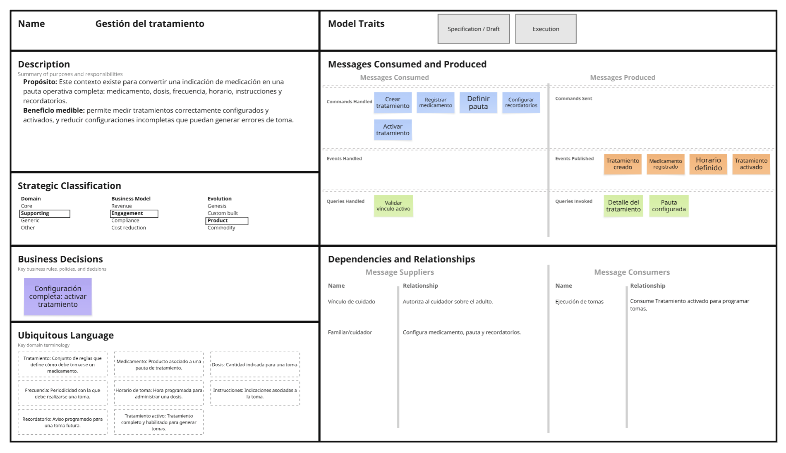

*Figura. Bounded Context Canvas de Gestión del tratamiento.*

##### Ejecución de tomas

El contexto **Ejecución de tomas** administra las instancias concretas generadas a partir de un tratamiento activo. Su responsabilidad comienza cuando debe programarse una toma y continúa hasta que esta queda confirmada o se detecta que permanece sin confirmación.

Dentro de este contexto se manejan conceptos como **Toma**, **Próxima toma**, **Ventana de confirmación**, **Confirmación por toque** y **Confirmación por voz**.

También coordina servicios externos necesarios para determinadas interacciones, como el reconocimiento de voz o las notificaciones. Sus principales eventos de salida incluyen **Toma confirmada**, **Toma no confirmada** e **Historial diario actualizado**.

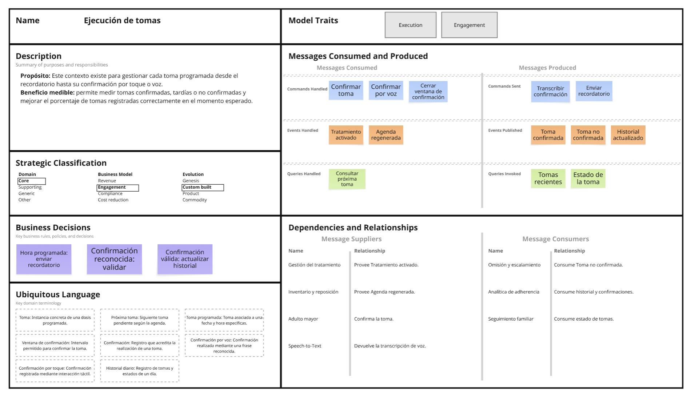

*Figura. Bounded Context Canvas de Ejecución de tomas.*

##### Omisión y escalamiento

El contexto **Omisión y escalamiento** administra las situaciones excepcionales originadas cuando una toma permanece sin confirmación.

Este contexto controla la ventana de tolerancia, los recordatorios reforzados, el registro de una omisión, la generación de alertas y el escalamiento cuando corresponde. De esta manera, la lógica de excepción no queda mezclada con la ejecución normal de una toma.

Entre sus eventos principales se encuentran **Toma omitida registrada**, **Alerta al cuidador generada** y **Escalamiento ejecutado**. Estos eventos pueden ser consumidos posteriormente por Analítica de adherencia y Seguimiento familiar.

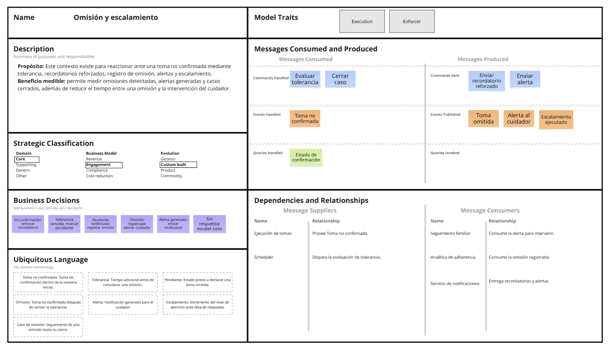

*Figura. Bounded Context Canvas de Omisión y escalamiento.*

##### Seguimiento familiar

El contexto **Seguimiento familiar** representa la visión del dominio orientada al familiar o cuidador. Su responsabilidad es reunir y presentar la información necesaria para conocer el estado reciente del adulto mayor y facilitar una intervención cuando sea necesaria.

Este contexto recibe información producida por Ejecución de tomas, Omisión y escalamiento y Analítica de adherencia. A partir de ella permite construir un resumen familiar, consultar información relevante y registrar acciones como notas del cuidador.

El contexto no recalcula la adherencia ni decide cuándo una toma se convierte en una omisión; consume los resultados generados por los contextos responsables de esas reglas.

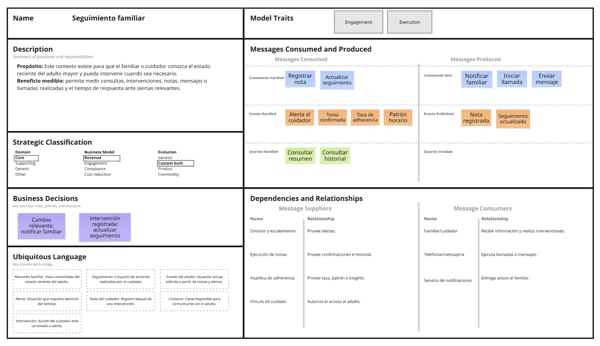

*Figura. Bounded Context Canvas de Seguimiento familiar.*

##### Accesibilidad y preferencias

El contexto **Accesibilidad y preferencias** administra las configuraciones que permiten adaptar la interacción con Tata según las necesidades de cada usuario.

Incluye elementos como el tamaño de texto, contraste reforzado, reducción de movimiento, confirmación por voz, ayuda de lectura, horario de silencio y canales de notificación.

Estas preferencias poseen un carácter transversal debido a que pueden condicionar el comportamiento de otras áreas del producto. Sin embargo, mantenerlas dentro de un modelo propio evita que cada contexto deba definir nuevamente las reglas relacionadas con la configuración personal del usuario.

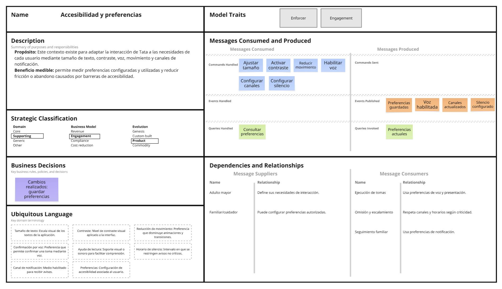

*Figura. Bounded Context Canvas de Accesibilidad y preferencias.*

##### Analítica de adherencia

El contexto **Analítica de adherencia** transforma los resultados acumulados de las tomas en información útil para comprender la evolución del tratamiento.

Su modelo maneja conceptos como **Adherencia**, **Tasa de adherencia**, **Toma tardía**, **Omisión**, **Patrón horario**, **Riesgo de omisión**, **Insight** y **Recomendación**.

El contexto recibe los registros generados durante la ejecución normal y los casos de omisión. A partir de ellos puede consolidar periodos, calcular indicadores e identificar patrones. Los resultados obtenidos se publican posteriormente para que otros contextos, especialmente Seguimiento familiar, puedan utilizarlos.

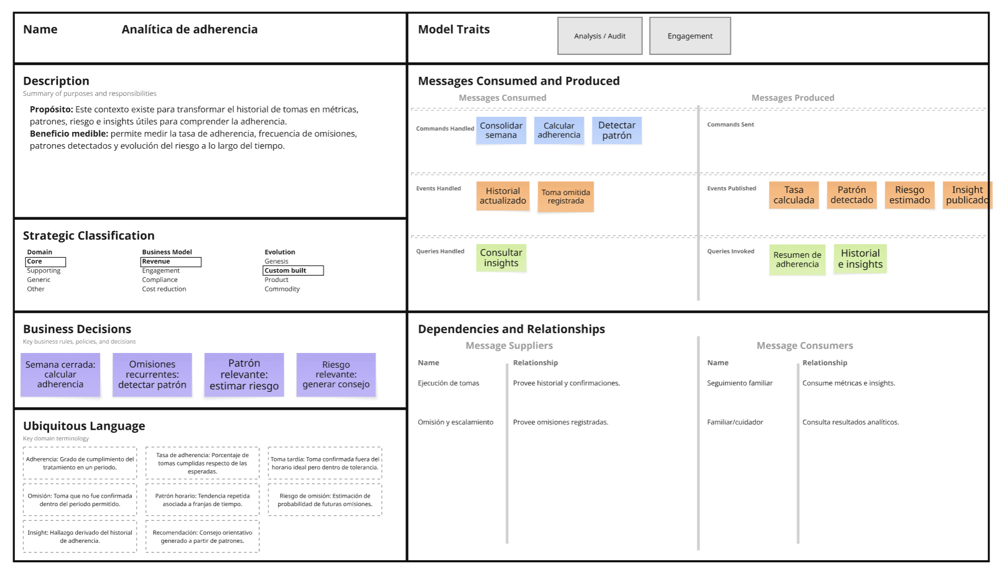

*Figura. Bounded Context Canvas de Analítica de adherencia.*

##### Inventario y reposición

El contexto **Inventario y reposición** administra la disponibilidad de los medicamentos asociados a un tratamiento y las acciones necesarias para mantener su continuidad.

Su modelo contempla el stock disponible, el umbral de reposición, los lotes registrados y el proceso de reabastecimiento. Cuando detecta que las unidades restantes se acercan a un límite establecido, puede generar un aviso para el familiar.

Después de registrar una reposición, el contexto puede producir información que permita actualizar la planificación de futuras tomas. De esta manera, la disponibilidad física del medicamento se mantiene separada de las reglas propias de la configuración del tratamiento y de la ejecución diaria.

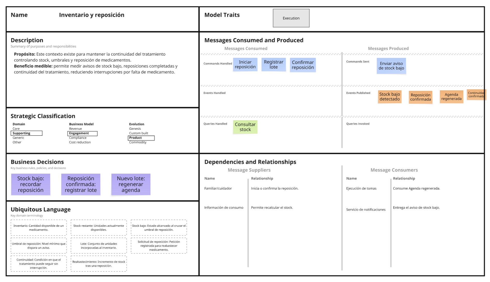

*Figura. Bounded Context Canvas de Inventario y reposición.*

En conjunto, los nueve Bounded Context Canvases permitieron precisar las responsabilidades y colaboraciones identificadas durante el EventStorming. El resultado proporciona una visión más estable de los límites estratégicos del dominio y sirve como base para el posterior Context Mapping, donde se analizarán las relaciones existentes entre estos contextos y la forma en que sus modelos deben colaborar.

Enlace a la version de Bounded Context Canvas: [https://miro.com/app/board/uXjVHq5Jc9w=/](https://miro.com/app/board/uXjVHq5Jc9w=/)

### 2.5.2. Context Mapping

El Context Mapping se utilizó para representar las relaciones estructurales entre los nueve Bounded Contexts identificados en el Candidate Context Discovery, a partir de la información ya documentada en el Domain Message Flows Modeling y en los Bounded Context Canvases. El objetivo de esta etapa es explicitar, para cada colaboración relevante entre contextos, qué patrón de relación de Domain-Driven Design describe mejor la forma en que ambos modelos deben coexistir.

Para construir el mapa, el equipo revisó cada mensaje identificado entre contextos y discutió preguntas exploratorias del tipo "¿qué pasaría si...?" antes de fijar el patrón definitivo. Entre las discusiones más relevantes:

- **¿Qué pasaría si moviéramos la validación del vínculo de cuidado dentro de Gestión del tratamiento?** Se descartó porque duplicaría las reglas de autorización ya definidas en Vínculo de cuidado y rompería la responsabilidad única de ese contexto. Se optó por mantener una relación **Customer/Supplier**, donde Gestión del tratamiento consulta a Vínculo de cuidado sin reimplementar su lógica.
- **¿Qué pasaría si Seguimiento familiar recalculara la adherencia o decidiera cuándo una toma se convierte en omisión?** Se descartó porque mezclaría reglas de negocio que ya pertenecen a Ejecución de tomas, Omisión y escalamiento y Analítica de adherencia. Se decidió que Seguimiento familiar se comporte como **Conformist** frente a esos tres contextos: consume sus resultados tal como se publican, sin traducirlos ni cuestionarlos.
- **¿Qué pasaría si duplicáramos las preferencias de accesibilidad dentro de cada contexto que las necesita (Ejecución de tomas, Omisión y escalamiento, Seguimiento familiar)?** Se descartó por el riesgo de que las configuraciones queden inconsistentes entre contextos. Se optó por tratar a Accesibilidad y preferencias como un **Shared Kernel** acotado, limitado a un conjunto pequeño y estable de conceptos (canal de notificación, horario de silencio, confirmación por voz) que los demás contextos referencian directamente.
- **¿Qué pasaría si Tata se acoplara directamente a los modelos de los servicios externos de reconocimiento de voz, notificaciones push y correo?** Se descartó porque un cambio en la API de cualquiera de esos proveedores impactaría directamente el modelo de dominio. Se decidió aislar cada integración mediante un **Anti-Corruption Layer**, de modo que Tata siempre trabaje con sus propios conceptos (Confirmación por voz, Alerta, Correo verificado) independientemente del contrato específico del proveedor.

El resultado de esta discusión se resume en el siguiente Context Map:

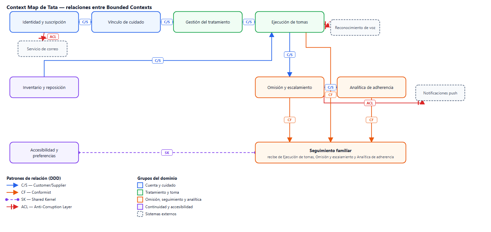

*Figura. Context Map de Tata, con los patrones de relación aplicados entre Bounded Contexts.*

En conjunto, la mayoría de las colaboraciones entre contextos internos de Tata siguen relaciones de tipo **Customer/Supplier**, reflejando un flujo con dirección clara (identidad → vínculo → tratamiento → ejecución → omisión/analítica). Seguimiento familiar se mantiene deliberadamente como **Conformist** frente a los contextos que sí poseen las reglas de negocio, evitando duplicar lógica. Accesibilidad y preferencias se aísla como un **Shared Kernel** pequeño y estable para no fragmentar la configuración del usuario, mientras que toda integración con los sistemas externos de terceros (correo, reconocimiento de voz, notificaciones push) queda protegida mediante un **Anti-Corruption Layer**. Esta estructura sirve como base para las decisiones de Software Architecture que se detallan en la siguiente sección.

### 2.5.3. Software Architecture

La arquitectura de software de Tata se representa mediante C4 Model con el propósito de describir la solución desde distintos niveles de abstracción. Las vistas elaboradas permiten observar el entorno general del sistema, los principales elementos que conforman la solución y la distribución de estos elementos en un entorno de ejecución.

La propuesta considera los productos definidos para Tata: un Landing Page, una aplicación Android nativa, una aplicación móvil multiplataforma y un backend encargado de atender las operaciones del dominio. Las aplicaciones móviles disponen de almacenamiento local y se comunican con el backend mediante solicitudes sobre HTTPS. Asimismo, la solución emplea una base de datos central e integra servicios externos para notificaciones, reconocimiento de voz y correo electrónico.

El diseño del backend mantiene correspondencia con los Bounded Contexts identificados durante el Strategic-Level Domain-Driven Design. Estos límites de dominio se hacen explícitos en la vista de contenedores para mostrar cómo las solicitudes son dirigidas desde un punto de entrada común hacia las diferentes capacidades del negocio. Esta representación no implica que cada Bounded Context corresponda a un microservicio independiente. Para el alcance actual de Tata, los módulos del backend se consideran parte de una misma solución desplegable.

#### 2.5.3.1. Software Architecture Context Level Diagrams

El System Context Diagram presenta a Tata como el sistema de software central y muestra las personas y sistemas externos que interactúan directamente con la solución.

Se consideran tres tipos de personas. El adulto mayor utiliza Tata para consultar su rutina de medicación, recibir recordatorios y registrar confirmaciones de toma. El familiar o cuidador configura tratamientos y realiza seguimiento remoto de la adherencia. El visitante consulta la información pública de Tata para conocer su propuesta de valor, funcionalidades y planes disponibles.

Tata se integra con tres sistemas externos. El servicio de correo electrónico permite gestionar verificaciones de cuenta y comunicaciones transaccionales. El servicio Speech-to-Text procesa las confirmaciones realizadas mediante voz. Por su parte, el servicio de notificaciones push permite entregar recordatorios y alertas a los dispositivos móviles.

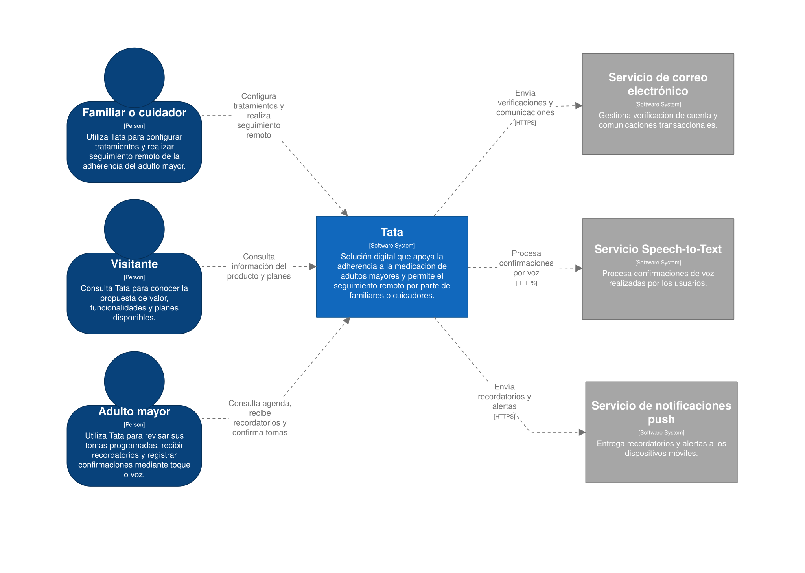

*Figura. Diagrama de Contexto del Sistema de Tata.*

#### 2.5.3.2. Software Architecture Container Level Diagrams

El Container Diagram representa los principales elementos que conforman Tata y complementa esta visión con los Bounded Contexts obtenidos durante el diseño estratégico del dominio. De esta manera, además de las aplicaciones y almacenes de datos, se observa cómo las solicitudes son distribuidas hacia las capacidades responsables de cada parte del negocio.

El Landing Page se implementa mediante HTML5, CSS3 y JavaScript. Su responsabilidad consiste en presentar la propuesta de valor, las funcionalidades principales y los planes disponibles de Tata.

La solución móvil comprende una aplicación Android nativa desarrollada con Kotlin y una aplicación móvil multiplataforma desarrollada con Flutter y Dart. Ambas permiten acceder a las funcionalidades de Tata y se comunican con el backend mediante JSON sobre HTTPS. La aplicación Android utiliza Room sobre SQLite para su almacenamiento local, mientras que la aplicación multiplataforma emplea SQLite. Estos almacenes conservan información como agenda, preferencias, datos en caché y operaciones pendientes de sincronización.

Las solicitudes de las aplicaciones móviles ingresan al backend mediante un API Gateway implementado con Spring Cloud Gateway y Java. Este elemento actúa como punto de entrada y dirige cada operación hacia el Bounded Context responsable.

El backend se organiza en los siguientes Bounded Contexts:

- **Identity & Subscription BC:** gestiona cuentas, autenticación, planes y suscripciones.
- **Care Link BC:** administra el vínculo de cuidado entre el familiar o cuidador y el adulto mayor.
- **Treatment Management BC:** gestiona medicamentos, tratamientos, dosis y programación terapéutica.
- **Intake Execution BC:** administra la agenda de tomas, recordatorios, confirmaciones y ventanas de tolerancia.
- **Omission & Escalation BC:** gestiona tomas no confirmadas, omisiones, alertas y reglas de escalamiento.
- **Adherence Analytics BC:** calcula indicadores de adherencia e identifica tendencias y patrones de cumplimiento.
- **Family Monitoring BC:** consolida información necesaria para el seguimiento remoto del familiar o cuidador.
- **Accessibility & Preferences BC:** administra preferencias de accesibilidad, interacción, recordatorios y notificaciones.
- **Inventory & Replenishment BC:** gestiona disponibilidad de medicamentos y necesidades de reposición.

Las relaciones entre estos Bounded Contexts conservan la estructura definida en el Context Mapping del dominio. Los patrones Customer/Supplier, Conformist, Shared Kernel y Anti-Corruption Layer representan las dependencias y formas de colaboración previamente identificadas durante el Strategic-Level DDD.

Los diferentes módulos utilizan una base de datos PostgreSQL como persistencia central. Aunque se emplea una misma tecnología de almacenamiento, las responsabilidades sobre la información se mantienen asociadas al Bounded Context correspondiente. Las integraciones con correo electrónico, Speech-to-Text y notificaciones push se realizan desde los contextos que requieren dichas capacidades.

No se incorpora un bus de mensajes externo en la arquitectura actual. Las interacciones necesarias entre los Bounded Contexts forman parte del backend de Tata y no requieren, para el alcance actual del proyecto, infraestructura adicional de mensajería distribuida.

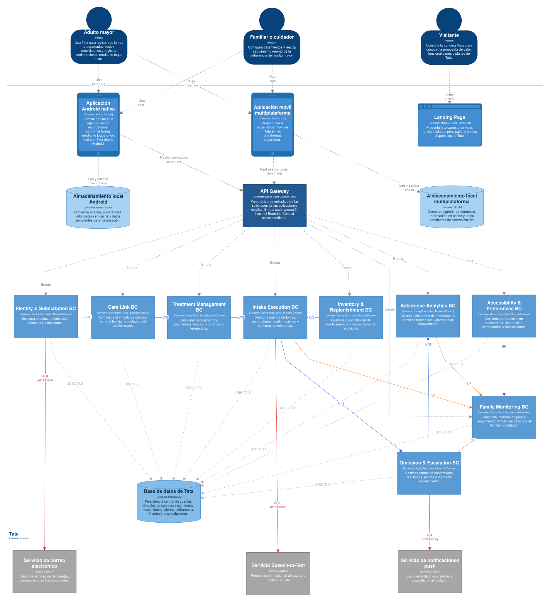

*Figura. Diagrama de Contenedores y Bounded Contexts de Tata.*

#### 2.5.3.3. Software Architecture Deployment Diagrams

El Deployment Diagram representa la distribución de los elementos de Tata en los diferentes entornos de ejecución previstos para producción.

La aplicación Android nativa se ejecuta sobre dispositivos Android y mantiene información local mediante Room y SQLite. El dispositivo proporciona además capacidades internas utilizadas por Tata, como el micrófono requerido para la confirmación de tomas mediante voz.

La aplicación móvil multiplataforma se ejecuta sobre dispositivos compatibles con Android o iOS y dispone igualmente de almacenamiento SQLite para conservar información necesaria durante la experiencia móvil.

El Landing Page se despliega de manera independiente mediante un servicio de hosting web estático o una CDN, debido a que su responsabilidad se limita a presentar información pública del producto.

El backend se despliega en una plataforma de aplicaciones en la nube. Dentro de este entorno se ejecutan conjuntamente el API Gateway y los módulos correspondientes a los Bounded Contexts de Tata. Esta decisión mantiene la separación lógica establecida mediante DDD sin requerir que cada contexto sea desplegado como un microservicio independiente.

La persistencia central se aloja en un servicio administrado de PostgreSQL. Las aplicaciones móviles no acceden directamente a esta base de datos, sino que realizan sus operaciones mediante el backend de Tata.

Finalmente, los servicios de correo electrónico, Speech-to-Text y notificaciones push se consideran servicios SaaS externos. Estos sistemas son consumidos únicamente por los Bounded Contexts que requieren sus respectivas capacidades.

La distribución propuesta mantiene una infraestructura acorde con el alcance del producto y evita incorporar componentes adicionales, como clústeres Kubernetes o brokers de mensajería, que no resultan necesarios para la versión actual de Tata.

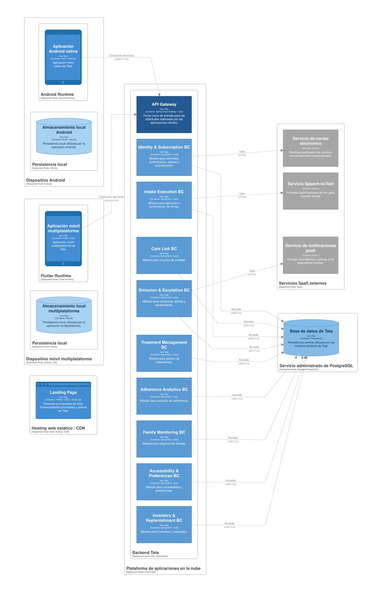

*Figura. Diagrama de Despliegue de Tata.*

## 2.6. Tactical-Level Domain-Driven Design

### 2.6.1. Bounded Context: Ejecución de tomas
 
El Bounded Context **Ejecución de tomas** (**Intake Execution BC**) es responsable de generar las tomas programadas a partir de los tratamientos activos, emitir los recordatorios correspondientes, y registrar la confirmación del adulto mayor mediante interacción táctil o por voz. Se implementa como un módulo del backend único de Tata y constituye el punto de origen del ciclo de vida de una toma: desde su programación hasta su confirmación o, en caso de no ser confirmada dentro del periodo de tolerancia, el traspaso de dicha situación hacia Omisión y escalamiento.
 
El contexto reacciona a `TreatmentActivated`, publicado por Gestión de Medicamentos, generando las tomas futuras correspondientes a la pauta vigente del tratamiento. Cuando la pauta de un tratamiento se modifica, el contexto regenera únicamente las tomas futuras que todavía no poseen un resultado definitivo. Cuando una toma programada alcanza su horario, el contexto emite el recordatorio inicial y, si no existe confirmación dentro del intervalo configurado, emite un recordatorio reforzado. Cuando el adulto mayor confirma una toma, ya sea por interacción táctil o mediante una confirmación de voz validada, el contexto registra el resultado y publica `IntakeHistoryUpdated`, evento que Adherence Analytics consume para clasificar la toma como confirmada a tiempo o tardía. Cuando una toma pendiente supera su periodo de tolerancia sin haber sido confirmada, el contexto publica `IntakeToleranceExpired`, cediendo a Omisión y escalamiento la responsabilidad de registrar la omisión y gestionar la alerta correspondiente al familiar.
 
#### 2.6.1.1. Domain Layer
 
**Sub-capa Model - Aggregates:**
 
| Tipo | Nombre | Propósito | Atributos / Métodos principales | Relación con otros elementos |
| --- | --- | --- | --- | --- |
| Aggregate Root | Intake | Representar una toma programada, controlar la emisión de recordatorios y registrar su confirmación dentro del periodo de tolerancia | `id`, `treatmentId`, `olderAdultId`, `medicationSnapshot: MedicationSnapshot`, `scheduledAt`, `tolerance: ToleranceWindow`, `status: IntakeStatus`, `remindersIssued`, `confirmedAt`, `confirmationChannel: ConfirmationChannel` - `issueReminder()`, `reinforceReminder()`, `confirm(channel, confirmedAt)`, `expireTolerance()` | Creado por IntakeSchedulingService a partir de un tratamiento activo; publica ReminderIssued, ReminderReinforced, IntakeHistoryUpdated e IntakeToleranceExpired en sus distintas transiciones |
 
**Sub-capa Model - Value Objects:**
 
| Tipo | Nombre | Propósito | Atributos / Métodos principales | Relación con otros elementos |
| --- | --- | --- | --- | --- |
| Value Object | MedicationSnapshot | Conservar el nombre, dosis e instrucciones del medicamento vigentes al momento de programar la toma, independientemente de cambios posteriores en el tratamiento | `medicationName`, `dose`, `instructions` | Embebido en Intake; se genera a partir de la pauta consultada en Gestión de Medicamentos al momento de la programación |
| Value Object | ToleranceWindow | Delimitar el intervalo de tiempo dentro del cual una confirmación tardía todavía es válida | `duration` - `hasExpired(now)` | Consultado por Intake al evaluar `expireTolerance()` |
| Enumeration | ConfirmationChannel | Representar el medio utilizado para confirmar una toma | `TAP`, `VOICE` | Usado por Intake al registrar `confirm()` |
| Enumeration | IntakeStatus | Representar el estado vigente de una toma dentro de este contexto | `PENDING`, `CONFIRMED`, `ESCALATED` | Usado por Intake; `ESCALATED` marca el traspaso hacia Omisión y escalamiento |
 
**Sub-capa Services y Repositories:**
 
| Tipo | Nombre | Propósito | Firma / Método principal | Relación con otros elementos |
| --- | --- | --- | --- | --- |
| Interface | IIntakeRepository | Contrato de persistencia del agregado Intake | `save(intake)`, `findById(id): Intake`, `findNextByOlderAdultId(id): Intake`, `findByOlderAdultIdAndDate(id, date): List<Intake>`, `findPendingWithReminderDue(now): List<Intake>`, `findPendingWithToleranceExpired(now): List<Intake>` | Implementado en Infrastructure |
| Domain Service | IntakeSchedulingService | Generar las tomas futuras de un tratamiento activo a partir de su pauta (dosis, horarios, días de la semana) | `generateSchedule(treatment): List<Intake>`, `regenerateFutureIntakes(treatment): List<Intake>` | Consultado por GenerateIntakeScheduleCommandHandler (TS-08); solo reemplaza tomas futuras sin resultado definitivo |
| Domain Service | VoiceConfirmationValidationService | Determinar si una transcripción obtenida del reconocimiento de voz corresponde a una confirmación válida de la toma | `validate(transcription, expectedPhrase): boolean` | Consultado por ConfirmIntakeByVoiceCommandHandler (US-06, TS-11) |
 
#### 2.6.1.2. Interface Layer
 
**Sub-capa REST - Resources:**
 
| Tipo | Nombre | Propósito |
| --- | --- | --- |
| Resource | NextIntakeResource | Representar la próxima toma pendiente del adulto mayor (US-20) |
| Resource | IntakeDetailResource | Representar el detalle de una toma, incluyendo medicamento, dosis, instrucciones y estado (US-21) |
| Resource | DailyIntakeAgendaResource | Representar el listado de tomas programadas para un día específico, ordenadas cronológicamente (US-24) |
| Resource | IntakeConfirmationResource | Representar el resultado de una confirmación registrada, ya sea por toque o por voz (US-06, US-23) |
 
**Sub-capa REST - Transform:**
 
| Tipo | Nombre | Propósito |
| --- | --- | --- |
| Assembler | IntakeResourceFromEntityAssembler | Convertir un Intake en NextIntakeResource, IntakeDetailResource o DailyIntakeAgendaResource según la consulta |
| Assembler | IntakeConfirmationResourceFromEntityAssembler | Convertir el resultado de una confirmación en IntakeConfirmationResource |
 
**Sub-capa REST - Controllers:**
 
| Tipo | Nombre | Propósito |
| --- | --- | --- |
| Controller | IntakeQueriesController | Exponer la próxima toma, el detalle de una toma y la agenda diaria, enrutado desde el API Gateway (US-20, US-21, US-24) |
| Controller | IntakeConfirmationController | Exponer la confirmación de una toma por interacción táctil o por voz (US-06, US-23, TS-04) |
 
**Sub-capa Domain Event Listeners:**
 
| Tipo | Nombre | Propósito |
| --- | --- | --- |
| Consumer | TreatmentActivatedEventConsumer | Escuchar el evento `TreatmentActivated` publicado por Gestión de Medicamentos para generar el calendario de tomas del tratamiento |
| Consumer | TreatmentUpdatedEventConsumer | Escuchar el evento `TreatmentUpdated` publicado por Gestión de Medicamentos para regenerar únicamente las tomas futuras sin resultado definitivo |
 
#### 2.6.1.3. Application Layer
 
**Sub-capa Internal - CommandServices:**
 
| Tipo | Nombre | Propósito |
| --- | --- | --- |
| CommandHandler | GenerateIntakeScheduleCommandHandler | Ejecutar IntakeSchedulingService sobre un tratamiento activo, persistir las tomas generadas y publicar el evento correspondiente por cada una ("Generar agenda", TS-08) |
| CommandHandler | IssueReminderCommandHandler | Emitir el recordatorio inicial de una toma pendiente cuando se alcanza su horario programado, publicando `ReminderIssued` ("Emitir recordatorio", US-05) |
| CommandHandler | ReinforceReminderCommandHandler | Emitir un recordatorio reforzado cuando una toma continúa pendiente tras el intervalo configurado, publicando `ReminderReinforced` ("Reforzar recordatorio", US-22) |
| CommandHandler | ConfirmIntakeCommandHandler | Registrar la confirmación de una toma pendiente mediante interacción táctil, invocando `Intake.confirm()` y publicando `IntakeHistoryUpdated` ("Confirmar toma", US-06, US-23, TS-04) |
| CommandHandler | ConfirmIntakeByVoiceCommandHandler | Invocar el reconocimiento de voz mediante IVoiceRecognitionPort, validar la transcripción con VoiceConfirmationValidationService y, si es válida, registrar la confirmación mediante `Intake.confirm()` ("Confirmar por voz", US-06, TS-11) |
| CommandHandler | ExpireIntakeToleranceCommandHandler | Marcar como escalada una toma pendiente cuyo periodo de tolerancia venció sin confirmación, invocando `Intake.expireTolerance()` y publicando `IntakeToleranceExpired` ("Expirar tolerancia") |
 
**Sub-capa Internal - QueryServices:**
 
| Tipo | Nombre | Propósito |
| --- | --- | --- |
| QueryHandler | GetNextIntakeQueryHandler | Obtener la toma pendiente más próxima del adulto mayor (US-20) |
| QueryHandler | GetIntakeDetailQueryHandler | Obtener el detalle de una toma específica, incluyendo su estado vigente (US-21) |
| QueryHandler | GetDailyIntakeAgendaQueryHandler | Obtener las tomas programadas para una fecha determinada, ordenadas cronológicamente (US-24) |
 
**Sub-capa Internal - EventServices:**
 
| Tipo | Nombre | Propósito |
| --- | --- | --- |
| EventHandler | TreatmentActivatedEventHandler | Traducir `TreatmentActivated` en la ejecución de GenerateIntakeScheduleCommandHandler para el tratamiento correspondiente |
| EventHandler | TreatmentUpdatedEventHandler | Traducir `TreatmentUpdated` en la regeneración de las tomas futuras aún no resueltas |
 
**Sub-capa Internal - OutboundServices:**
 
| Tipo | Nombre | Propósito |
| --- | --- | --- |
| Service | IVoiceRecognitionPort | Puerto para invocar el servicio de reconocimiento de voz seleccionado en el Spike 1, devolviendo la transcripción obtenida a partir de un audio |
| Service | IDomainEventPublisher | Puerto para publicar dentro del mismo proceso los eventos `ReminderIssued`, `ReminderReinforced`, `IntakeHistoryUpdated` e `IntakeToleranceExpired`; consumidos por Adherence Analytics y por Omisión y escalamiento |
 
#### 2.6.1.4. Infrastructure Layer
 
**Sub-capa Persistence (PostgreSQL):**
 
| Tipo | Nombre | Propósito |
| --- | --- | --- |
| Repository | IntakeRepository | Implementación de IIntakeRepository mediante Spring Data JPA; persiste Intake junto con su MedicationSnapshot y su estado vigente |
 
**Sub-capa Scheduled Processing:**
 
| Tipo | Nombre | Propósito |
| --- | --- | --- |
| Scheduler | ReminderScheduler | Ejecutar periódicamente IssueReminderCommandHandler sobre las tomas pendientes que alcanzan su horario programado ("Recordatorio emitido") |
| Scheduler | ReminderReinforcementScheduler | Ejecutar periódicamente ReinforceReminderCommandHandler sobre las tomas pendientes que superan el intervalo de refuerzo sin confirmación (US-22) |
| Scheduler | ToleranceExpirationScheduler | Ejecutar periódicamente ExpireIntakeToleranceCommandHandler sobre las tomas pendientes que superan su ToleranceWindow, entregando el caso a Omisión y escalamiento |
 
**Sub-capa External Service Adapters:**
 
| Tipo | Nombre | Propósito |
| --- | --- | --- |
| Adapter | VoiceRecognitionAdapter | Implementación de IVoiceRecognitionPort mediante el servicio de reconocimiento de voz seleccionado en el Spike 1, encargada de enviar el audio recibido y devolver la transcripción obtenida |
 
**Sub-capa Domain Events:**
 
| Tipo | Nombre | Propósito |
| --- | --- | --- |
| Listener | TreatmentActivatedEventListener | Registra TreatmentActivatedEventConsumer como manejador del evento en memoria publicado por Gestión de Medicamentos |
| Listener | TreatmentUpdatedEventListener | Registra TreatmentUpdatedEventConsumer como manejador del evento en memoria publicado por Gestión de Medicamentos |
| Publisher | IntakeDomainEventPublisher | Implementación de IDomainEventPublisher mediante eventos de aplicación en memoria; publica `ReminderIssued`, `ReminderReinforced`, `IntakeHistoryUpdated` e `IntakeToleranceExpired` para Adherence Analytics y Omisión y escalamiento |

#### 2.6.1.5. Bounded Context Software Architecture Component Level Diagrams

#### 2.6.1.6. Bounded Context Software Architecture Code Level Diagrams

##### 2.6.1.6.1. Bounded Context Domain Layer Class Diagrams

##### 2.6.1.6.2. Bounded Context Database Design Diagram

### 2.6.2. Bounded Context: Analítica de adherencia

El Bounded Context **Analítica de adherencia** (**Adherence Analytics BC**) transforma los resultados acumulados de las tomas del adulto mayor en indicadores de cumplimiento, patrones recurrentes, estimaciones de riesgo e insights que permiten anticipar futuras omisiones. Se implementa como un módulo del backend único de Tata y no participa en la ejecución ni en la resolución de una toma: únicamente consume los resultados ya definidos por Ejecución de tomas y Omisión y escalamiento para consolidarlos en periodos de seguimiento.

El contexto sigue un flujo de cuatro decisiones de negocio encadenadas. Cuando una semana se cierra, se calcula la adherencia del periodo y se publica `AdherenceRateCalculated`. Cuando se detectan omisiones recurrentes dentro del historial, se identifica un patrón y se publica `AdherencePatternDetected`. Cuando ese patrón resulta relevante, se estima su riesgo y se publica `OmissionRiskEstimated`. Finalmente, cuando el riesgo estimado resulta relevante, se genera un insight orientativo y se publica `AdherenceInsightPublished`. Estos cuatro eventos permiten que Seguimiento familiar presente los resultados al familiar o cuidador sin reproducir internamente la lógica analítica.

Para alimentar este flujo, el contexto recibe el evento `IntakeHistoryUpdated` publicado por Ejecución de tomas, con el que actualiza el historial y clasifica cada toma como confirmada a tiempo o tardía según la política de tolerancia definida, y `IntakeOmitted` publicado por Omisión y escalamiento, con el que registra las tomas que finalizaron sin confirmación. Seguimiento familiar también puede consultar directamente, dentro del mismo proceso, el resumen vigente de adherencia mediante la interfaz pública expuesta por este contexto, y el familiar o cuidador puede consultar los resultados analíticos directamente a través del API Gateway.

#### 2.6.2.1. Domain Layer

**Sub-capa Model - Aggregates:**

| Tipo | Nombre | Propósito | Atributos / Métodos principales | Relación con otros elementos |
| --- | --- | --- | --- | --- |
| Aggregate Root | AdherenceLedger | Mantener el historial acumulado de resultados de tomas de un adulto mayor, calcular la adherencia de un periodo cerrado y conservar los periodos ya consolidados | `id`, `olderAdultId`, `records: List<IntakeOutcomeRecord>`, `periodSnapshots: List<AdherencePeriodSnapshot>` - `absorbHistoryUpdate(historyUpdate)`, `registerOmitted(intakeId, scheduledAt)`, `closePeriod(period)`, `calculateRate(period): AdherenceSnapshot` | Contiene IntakeOutcomeRecord y AdherencePeriodSnapshot; consultado por AdherencePatternDetectionService para identificar patrones |
| Entity | IntakeOutcomeRecord | Representar el resultado clasificado de una toma dentro del historial acumulado | `id`, `intakeId`, `scheduledAt`, `resolvedAt`, `status` - `classify(tolerancePolicy)` | Entidad hija de AdherenceLedger; referencia la toma de Ejecución de tomas mediante identificador lógico |
| Entity | AdherencePeriodSnapshot | Conservar el resultado de adherencia ya calculado para un periodo semanal cerrado | `id`, `snapshot: AdherenceSnapshot`, `closedAt` - `close(snapshot)` | Entidad hija de AdherenceLedger; creada por CalculateAdherenceRateCommandHandler; publica AdherenceRateCalculated; consultada en el historial de adherencia (US-32) |
| Aggregate Root | AdherencePattern | Representar un patrón recurrente de retraso u omisión detectado a partir del historial, junto con la estimación de riesgo, el insight y la recomendación asociada cuando corresponde | `id`, `adherenceLedgerId`, `olderAdultId`, `timeSlot: TimeSlot`, `occurrences`, `riskLevel`, `riskEstimatedAt`, `insight: Insight`, `recommendation: Recommendation`, `insightPublishedAt`, `detectedAt` - `reinforce(occurrence)`, `isRelevant()`, `estimateRisk(riskLevel)`, `isRiskRelevant()`, `publishInsight(insight, recommendation)` | Mantiene un ciclo de vida independiente de AdherenceLedger, pero lo referencia mediante `adherenceLedgerId`; creado y reforzado por AdherencePatternDetectionService; publica AdherencePatternDetected, OmissionRiskEstimated y AdherenceInsightPublished en sus distintas etapas |

**Sub-capa Model - Value Objects:**

| Tipo | Nombre | Propósito | Atributos / Métodos principales | Relación con otros elementos |
| --- | --- | --- | --- | --- |
| Value Object | AdherenceSnapshot | Encapsular los indicadores de adherencia calculados para un periodo determinado | `period`, `scheduledCount`, `confirmedCount`, `lateCount`, `omittedCount`, `adherenceRate` - `hasSufficientData()` | Calculado por AdherenceLedger; embebido en AdherencePeriodSnapshot; retornado por las consultas de resumen y de historial (US-08, US-32) y por IAdherenceSummaryPort hacia Seguimiento familiar |
| Value Object | TimeSlot | Ubicar la franja horaria en la que se concentra un patrón recurrente | `dayPart`, `hourRange` | Compuesto por AdherencePattern |
| Value Object | Insight | Describir el hallazgo obtenido a partir del análisis del historial de adherencia | `description` | Compuesto por AdherencePattern; se genera únicamente cuando el riesgo estimado resulta relevante |
| Value Object | Recommendation | Encapsular el consejo orientativo generado a partir de un patrón con riesgo relevante | `text` | Compuesto por AdherencePattern; nunca sustituye indicaciones médicas (US-34) |
| Enumeration | IntakeOutcomeStatus | Representar la clasificación de una toma dentro del historial | `CONFIRMED`, `LATE`, `OMITTED` | Usado por IntakeOutcomeRecord |
| Enumeration | OmissionRiskLevel | Representar la estimación del riesgo de futuras omisiones asociado a un patrón | `LOW`, `MODERATE`, `HIGH` | Usado por AdherencePattern |

**Sub-capa Services y Repositories:**

| Tipo | Nombre | Propósito | Firma / Método principal | Relación con otros elementos |
| --- | --- | --- | --- | --- |
| Interface | IAdherenceLedgerRepository | Contrato de persistencia del agregado AdherenceLedger | `save(ledger)`, `findByOlderAdultId(id): AdherenceLedger` | Implementado en Infrastructure |
| Interface | IAdherencePatternRepository | Contrato de persistencia del agregado AdherencePattern | `save(pattern)`, `findByOlderAdultId(id): List<AdherencePattern>` | Implementado en Infrastructure |
| Domain Service | AdherenceTolerancePolicy | Determinar si una toma confirmada se clasifica como a tiempo o tardía según su horario programado y el momento de confirmación | `classify(scheduledAt, resolvedAt): IntakeOutcomeStatus` | Consultado por AdherenceLedger al absorber una actualización de historial (US-33) |
| Domain Service | AdherencePatternDetectionService | Analizar el historial acumulado de un AdherenceLedger y determinar si las omisiones recurrentes cumplen el criterio de recurrencia configurado para identificar o reforzar un patrón | `detect(ledger, criteria): Optional<AdherencePattern>` | Consultado por DetectAdherencePatternCommandHandler (TS-10) |
| Domain Service | OmissionRiskEstimationService | Estimar el nivel de riesgo de futuras omisiones para un patrón relevante | `estimate(pattern): OmissionRiskLevel` | Consultado por DetectAdherencePatternCommandHandler cuando `AdherencePattern.isRelevant()` |
| Domain Service | AdherenceInsightGenerationService | Generar el Insight y, cuando corresponde, la Recommendation orientativa asociada a un patrón con riesgo relevante | `generate(pattern): Insight`, `recommend(pattern): Optional<Recommendation>` | Consultado por DetectAdherencePatternCommandHandler cuando `AdherencePattern.isRiskRelevant()` (US-34) |

#### 2.6.2.2. Interface Layer

**Sub-capa REST - Resources:**

| Tipo | Nombre | Propósito |
| --- | --- | --- |
| Resource | WeeklyAdherenceSummaryResource | Representar el resumen semanal de adherencia consultado por el familiar (US-08) |
| Resource | AdherenceHistoryResource | Representar los indicadores de adherencia calculados para un periodo solicitado (US-32) |
| Resource | AdherenceInsightResource | Representar un patrón detectado junto con su riesgo estimado, su insight y su recomendación asociada, cuando existen (US-09, US-34) |

**Sub-capa REST - Transform:**

| Tipo | Nombre | Propósito |
| --- | --- | --- |
| Assembler | AdherenceSnapshotResourceFromEntityAssembler | Convertir un AdherenceSnapshot en WeeklyAdherenceSummaryResource o AdherenceHistoryResource según la consulta |
| Assembler | AdherencePatternResourceFromEntityAssembler | Convertir un AdherencePattern en AdherenceInsightResource |

**Sub-capa REST - Controllers:**

| Tipo | Nombre | Propósito |
| --- | --- | --- |
| Controller | AdherenceSummariesController | Exponer el resumen semanal y la consulta del historial de adherencia por periodo, enrutado desde el API Gateway (US-08, US-32) |
| Controller | AdherenceInsightsController | Exponer los patrones detectados, el riesgo estimado y las recomendaciones orientativas asociadas (US-09, US-34) |

**Sub-capa Domain Event Listeners:**

| Tipo | Nombre | Propósito |
| --- | --- | --- |
| Consumer | IntakeHistoryUpdatedEventConsumer | Escuchar el evento `IntakeHistoryUpdated` publicado por Ejecución de tomas para actualizar el historial dentro del AdherenceLedger correspondiente |
| Consumer | IntakeOmittedEventConsumer | Escuchar el evento `IntakeOmitted` publicado por Omisión y escalamiento para registrar la omisión dentro del historial |

Este Bounded Context expone además una interfaz pública de consulta invocada directamente, dentro del mismo proceso, por Seguimiento familiar mediante `IAdherenceSummaryPort`, sin pasar por el API Gateway.

#### 2.6.2.3. Application Layer

**Sub-capa Internal - CommandServices:**

| Tipo | Nombre | Propósito |
| --- | --- | --- |
| CommandHandler | ConsolidateWeeklyPeriodCommandHandler | Cerrar el periodo semanal vigente del adulto mayor sobre el AdherenceLedger correspondiente, dejándolo listo para el cálculo de adherencia ("Consolidar semana") |
| CommandHandler | CalculateAdherenceRateCommandHandler | Calcular el AdherenceSnapshot del periodo recién consolidado, almacenarlo como AdherencePeriodSnapshot y publicar `AdherenceRateCalculated` ("Calcular adherencia", US-08, US-32) |
| CommandHandler | DetectAdherencePatternCommandHandler | Ejecutar AdherencePatternDetectionService sobre las omisiones recurrentes del historial; al crear o reforzar un AdherencePattern publica `AdherencePatternDetected` y, cuando el patrón resulta relevante, invoca en cascada a OmissionRiskEstimationService (publicando `OmissionRiskEstimated`) y, si el riesgo resulta relevante, a AdherenceInsightGenerationService (publicando `AdherenceInsightPublished`) ("Detectar patrón", TS-10, US-09, US-34) |

**Sub-capa Internal - QueryServices:**

| Tipo | Nombre | Propósito |
| --- | --- | --- |
| QueryHandler | GetWeeklyAdherenceSummaryQueryHandler | Obtener el AdherenceSnapshot del periodo semanal vigente del adulto mayor, calculándolo al vuelo si aún no fue consolidado (US-08); invocado también dentro del mismo proceso por Seguimiento familiar mediante `IAdherenceSummaryPort.getWeeklySummary(olderAdultId)` |
| QueryHandler | GetAdherenceHistoryQueryHandler | Obtener los AdherencePeriodSnapshot ya calculados para los distintos periodos solicitados por el familiar (US-32) |
| QueryHandler | ListAdherenceInsightsQueryHandler | Obtener los AdherencePattern vigentes junto con su riesgo estimado, su Insight y su Recommendation asociada, cuando existen (US-09, US-34) |

**Sub-capa Internal - EventServices:**

| Tipo | Nombre | Propósito |
| --- | --- | --- |
| EventHandler | IntakeHistoryUpdatedEventHandler | Traducir `IntakeHistoryUpdated` en la actualización del AdherenceLedger correspondiente mediante `absorbHistoryUpdate()` |
| EventHandler | IntakeOmittedEventHandler | Traducir `IntakeOmitted` en el registro de la omisión mediante `registerOmitted()` |

**Sub-capa Internal - OutboundServices:**

| Tipo | Nombre | Propósito |
| --- | --- | --- |
| Service | IDomainEventPublisher | Puerto para publicar dentro del mismo proceso los eventos `AdherenceRateCalculated`, `AdherencePatternDetected`, `OmissionRiskEstimated` y `AdherenceInsightPublished`; consumidos por Seguimiento familiar |

#### 2.6.2.4. Infrastructure Layer

**Sub-capa Persistence (PostgreSQL):**

| Tipo | Nombre | Propósito |
| --- | --- | --- |
| Repository | AdherenceLedgerRepository | Implementación de IAdherenceLedgerRepository mediante Spring Data JPA; persiste AdherenceLedger junto con sus IntakeOutcomeRecord y AdherencePeriodSnapshot |
| Repository | AdherencePatternRepository | Implementación de IAdherencePatternRepository mediante Spring Data JPA; persiste AdherencePattern junto con su riesgo estimado, su Insight y su Recommendation |

**Sub-capa Scheduled Processing:**

| Tipo | Nombre | Propósito |
| --- | --- | --- |
| Scheduler | WeeklyConsolidationScheduler | Ejecutar semanalmente ConsolidateWeeklyPeriodCommandHandler seguido de CalculateAdherenceRateCommandHandler para cada adulto mayor con historial activo ("Semana cerrada") |
| Scheduler | AdherencePatternDetectionScheduler | Ejecutar periódicamente DetectAdherencePatternCommandHandler como respaldo sobre los adultos mayores con historial reciente, además de la ejecución reactiva inmediatamente después de cada omisión registrada (TS-10) |

**Sub-capa Domain Events:**

| Tipo | Nombre | Propósito |
| --- | --- | --- |
| Listener | IntakeHistoryUpdatedEventListener | Registra IntakeHistoryUpdatedEventConsumer como manejador del evento en memoria publicado por Ejecución de tomas |
| Listener | IntakeOmittedEventListener | Registra IntakeOmittedEventConsumer como manejador del evento en memoria publicado por Omisión y escalamiento |
| Publisher | AdherenceDomainEventPublisher | Implementación de IDomainEventPublisher mediante eventos de aplicación en memoria; publica `AdherenceRateCalculated`, `AdherencePatternDetected`, `OmissionRiskEstimated` y `AdherenceInsightPublished` para Seguimiento familiar |

#### 2.6.2.5. Bounded Context Software Architecture Component Level Diagrams

El diagrama representa la descomposición interna del módulo **Adherence Analytics BC** dentro del container Backend. `IntakeHistoryUpdatedEventListener` e `IntakeOmittedEventListener` reciben los eventos publicados por Ejecución de tomas y por Omisión y escalamiento, respectivamente, y activan sus Consumers y EventHandlers correspondientes para actualizar el agregado `AdherenceLedger` mediante `AdherenceLedgerRepository`. `WeeklyConsolidationScheduler` ejecuta semanalmente el cierre de periodo y el cálculo de adherencia, publicando `AdherenceRateCalculated`. `AdherencePatternDetectionScheduler`, junto con la activación reactiva tras cada omisión, ejecuta `AdherencePatternDetectionService`, que crea o refuerza un `AdherencePattern` mediante `AdherencePatternRepository` y publica `AdherencePatternDetected`; cuando el patrón es relevante, `OmissionRiskEstimationService` estima su riesgo (`OmissionRiskEstimated`) y, si el riesgo resulta relevante, `AdherenceInsightGenerationService` genera el insight y la recomendación (`AdherenceInsightPublished`). `AdherenceSummariesController` y `AdherenceInsightsController` exponen las consultas hacia el familiar, mientras que `AdherenceDomainEventPublisher` publica en memoria los cuatro eventos para Seguimiento familiar.

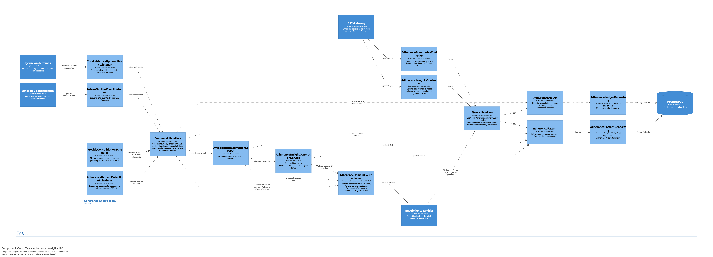

*Figura. Component Diagram (C4 Nivel 3) del Bounded Context Analítica de adherencia.*

#### 2.6.2.6. Bounded Context Software Architecture Code Level Diagrams

##### 2.6.2.6.1. Bounded Context Domain Layer Class Diagrams

El diagrama de clases del Domain Layer presenta dos aggregate roots independientes. `AdherenceLedger` mantiene, en relación de composición (1 a 0..*), el historial de `IntakeOutcomeRecord` y los periodos ya cerrados como `AdherencePeriodSnapshot`, cada uno con su `AdherenceSnapshot` calculado. `AdherencePattern` conserva un ciclo de vida propio, ya que un patrón detectado puede persistir, reforzarse, estimar su riesgo o dejar de tener evidencia suficiente independientemente de que continúen llegando nuevos resultados de tomas; sin embargo, referencia mediante identificador (`adherenceLedgerId`) al `AdherenceLedger` sobre el cual fue detectado, dejando explícita su trazabilidad sin que ambos agregados deban modificarse dentro de la misma transacción. `AdherencePattern` compone además los Value Objects `TimeSlot`, `Insight` y `Recommendation`, y utiliza la enumeración `OmissionRiskLevel`. Se incluyen `IAdherenceLedgerRepository`, `IAdherencePatternRepository`, `AdherenceTolerancePolicy`, `AdherencePatternDetectionService`, `OmissionRiskEstimationService` y `AdherenceInsightGenerationService`, manteniendo la lógica de clasificación, detección de patrones, estimación de riesgo y generación de insights independiente de PostgreSQL y de los procesos programados.

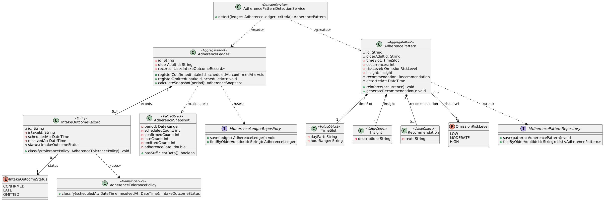

*Figura. Domain Layer Class Diagram del Bounded Context Analítica de adherencia.*

##### 2.6.2.6.2. Bounded Context Database Design Diagram

Las tablas de este Bounded Context se encuentran dentro de la misma instancia PostgreSQL utilizada por Tata, pero conservan la propiedad lógica de sus datos dentro de Analítica de adherencia. Las referencias `intake_id` y `older_adult_id` se mantienen como identificadores lógicos, sin foreign keys físicas hacia Ejecución de tomas, Omisión y escalamiento ni Vínculo de cuidado.

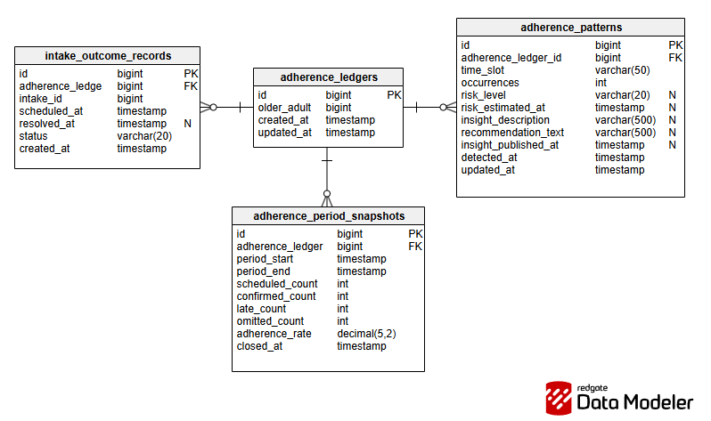

*Figura. Database Design Diagram del Bounded Context Analítica de adherencia.*

**ADHERENCE_LEDGERS**

| Columna | Descripción |
| --- | --- |
| id (PK) | Identificador único del historial acumulado |
| older_adult_id | Referencia lógica al adulto mayor (sin FK física) |
| created_at / updated_at | Fechas de auditoría |

**INTAKE_OUTCOME_RECORDS**

| Columna | Descripción |
| --- | --- |
| id (PK) | Identificador único del registro |
| adherence_ledger_id (FK → ADHERENCE_LEDGERS.id) | Historial al que pertenece |
| intake_id | Referencia lógica a la toma en Ejecución de tomas (sin FK física) |
| scheduled_at | Horario programado de la toma |
| resolved_at | Fecha de confirmación; nullable cuando la toma fue omitida |
| status | Clasificación: CONFIRMED, LATE u OMITTED |
| created_at | Fecha de registro |

**ADHERENCE_PERIOD_SNAPSHOTS**

| Columna | Descripción |
| --- | --- |
| id (PK) | Identificador único del periodo consolidado |
| adherence_ledger_id (FK → ADHERENCE_LEDGERS.id) | Historial al que pertenece |
| period_start / period_end | Rango del periodo semanal calculado |
| scheduled_count / confirmed_count / late_count / omitted_count | Conteos utilizados para el cálculo de la tasa |
| adherence_rate | Porcentaje de cumplimiento calculado para el periodo |
| closed_at | Fecha en la que se consolidó el periodo y se calculó la tasa |

**ADHERENCE_PATTERNS**

| Columna | Descripción |
| --- | --- |
| id (PK) | Identificador único del patrón |
| adherence_ledger_id (FK → ADHERENCE_LEDGERS.id) | Historial a partir del cual fue detectado el patrón |
| time_slot | Franja horaria recurrente asociada al patrón |
| occurrences | Número de ocurrencias que sustentan el patrón |
| risk_level | Estimación de riesgo: LOW, MODERATE o HIGH; nullable hasta que el patrón resulta relevante |
| risk_estimated_at | Fecha de estimación del riesgo; nullable |
| insight_description | Hallazgo obtenido a partir del análisis; nullable hasta que el riesgo resulta relevante |
| recommendation_text | Recomendación orientativa; nullable cuando no existe evidencia suficiente |
| insight_published_at | Fecha de publicación del insight; nullable |
| detected_at / updated_at | Fechas de detección y de última actualización |

Relaciones: ADHERENCE_LEDGERS (1) - (N) INTAKE_OUTCOME_RECORDS; ADHERENCE_LEDGERS (1) - (N) ADHERENCE_PERIOD_SNAPSHOTS; ADHERENCE_LEDGERS (1) - (N) ADHERENCE_PATTERNS. Aunque `AdherencePattern` conserva su propio ciclo de vida como aggregate root, la foreign key hacia `ADHERENCE_LEDGERS` deja explícita la trazabilidad del historial que originó cada patrón, sin que ambas tablas deban modificarse dentro de la misma transacción.

### 2.6.3. Bounded Context: Identidad y suscripción

El Bounded Context **Identidad y suscripción** (**Identity & Subscription BC**) concentra las responsabilidades relacionadas con la existencia, acceso y habilitación de las cuentas dentro de Tata. Se implementa como un módulo del backend único y administra el registro de cuentas, la verificación del correo del familiar, el acceso mediante credenciales, el PIN simplificado del adulto mayor y el estado de los planes y suscripciones asociados.

La cuenta del familiar permanece pendiente hasta completar la verificación de correo. Una vez cumplidas las condiciones de habilitación, el contexto publica el evento `AccountEnabled`, utilizado por Vínculo de cuidado para continuar con los procesos que requieren una cuenta habilitada y por Accesibilidad y preferencias para inicializar la configuración del usuario. El servicio externo de correo se mantiene aislado mediante un Anti-Corruption Layer. La gestión del consentimiento específico para establecer el vínculo entre familiar y adulto mayor permanece dentro de Vínculo de cuidado, evitando duplicar esa regla en este contexto.

#### 2.6.3.1. Domain Layer

**Sub-capa Model - Aggregates:**

| Tipo | Nombre | Propósito | Atributos / Métodos principales | Relación con otros elementos |
| --- | --- | --- | --- | --- |
| Aggregate Root | Account | Representar la cuenta de acceso a Tata y controlar su habilitación, credenciales y suscripciones | `id`, `type`, `status`, `email`, `emailVerification`, `credentials: List<AccessCredential>`, `subscriptions: List<Subscription>` - `requestEmailVerification()`, `verifyEmail()`, `enable()`, `registerCredential()`, `registerFailedAttempt()`, `activateSubscription()`, `changeSubscription()`, `hasCapability()` | Contiene EmailVerification, AccessCredential y Subscription; publica AccountEnabled cuando la cuenta queda habilitada |
| Aggregate Root | Plan | Representar una modalidad disponible de Tata y las capacidades habilitadas por ella | `id`, `code`, `name`, `status`, `capabilities: List<PlanCapability>` - `supports()`, `activate()`, `deactivate()` | Es referenciado por Subscription mediante `planId`; permite resolver las capacidades asociadas a una cuenta |
| Entity | EmailVerification | Mantener el ciclo de vida de una verificación de correo hasta su consumo o expiración | `id`, `tokenHash`, `expiresAt`, `verifiedAt` - `isValid()`, `verify()` | Entidad perteneciente a Account; se utiliza durante US-11 |
| Entity | AccessCredential | Representar una credencial de acceso y controlar intentos fallidos o bloqueo temporal | `id`, `type`, `secretHash`, `failedAttempts`, `lockedUntil` - `registerFailure()`, `resetFailures()`, `isLocked()` | Entidad perteneciente a Account; soporta el PIN del adulto mayor y las credenciales del familiar |
| Entity | Subscription | Representar la asociación vigente o histórica entre una cuenta y un plan | `id`, `planId`, `status`, `startedAt`, `changedAt` - `activate()`, `changePlan()`, `cancel()` | Entidad perteneciente a Account; referencia un Plan dentro del mismo Bounded Context |

**Sub-capa Model - Value Objects:**

| Tipo | Nombre | Propósito | Atributos / Métodos principales | Relación con otros elementos |
| --- | --- | --- | --- | --- |
| Value Object | EmailAddress | Encapsular una dirección de correo válida utilizada por las cuentas que requieren verificación | `value` - `isValid()` | Usado por Account |
| Value Object | PlanCapability | Representar una capacidad habilitada por un plan | `code`, `name` | Compuesto por Plan; consultado al verificar funcionalidades disponibles |
| Enumeration | AccountType | Diferenciar los tipos de cuenta utilizados por Tata | `FAMILY`, `OLDER_ADULT` | Usado por Account |
| Enumeration | AccountStatus | Representar el estado de habilitación de la cuenta | `PENDING_VERIFICATION`, `ENABLED`, `LOCKED`, `DISABLED` | Controla las operaciones permitidas sobre Account |
| Enumeration | CredentialType | Identificar el mecanismo de acceso asociado a una credencial | `PASSWORD`, `PIN` | Usado por AccessCredential |
| Enumeration | SubscriptionStatus | Representar el estado de una suscripción | `ACTIVE`, `INACTIVE`, `CANCELLED` | Usado por Subscription |
| Enumeration | PlanStatus | Representar la disponibilidad de un plan | `ACTIVE`, `INACTIVE` | Usado por Plan |

**Sub-capa Services y Repositories:**

| Tipo | Nombre | Propósito | Firma / Método principal | Relación con otros elementos |
| --- | --- | --- | --- | --- |
| Interface | IAccountRepository | Contrato de persistencia del agregado Account | `save(account)`, `findById(id): Account`, `findByEmail(email): Account` | Implementado en Infrastructure |
| Interface | IPlanRepository | Contrato de persistencia del catálogo de planes | `findById(id): Plan`, `findActive(): List<Plan>` | Implementado en Infrastructure |
| Factory | AccountFactory | Crear una cuenta familiar pendiente de verificación o una cuenta de adulto mayor preparada para registrar su credencial de acceso | `createFamily(email): Account`, `createOlderAdult(): Account` | Usado por RegisterFamilyAccountCommandHandler y los flujos de aprovisionamiento correspondientes |
| Domain Service | AccountAccessPolicy | Evaluar si una cuenta puede iniciar sesión considerando su estado y los bloqueos de seguridad | `canAuthenticate(account, now): boolean` | Consultado por los handlers de autenticación |

#### 2.6.3.2. Interface Layer

**Sub-capa REST - Resources:**

| Tipo | Nombre | Propósito |
| --- | --- | --- |
| Resource | RegisterFamilyAccountResource | Representar los datos necesarios para crear la cuenta del familiar (US-10) |
| Resource | VerifyEmailResource | Representar la verificación de correo del familiar (US-11) |
| Resource | SignInResource | Representar las credenciales utilizadas para iniciar una sesión |
| Resource | RegisterPinResource | Representar el PIN corto que el adulto mayor registra para acceder a Tata (US-01) |
| Resource | SubscriptionResource | Representar el plan y el estado de la suscripción de una cuenta (US-44) |
| Resource | ChangeSubscriptionResource | Representar la selección o cambio de plan solicitado por el familiar (US-45) |
| Resource | PlanResource | Representar un plan disponible y sus capacidades (TS-14) |

**Sub-capa REST - Transform:**

| Tipo | Nombre | Propósito |
| --- | --- | --- |
| Assembler | AccountResourceFromEntityAssembler | Convertir Account en la representación REST correspondiente |
| Assembler | RegisterFamilyAccountCommandFromResourceAssembler | Convertir RegisterFamilyAccountResource en RegisterFamilyAccountCommand |
| Assembler | VerifyEmailCommandFromResourceAssembler | Convertir VerifyEmailResource en VerifyEmailCommand |
| Assembler | ChangeSubscriptionCommandFromResourceAssembler | Convertir ChangeSubscriptionResource en ChangeSubscriptionCommand |
| Assembler | SubscriptionResourceFromEntityAssembler | Convertir la suscripción activa y su plan en SubscriptionResource |

**Sub-capa REST - Controllers:**

| Tipo | Nombre | Propósito |
| --- | --- | --- |
| Controller | AccountsController | Exponer operaciones de registro y verificación de cuentas (US-10, US-11), enrutadas desde el API Gateway |
| Controller | SessionsController | Exponer el inicio de sesión del familiar y la autenticación mediante PIN del adulto mayor (US-01, TS-01, TS-07) |
| Controller | SubscriptionsController | Exponer la consulta del plan actual, el catálogo disponible y la activación o cambio de suscripción (US-44, US-45, TS-14) |

Este Bounded Context no requiere Consumers de eventos provenientes de otros módulos en la versión actual. Su colaboración principal hacia otros contextos se produce mediante el evento `AccountEnabled`.

#### 2.6.3.3. Application Layer

**Sub-capa Internal - CommandServices:**

| Tipo | Nombre | Propósito |
| --- | --- | --- |
| CommandHandler | RegisterFamilyAccountCommandHandler | Crear una cuenta familiar en estado `PENDING_VERIFICATION` evitando correos duplicados (US-10, TS-07) |
| CommandHandler | VerifyEmailCommandHandler | Validar una verificación vigente, marcar el correo como verificado y habilitar la cuenta cuando corresponda (US-11) |
| CommandHandler | RegisterPinCommandHandler | Registrar de forma segura el PIN corto del adulto mayor habilitado (US-01) |
| CommandHandler | AuthenticateFamilyCommandHandler | Validar las credenciales de una cuenta familiar habilitada y solicitar una sesión válida (TS-07) |
| CommandHandler | AuthenticateWithPinCommandHandler | Validar el PIN del adulto mayor, controlar intentos fallidos y solicitar una sesión válida (US-01, TS-01) |
| CommandHandler | ChangeSubscriptionCommandHandler | Activar o cambiar el plan asociado a la cuenta y actualizar sus capacidades disponibles (US-45, TS-14) |

**Sub-capa Internal - QueryServices:**

| Tipo | Nombre | Propósito |
| --- | --- | --- |
| QueryHandler | GetAccountQueryHandler | Obtener la información necesaria de una cuenta autenticada |
| QueryHandler | GetCurrentSubscriptionQueryHandler | Obtener el plan, estado y capacidades de la suscripción actual (US-44) |
| QueryHandler | ListAvailablePlansQueryHandler | Obtener el catálogo de planes activos y sus capacidades (TS-14) |

**Sub-capa Internal - OutboundServices:**

| Tipo | Nombre | Propósito |
| --- | --- | --- |
| Service | IEmailVerificationPort | Puerto para solicitar el envío de mensajes de verificación sin acoplar el dominio al proveedor de correo |
| Service | ICredentialHashingPort | Puerto para generar y verificar representaciones seguras de credenciales sin exponer el mecanismo criptográfico al dominio |
| Service | ISessionTokenPort | Puerto para generar una sesión válida después de una autenticación satisfactoria |
| Service | IDomainEventPublisher | Puerto para publicar `AccountEnabled` dentro del mismo proceso; el evento es consumido por Vínculo de cuidado y Accesibilidad y preferencias |

#### 2.6.3.4. Infrastructure Layer

**Sub-capa Persistence (PostgreSQL):**

| Tipo | Nombre | Propósito |
| --- | --- | --- |
| Repository | AccountRepository | Implementación de IAccountRepository mediante Spring Data JPA; persiste Account junto con EmailVerification, AccessCredential y Subscription |
| Repository | PlanRepository | Implementación de IPlanRepository mediante Spring Data JPA; persiste el catálogo de Plan y sus PlanCapability |

**Sub-capa Security:**

| Tipo | Nombre | Propósito |
| --- | --- | --- |
| Adapter | CredentialHashingAdapter | Implementación de ICredentialHashingPort mediante el mecanismo de codificación configurado en Spring Security |
| Adapter | SessionTokenAdapter | Implementación de ISessionTokenPort; genera la representación de sesión utilizada por las aplicaciones móviles |

**Sub-capa External Services:**

| Tipo | Nombre | Propósito |
| --- | --- | --- |
| Adapter | EmailVerificationAdapter | Implementación de IEmailVerificationPort; actúa como Anti-Corruption Layer frente al servicio externo de correo y traduce el contrato del proveedor a los conceptos de verificación de Tata |

**Sub-capa Domain Events:**

| Tipo | Nombre | Propósito |
| --- | --- | --- |
| Publisher | IdentityDomainEventPublisher | Implementación de IDomainEventPublisher mediante eventos de aplicación en memoria; publica `AccountEnabled` para los módulos del mismo backend |

#### 2.6.3.5. Bounded Context Software Architecture Component Level Diagrams

El diagrama representa la descomposición interna del módulo **Identity & Subscription BC** dentro del container Backend. `AccountsController`, `SessionsController` y `SubscriptionsController` reciben las peticiones enrutadas por el API Gateway e invocan los Command/Query Handlers correspondientes. Estos operan sobre los agregados `Account` y `Plan` mediante `AccountRepository` y `PlanRepository`. La verificación de correo se realiza mediante `EmailVerificationAdapter`, que actúa como Anti-Corruption Layer frente al servicio externo de correo. La autenticación utiliza `CredentialHashingAdapter` y `SessionTokenAdapter`. Finalmente, `IdentityDomainEventPublisher` publica en memoria el evento `AccountEnabled`, consumido por Vínculo de cuidado y Accesibilidad y preferencias.

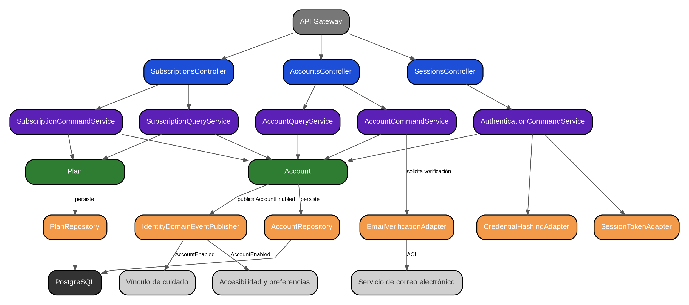

*Figura. Component Diagram (C4 Nivel 3) del Bounded Context Identidad y suscripción.*

#### 2.6.3.6. Bounded Context Software Architecture Code Level Diagrams

##### 2.6.3.6.1. Bounded Context Domain Layer Class Diagrams

El diagrama de clases del Domain Layer presenta a `Account` como aggregate root, en relaciones de composición con `EmailVerification`, `AccessCredential` y `Subscription`. `Account` utiliza los Value Objects y enumeraciones necesarios para representar el correo, el tipo de cuenta y su estado. `Plan` se mantiene como un segundo aggregate root porque su catálogo posee un ciclo de vida independiente y puede ser compartido por múltiples suscripciones. Se incluyen `IAccountRepository`, `IPlanRepository`, `AccountFactory` y `AccountAccessPolicy`, manteniendo la lógica de acceso y habilitación independiente de PostgreSQL, Spring Security y del proveedor externo de correo.

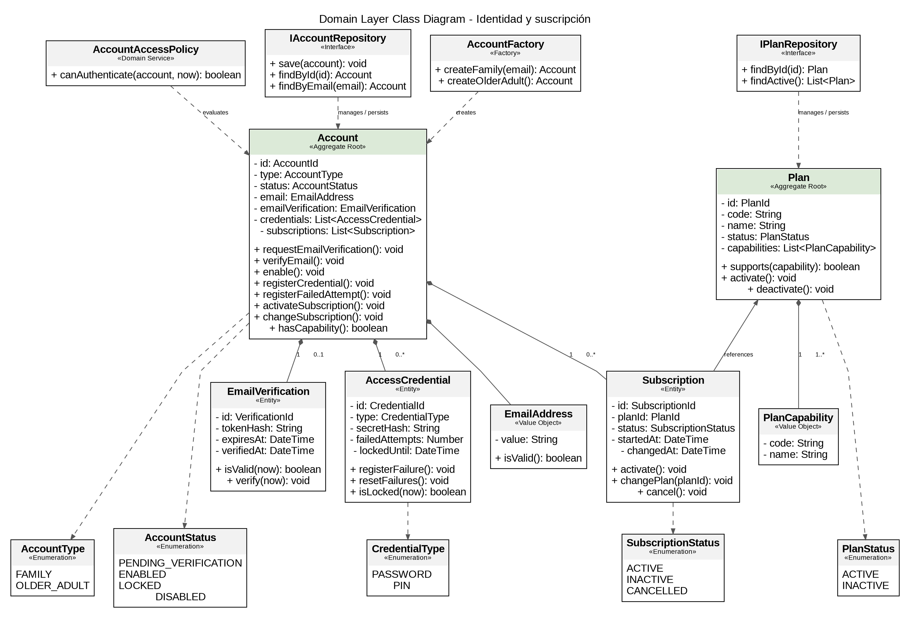

*Figura. Domain Layer Class Diagram del Bounded Context Identidad y suscripción.*

##### 2.6.3.6.2. Bounded Context Database Design Diagram

Las tablas de este Bounded Context se encuentran dentro de la misma instancia PostgreSQL utilizada por Tata, pero mantienen la propiedad lógica de sus datos dentro de Identidad y suscripción. No se definen foreign keys físicas hacia Vínculo de cuidado ni hacia otros módulos. Las integraciones externas de correo tampoco forman parte del esquema relacional.

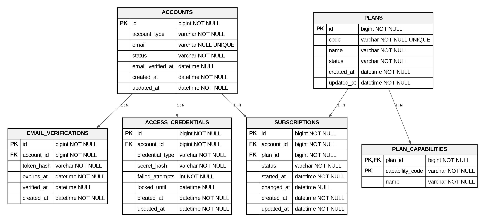

*Figura. Database Design Diagram del Bounded Context Identidad y suscripción.*

**ACCOUNTS**

| Columna | Descripción |
| --- | --- |
| id (PK) | Identificador único de la cuenta |
| account_type | Tipo de cuenta: FAMILY u OLDER_ADULT |
| email | Correo asociado cuando corresponde; nullable para cuentas que utilizan únicamente acceso simplificado |
| status | Estado: PENDING_VERIFICATION, ENABLED, LOCKED o DISABLED |
| email_verified_at | Fecha de verificación del correo; nullable |
| created_at / updated_at | Fechas de auditoría |

**EMAIL_VERIFICATIONS**

| Columna | Descripción |
| --- | --- |
| id (PK) | Identificador de la verificación |
| account_id (FK → ACCOUNTS.id) | Cuenta a la que pertenece |
| token_hash | Representación segura del token de verificación |
| expires_at | Fecha de expiración |
| verified_at | Fecha de consumo correcto; nullable |
| created_at | Fecha de creación |

**ACCESS_CREDENTIALS**

| Columna | Descripción |
| --- | --- |
| id (PK) | Identificador de la credencial |
| account_id (FK → ACCOUNTS.id) | Cuenta a la que pertenece |
| credential_type | PASSWORD o PIN |
| secret_hash | Representación segura de la credencial |
| failed_attempts | Número de intentos fallidos consecutivos |
| locked_until | Fecha hasta la cual el acceso permanece bloqueado; nullable |
| created_at / updated_at | Fechas de auditoría |

**PLANS**

| Columna | Descripción |
| --- | --- |
| id (PK) | Identificador del plan |
| code | Código único del plan |
| name | Nombre comercial |
| status | ACTIVE o INACTIVE |
| created_at / updated_at | Fechas de auditoría |

**PLAN_CAPABILITIES**

| Columna | Descripción |
| --- | --- |
| plan_id (PK, FK → PLANS.id) | Plan al que pertenece la capacidad |
| capability_code (PK) | Código de la capacidad habilitada |
| name | Nombre descriptivo de la capacidad |

**SUBSCRIPTIONS**

| Columna | Descripción |
| --- | --- |
| id (PK) | Identificador de la suscripción |
| account_id (FK → ACCOUNTS.id) | Cuenta propietaria |
| plan_id (FK → PLANS.id) | Plan asociado |
| status | ACTIVE, INACTIVE o CANCELLED |
| started_at | Fecha de activación |
| changed_at | Fecha del último cambio de plan; nullable |
| created_at / updated_at | Fechas de auditoría |

Relaciones: ACCOUNTS (1) - (N) EMAIL_VERIFICATIONS; ACCOUNTS (1) - (N) ACCESS_CREDENTIALS; ACCOUNTS (1) - (N) SUBSCRIPTIONS; PLANS (1) - (N) PLAN_CAPABILITIES; PLANS (1) - (N) SUBSCRIPTIONS.

### 2.6.4. Bounded Context: Vínculo de cuidado

El Bounded Context **Vínculo de cuidado** (**Care Link BC**) administra la relación autorizada entre un familiar o cuidador y un adulto mayor. Se implementa como un módulo dentro del backend único de Tata y concentra las reglas relacionadas con el registro del perfil del adulto mayor, la generación y vigencia del código de vinculación, la aceptación de la solicitud, el consentimiento, la confirmación del vínculo y la consulta de su estado.

Su responsabilidad comienza cuando un familiar con una cuenta habilitada registra el perfil del adulto mayor. A partir de este perfil puede generarse un `LinkingCode` temporal para iniciar la vinculación. El código solo puede utilizarse mientras se encuentre vigente y no haya sido consumido. La relación no se considera autorizada hasta que el adulto mayor registra su consentimiento y el vínculo queda confirmado. Una vez confirmado, otros Bounded Contexts pueden consultar si un familiar está autorizado para operar sobre un adulto mayor. Gestión del tratamiento utiliza esta capacidad antes de permitir la configuración de un tratamiento, mientras Seguimiento familiar puede consultar la relación y el contacto del adulto mayor.

#### 2.6.4.1. Domain Layer

**Sub-capa Model - Aggregates:**

| Tipo | Nombre | Propósito | Atributos / Métodos principales | Relación con otros elementos |
| --- | --- | --- | --- | --- |
| Aggregate Root | OlderAdultProfile | Representar el perfil de cuidado del adulto mayor registrado dentro de Tata | `id`, `registeredByCaregiverId`, `basicData`, `emergencyContact`, `createdAt` - `updateBasicData()`, `associateEmergencyContact()` | Es referenciado por CareLink mediante `olderAdultId`; conserva el contacto de emergencia |
| Aggregate Root | CareLink | Representar y proteger el ciclo de vida de la relación autorizada entre familiar y adulto mayor | `id`, `caregiverId`, `olderAdultId`, `status`, `linkingCode`, `consent`, `confirmedAt` - `generateCode()`, `accept()`, `registerConsent()`, `confirm()`, `isActive()` | Referencia lógicamente a las cuentas del familiar y adulto mayor; su estado es consultado por Gestión del tratamiento y Seguimiento familiar |

**Sub-capa Model - Value Objects:**

| Tipo | Nombre | Propósito | Atributos / Métodos principales | Relación con otros elementos |
| --- | --- | --- | --- | --- |
| Value Object | OlderAdultBasicData | Encapsular los datos básicos utilizados para crear el perfil de cuidado | `fullName`, `birthDate` | Usado por OlderAdultProfile |
| Value Object | LinkingCode | Encapsular el código temporal de vinculación y su vigencia | `value`, `expiresAt`, `usedAt` - `isValid(now)`, `markUsed()` | Usado por CareLink |
| Value Object | Consent | Representar la aceptación explícita del adulto mayor para establecer el vínculo | `accepted`, `recordedAt` - `isGranted()` | Usado por CareLink |
| Value Object | EmergencyContact | Encapsular la información de contacto disponible ante una situación que requiera mayor atención | `name`, `relationship`, `phone` | Usado por OlderAdultProfile |
| Enumeration | CareLinkStatus | Representar el estado de la relación de cuidado | `PENDING`, `AWAITING_CONSENT`, `CONFIRMED`, `REVOKED` | Controla las transiciones de CareLink |

**Sub-capa Services y Repositories:**

| Tipo | Nombre | Propósito | Firma / Método principal | Relación con otros elementos |
| --- | --- | --- | --- | --- |
| Factory | OlderAdultProfileFactory | Crear el perfil inicial de un adulto mayor asociado al familiar que realiza el registro | `create(caregiverId, basicData): OlderAdultProfile` | Usado por RegisterOlderAdultProfileCommandHandler |
| Factory | CareLinkFactory | Crear un vínculo pendiente entre un familiar y un adulto mayor | `createPending(caregiverId, olderAdultId): CareLink` | Usado por GenerateLinkingCodeCommandHandler |
| Domain Service | CareLinkConfirmationPolicy | Verificar que el código continúe vigente y que exista consentimiento antes de confirmar la relación | `canConfirm(careLink, now): boolean` | Consultado por ConfirmCareLinkCommandHandler |
| Interface | IOlderAdultProfileRepository | Contrato de persistencia del perfil del adulto mayor | `save(profile)`, `findById(id): OlderAdultProfile` | Implementado en Infrastructure |
| Interface | ICareLinkRepository | Contrato de persistencia del agregado CareLink | `save(link)`, `findById(id): CareLink`, `findByCode(code): CareLink`, `findActive(caregiverId, olderAdultId): CareLink` | Implementado en Infrastructure |
| Interface | IAccountStatusPort | Puerto para comprobar que la cuenta del familiar se encuentre habilitada antes de iniciar una vinculación | `isEnabled(userId): boolean` | Implementado en Infrastructure; consulta Identidad y suscripción dentro del mismo proceso |

#### 2.6.4.2. Interface Layer

**Sub-capa REST - Resources:**

| Tipo | Nombre | Propósito |
| --- | --- | --- |
| Resource | OlderAdultProfileResource | Representar el perfil de cuidado del adulto mayor |
| Resource | RegisterOlderAdultProfileResource | Representar la petición para registrar los datos básicos y el contacto de emergencia del adulto mayor |
| Resource | CareLinkResource | Representar el estado actual de un vínculo de cuidado |
| Resource | GenerateLinkingCodeResource | Representar la solicitud de generación de un código temporal |
| Resource | AcceptCareLinkResource | Representar la petición de aceptación de la vinculación mediante código |
| Resource | RegisterConsentResource | Representar la aceptación explícita del adulto mayor |

**Sub-capa REST - Transform:**

| Tipo | Nombre | Propósito |
| --- | --- | --- |
| Assembler | OlderAdultProfileResourceFromEntityAssembler | Convertir OlderAdultProfile en OlderAdultProfileResource |
| Assembler | CareLinkResourceFromEntityAssembler | Convertir CareLink en CareLinkResource |
| Assembler | RegisterOlderAdultProfileCommandFromResourceAssembler | Convertir RegisterOlderAdultProfileResource en RegisterOlderAdultProfileCommand |
| Assembler | AcceptCareLinkCommandFromResourceAssembler | Convertir AcceptCareLinkResource en AcceptCareLinkCommand |
| Assembler | RegisterConsentCommandFromResourceAssembler | Convertir RegisterConsentResource en RegisterConsentCommand |

**Sub-capa REST - Controllers:**

| Tipo | Nombre | Propósito |
| --- | --- | --- |
| Controller | OlderAdultsController | Exponer endpoints para registrar y consultar el perfil del adulto mayor, incluido su contacto de emergencia (US-12) |
| Controller | CareLinksController | Exponer endpoints para generar códigos, aceptar la vinculación, registrar consentimiento y consultar el estado del vínculo (US-02, US-13, TS-02) |

**Sub-capa Domain Event Listeners:**

| Tipo | Nombre | Propósito |
| --- | --- | --- |
| Consumer | AccountEnabledEventConsumer | Escuchar el evento `AccountEnabled` publicado por Identidad y suscripción como señal de que el usuario puede iniciar el proceso de vinculación |

La validación definitiva del estado de la cuenta se mantiene mediante `IAccountStatusPort`, evitando duplicar dentro de este Bounded Context el modelo completo de Identidad y suscripción.

#### 2.6.4.3. Application Layer

**Sub-capa Internal - CommandServices:**

| Tipo | Nombre | Propósito |
| --- | --- | --- |
| CommandHandler | RegisterOlderAdultProfileCommandHandler | Registrar el perfil de cuidado del adulto mayor y asociar, cuando corresponda, el contacto de emergencia (US-12) |
| CommandHandler | GenerateLinkingCodeCommandHandler | Crear un vínculo pendiente y generar un código temporal asociado al adulto mayor (US-02) |
| CommandHandler | AcceptCareLinkCommandHandler | Validar un código vigente y registrar la aceptación de la solicitud de vinculación (US-02, TS-02) |
| CommandHandler | RegisterConsentCommandHandler | Registrar el consentimiento explícito del adulto mayor (US-13) |
| CommandHandler | ConfirmCareLinkCommandHandler | Confirmar el vínculo cuando el código y el consentimiento cumplen las reglas de CareLinkConfirmationPolicy (US-02, US-13, TS-02) |
| CommandHandler | AssociateEmergencyContactCommandHandler | Asociar o actualizar el contacto de emergencia del perfil del adulto mayor (US-12) |

**Sub-capa Internal - QueryServices:**

| Tipo | Nombre | Propósito |
| --- | --- | --- |
| QueryHandler | GetCareLinkStatusQueryHandler | Consultar el estado actual de un vínculo |
| QueryHandler | ValidateActiveCareLinkQueryHandler | Verificar si un familiar posee un vínculo confirmado con un adulto mayor; es utilizado por Gestión del tratamiento |
| QueryHandler | GetOlderAdultContactQueryHandler | Recuperar el contacto de emergencia asociado al adulto mayor; puede ser utilizado por Seguimiento familiar |

**Sub-capa Internal - EventServices:**

| Tipo | Nombre | Propósito |
| --- | --- | --- |
| EventHandler | AccountEnabledEventHandler | Recibir `AccountEnabled` y habilitar el inicio del flujo de vinculación para el usuario sin importar el modelo interno de Identidad y suscripción |

**Sub-capa Internal - OutboundServices:**

| Tipo | Nombre | Propósito |
| --- | --- | --- |
| Service | IDomainEventPublisher | Puerto para publicar en memoria `OlderAdultProfileRegistered`, `LinkingCodeGenerated` y `CareLinkConfirmed` para los módulos interesados |

#### 2.6.4.4. Infrastructure Layer

**Sub-capa Persistence (PostgreSQL):**

| Tipo | Nombre | Propósito |
| --- | --- | --- |
| Repository | OlderAdultProfileRepository | Implementación de IOlderAdultProfileRepository mediante Spring Data JPA; persiste OlderAdultProfile y su contacto de emergencia |
| Repository | CareLinkRepository | Implementación de ICareLinkRepository mediante Spring Data JPA; persiste el vínculo, el código temporal, el consentimiento y su estado |

**Sub-capa Module Adapters:**

| Tipo | Nombre | Propósito |
| --- | --- | --- |
| Adapter | AccountStatusAdapter | Implementación de IAccountStatusPort; consulta directamente la interfaz pública del módulo Identidad y suscripción dentro del mismo proceso |

**Sub-capa Domain Events:**

| Tipo | Nombre | Propósito |
| --- | --- | --- |
| Listener | AccountEnabledEventListener | Registra AccountEnabledEventConsumer como manejador del evento en memoria publicado por Identidad y suscripción |
| Publisher | CareLinkDomainEventPublisher | Implementación de IDomainEventPublisher mediante eventos de aplicación en memoria; publica `OlderAdultProfileRegistered`, `LinkingCodeGenerated` y `CareLinkConfirmed` |

#### 2.6.4.5. Bounded Context Software Architecture Component Level Diagrams

El diagrama representa la descomposición interna del módulo **Care Link BC** dentro del container Backend. `OlderAdultsController` y `CareLinksController` reciben las peticiones enrutadas por el API Gateway y activan los Command/Query Handlers correspondientes. `AccountEnabledEventListener` recibe el evento publicado por Identidad y suscripción y lo entrega a `AccountEnabledEventConsumer`. Los casos de uso operan sobre los agregados `OlderAdultProfile` y `CareLink` mediante sus respectivos repositories. `AccountStatusAdapter` consulta el estado autorizado de la cuenta en Identidad y suscripción, mientras `CareLinkDomainEventPublisher` publica en memoria `CareLinkConfirmed`. La interfaz pública de consulta del BC es utilizada por Gestión del tratamiento para validar un vínculo activo y por Seguimiento familiar para recuperar la relación y el contacto del adulto mayor.

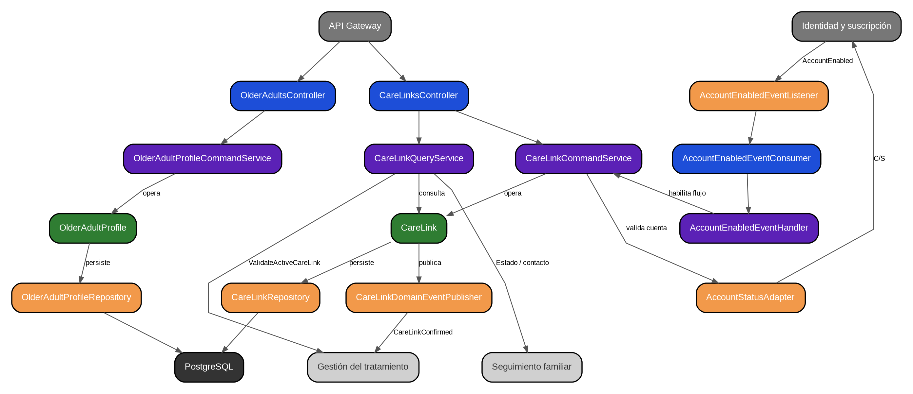

*Figura. Component Diagram (C4 Nivel 3) del Bounded Context Vínculo de cuidado.*

#### 2.6.4.6. Bounded Context Software Architecture Code Level Diagrams

##### 2.6.4.6.1. Bounded Context Domain Layer Class Diagrams

El diagrama de clases del Domain Layer presenta a `OlderAdultProfile` y `CareLink` como aggregate roots con ciclos de vida independientes dentro del mismo Bounded Context. `OlderAdultProfile` utiliza `OlderAdultBasicData` y `EmergencyContact`, mientras `CareLink` utiliza `LinkingCode`, `Consent` y `CareLinkStatus` para controlar el proceso de vinculación. Se incluyen además `IOlderAdultProfileRepository`, `ICareLinkRepository`, `IAccountStatusPort`, `OlderAdultProfileFactory`, `CareLinkFactory` y `CareLinkConfirmationPolicy`, manteniendo las reglas del vínculo independientes de PostgreSQL y del modelo interno de Identidad y suscripción.

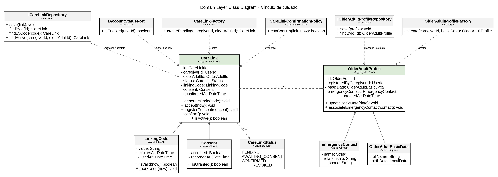

*Figura. Domain Layer Class Diagram del Bounded Context Vínculo de cuidado.*

##### 2.6.4.6.2. Bounded Context Database Design Diagram

Aunque la persistencia de Tata comparte una misma instancia de PostgreSQL, `registered_by_caregiver_id` y `caregiver_id` se conservan como referencias lógicas sin foreign keys físicas hacia Identidad y suscripción. Las foreign keys se utilizan únicamente entre tablas propias de Vínculo de cuidado, preservando el aislamiento lógico entre Bounded Contexts.

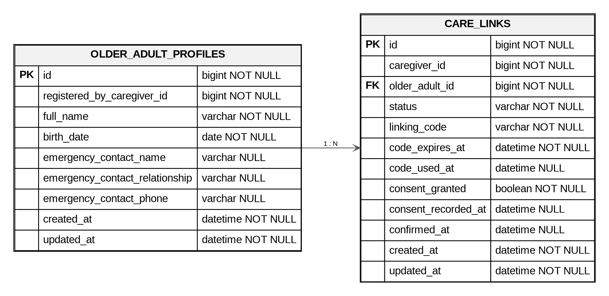

*Figura. Database Design Diagram del Bounded Context Vínculo de cuidado.*

**OLDER_ADULT_PROFILES**

| Columna | Descripción |
| --- | --- |
| id (PK) | Identificador único del perfil del adulto mayor |
| registered_by_caregiver_id | Identificador lógico del familiar que registró el perfil, sin FK física hacia Identidad y suscripción |
| full_name | Nombre del adulto mayor utilizado en su perfil de cuidado |
| birth_date | Fecha de nacimiento registrada en el perfil |
| emergency_contact_name | Nombre del contacto de emergencia; nullable |
| emergency_contact_relationship | Relación del contacto con el adulto mayor; nullable |
| emergency_contact_phone | Número de contacto disponible; nullable |
| created_at / updated_at | Fechas de auditoría |

**CARE_LINKS**

| Columna | Descripción |
| --- | --- |
| id (PK) | Identificador único del vínculo de cuidado |
| caregiver_id | Identificador lógico del familiar o cuidador, sin FK física hacia Identidad y suscripción |
| older_adult_id (FK → OLDER_ADULT_PROFILES.id) | Perfil del adulto mayor asociado al vínculo |
| status | Estado del vínculo: PENDING, AWAITING_CONSENT, CONFIRMED o REVOKED |
| linking_code | Código temporal utilizado para iniciar la vinculación |
| code_expires_at | Fecha y hora de expiración del código |
| code_used_at | Fecha y hora de utilización del código; nullable |
| consent_granted | Indica si el adulto mayor otorgó consentimiento |
| consent_recorded_at | Fecha y hora de registro del consentimiento; nullable |
| confirmed_at | Fecha y hora de confirmación del vínculo; nullable |
| created_at / updated_at | Fechas de auditoría |

Relación: OLDER_ADULT_PROFILES (1) - (N) CARE_LINKS.

### 2.6.5. Bounded Context: Gestión del tratamiento

Siguiendo el modelo de arquitectura **Clean Architecture** combinado con **Domain-Driven Design**, este Bounded Context (**Treatment Management BC**) se organiza en las capas Domain, Interface, Application e Infrastructure, y se implementa como un módulo dentro del backend único de Tata (sección 2.5.3.2). Gestión del tratamiento es responsable de definir la pauta operativa del adulto mayor: qué medicamentos debe tomar, en qué dosis, con qué frecuencia, en qué horarios y bajo qué instrucciones, además de la configuración de sus recordatorios (ver Bounded Context Canvas, sección 2.5.1.3). Su responsabilidad culmina en decidir cuándo un tratamiento queda completamente configurado y puede activarse; no administra la ejecución de cada toma individual, responsabilidad que pertenece a Ejecución de tomas, a quien notifica mediante el evento **Tratamiento activado**.

#### 2.6.5.1. Domain Layer

**Sub-capa Model - Aggregates:**

| Tipo | Nombre | Propósito | Atributos / Métodos principales | Relación con otros elementos |
| --- | --- | --- | --- | --- |
| Aggregate Root | Treatment | Representar la pauta completa de un adulto mayor y garantizar que solo se active cuando su configuración esté completa | `id`, `olderAdultId`, `status` (Draft / Active / Paused), `medications: List<Medication>` - `addMedication()`, `activate()`, `pause()`, `isComplete()` | Contiene entidades Medication; referencia al adulto mayor por identificador (Vínculo de cuidado) |
| Entity | Medication | Representar un medicamento y su pauta de administración dentro de un tratamiento | `id`, `name`, `dose: Dose`, `frequency: Frequency`, `intakeTimes: List<IntakeTime>`, `instructions: Instructions`, `reminderConfig: ReminderConfig`, `active` - `updateDose()`, `updateSchedule()`, `deactivate()` | Entidad hija de Treatment; sus datos alimentan a Ejecución de tomas cuando el tratamiento se activa |

**Sub-capa Model - Value Objects:**

| Tipo | Nombre | Propósito | Atributos principales | Relación con otros elementos |
| --- | --- | --- | --- | --- |
| Value Object | Dose | Encapsular la cantidad y unidad de una dosis | `amount`, `unit` | Usado en Medication |
| Value Object | Frequency | Encapsular la periodicidad de una toma | `timesPerDay`, `intervalHours` | Usado en Medication |
| Value Object | IntakeTime | Representar un horario programado de toma | `hour`, `minute` | Usado en Medication (colección) |
| Value Object | Instructions | Encapsular las indicaciones de administración | `text` | Usado en Medication |
| Value Object | ReminderConfig | Encapsular la configuración de recordatorio de un medicamento | `enabled`, `leadTimeMinutes`, `notificationChannel` | Referencia conceptos del Shared Kernel Accesibilidad y preferencias (canal de notificación) |

**Sub-capa Services y Repositories:**

| Tipo | Nombre | Propósito | Firma / Método principal | Relación con otros elementos |
| --- | --- | --- | --- | --- |
| Interface | ICareLinkVerificationPort | Puerto de dominio para verificar que el familiar solicitante posea un vínculo de cuidado activo con el adulto mayor | `isAuthorized(familiarId, olderAdultId): boolean` | Implementado en Infrastructure; invoca en el mismo proceso a Vínculo de cuidado (relación Customer/Supplier, sección 2.5.2) |
| Factory | TreatmentFactory | Crear un nuevo Treatment en estado Draft asociado a un adulto mayor | `createDraft(olderAdultId): Treatment` | Usado por CreateTreatmentCommandHandler |
| Interface | ITreatmentRepository | Contrato de persistencia para el agregado Treatment | `save(treatment)`, `findById(id): Treatment`, `findByOlderAdultId(id): List<Treatment>` | Implementado en la capa Infrastructure |

#### 2.6.5.2. Interface Layer

**Sub-capa REST - Resources:**

| Tipo | Nombre | Propósito |
| --- | --- | --- |
| Resource | TreatmentResource | Representar un tratamiento completo con sus medicamentos para el cliente |
| Resource | CreateTreatmentResource | Representar la petición para crear un tratamiento |
| Resource | RegisterMedicationResource | Representar la petición para registrar un medicamento (dosis, frecuencia, horarios, instrucciones) |
| Resource | ConfigureReminderResource | Representar la petición para configurar los recordatorios de un medicamento |

**Sub-capa REST - Transform:**

| Tipo | Nombre | Propósito |
| --- | --- | --- |
| Assembler | TreatmentResourceFromEntityAssembler | Convertir la entidad Treatment en TreatmentResource |
| Assembler | CreateTreatmentCommandFromResourceAssembler | Convertir CreateTreatmentResource en CreateTreatmentCommand |
| Assembler | RegisterMedicationCommandFromResourceAssembler | Convertir RegisterMedicationResource en RegisterMedicationCommand |

**Sub-capa REST - Controllers:**

| Tipo | Nombre | Propósito |
| --- | --- | --- |
| Controller | TreatmentsController | Exponer endpoints para crear, consultar, activar y pausar tratamientos (US-14, US-18, US-19), enrutados desde el API Gateway hacia este módulo |
| Controller | MedicationsController | Exponer endpoints para registrar, editar, desactivar y configurar medicamentos (US-03, US-04, US-15, US-16, US-17) |

Este Bounded Context no requiere Consumers de eventos en esta versión, ya que no reacciona a eventos publicados por otros módulos; únicamente invoca de forma síncrona y en el mismo proceso al módulo Vínculo de cuidado mediante `ICareLinkVerificationPort` (no existe bus de mensajes externo en la arquitectura actual, sección 2.5.3.2).

#### 2.6.5.3. Application Layer

**Sub-capa Internal - CommandServices:**

| Tipo | Nombre | Propósito |
| --- | --- | --- |
| CommandHandler | CreateTreatmentCommandHandler | Crear un tratamiento en estado Draft (US-14) |
| CommandHandler | RegisterMedicationCommandHandler | Registrar un medicamento dentro de un tratamiento (US-03) |
| CommandHandler | EditMedicationCommandHandler | Editar los datos de un medicamento (US-04) |
| CommandHandler | DeactivateMedicationCommandHandler | Desactivar un medicamento sin perder su historial (US-04) |
| CommandHandler | DefineDoseAndFrequencyCommandHandler | Definir dosis y frecuencia de un medicamento (US-15) |
| CommandHandler | ConfigureScheduleCommandHandler | Configurar horarios e instrucciones de un medicamento (US-16) |
| CommandHandler | ConfigureRemindersCommandHandler | Configurar los recordatorios de un tratamiento (US-17) |
| CommandHandler | ActivateTreatmentCommandHandler | Activar un tratamiento validando `isComplete()` y publicar el evento de dominio `TreatmentActivated` (US-18) |
| CommandHandler | PauseTreatmentCommandHandler | Pausar un tratamiento activo sin eliminar su historial (US-18) |

**Sub-capa Internal - QueryServices:**

| Tipo | Nombre | Propósito |
| --- | --- | --- |
| QueryHandler | GetTreatmentDetailQueryHandler | Obtener el detalle completo de un tratamiento (US-19) |

**Sub-capa Internal - OutboundServices:**

| Tipo | Nombre | Propósito |
| --- | --- | --- |
| Service | IDomainEventPublisher | Puerto para publicar el evento de dominio `TreatmentActivated` dentro del mismo proceso; según el Domain Message Flow de la sección 2.5.1.2, es consumido por el módulo Ejecución de tomas para programar las tomas correspondientes |

#### 2.6.5.4. Infrastructure Layer

**Sub-capa Persistence (PostgreSQL):**

| Tipo | Nombre | Propósito |
| --- | --- | --- |
| Repository | TreatmentRepository | Implementación de ITreatmentRepository (Spring Data JPA); persiste el agregado Treatment junto con sus entidades Medication en la base de datos PostgreSQL central, en las tablas propias de este Bounded Context |

**Sub-capa Module Adapters:**

| Tipo | Nombre | Propósito |
| --- | --- | --- |
| Adapter | CareLinkVerificationAdapter | Implementación de ICareLinkVerificationPort; invoca directamente, dentro del mismo proceso, la interfaz pública expuesta por el módulo Vínculo de cuidado |

**Sub-capa Domain Events:**

| Tipo | Nombre | Propósito |
| --- | --- | --- |
| Publisher | TreatmentDomainEventPublisher | Implementación de IDomainEventPublisher mediante el mecanismo de eventos de aplicación en memoria (por ejemplo, `ApplicationEventPublisher` de Spring); publica `TreatmentActivated` para que otros módulos del mismo backend lo escuchen |

### 2.6.5. Bounded Context: Gestión del tratamiento

Siguiendo el modelo de arquitectura **Clean Architecture** combinado con **Domain-Driven Design**, este Bounded Context (**Treatment Management BC**) se organiza en las capas Domain, Interface, Application e Infrastructure, y se implementa como un módulo dentro del backend único de Tata (sección 2.5.3.2). Gestión del tratamiento es responsable de definir la pauta operativa del adulto mayor: qué medicamentos debe tomar, en qué dosis, con qué frecuencia, en qué horarios y bajo qué instrucciones, además de la configuración de sus recordatorios (ver Bounded Context Canvas, sección 2.5.1.3). Su responsabilidad culmina en decidir cuándo un tratamiento queda completamente configurado y puede activarse; no administra la ejecución de cada toma individual, responsabilidad que pertenece a Ejecución de tomas, a quien notifica mediante el evento **Tratamiento activado**.

#### 2.6.5.1. Domain Layer

**Sub-capa Model - Aggregates:**

| Tipo | Nombre | Propósito | Atributos / Métodos principales | Relación con otros elementos |
| --- | --- | --- | --- | --- |
| Aggregate Root | Treatment | Representar la pauta completa de un adulto mayor y garantizar que solo se active cuando su configuración esté completa | `id`, `olderAdultId`, `status` (Draft / Active / Paused), `medications: List<Medication>` - `addMedication()`, `activate()`, `pause()`, `isComplete()` | Contiene entidades Medication; referencia al adulto mayor por identificador (Vínculo de cuidado) |
| Entity | Medication | Representar un medicamento y su pauta de administración dentro de un tratamiento | `id`, `name`, `dose: Dose`, `frequency: Frequency`, `intakeTimes: List<IntakeTime>`, `instructions: Instructions`, `reminderConfig: ReminderConfig`, `active` - `updateDose()`, `updateSchedule()`, `deactivate()` | Entidad hija de Treatment; sus datos alimentan a Ejecución de tomas cuando el tratamiento se activa |

**Sub-capa Model - Value Objects:**

| Tipo | Nombre | Propósito | Atributos principales | Relación con otros elementos |
| --- | --- | --- | --- | --- |
| Value Object | Dose | Encapsular la cantidad y unidad de una dosis | `amount`, `unit` | Usado en Medication |
| Value Object | Frequency | Encapsular la periodicidad de una toma | `timesPerDay`, `intervalHours` | Usado en Medication |
| Value Object | IntakeTime | Representar un horario programado de toma | `hour`, `minute` | Usado en Medication (colección) |
| Value Object | Instructions | Encapsular las indicaciones de administración | `text` | Usado en Medication |
| Value Object | ReminderConfig | Encapsular la configuración de recordatorio de un medicamento | `enabled`, `leadTimeMinutes`, `notificationChannel` | Referencia conceptos del Shared Kernel Accesibilidad y preferencias (canal de notificación) |

**Sub-capa Services y Repositories:**

| Tipo | Nombre | Propósito | Firma / Método principal | Relación con otros elementos |
| --- | --- | --- | --- | --- |
| Interface | ICareLinkVerificationPort | Puerto de dominio para verificar que el familiar solicitante posea un vínculo de cuidado activo con el adulto mayor | `isAuthorized(familiarId, olderAdultId): boolean` | Implementado en Infrastructure; invoca en el mismo proceso a Vínculo de cuidado (relación Customer/Supplier, sección 2.5.2) |
| Factory | TreatmentFactory | Crear un nuevo Treatment en estado Draft asociado a un adulto mayor | `createDraft(olderAdultId): Treatment` | Usado por CreateTreatmentCommandHandler |
| Interface | ITreatmentRepository | Contrato de persistencia para el agregado Treatment | `save(treatment)`, `findById(id): Treatment`, `findByOlderAdultId(id): List<Treatment>` | Implementado en la capa Infrastructure |

#### 2.6.5.2. Interface Layer

**Sub-capa REST - Resources:**

| Tipo | Nombre | Propósito |
| --- | --- | --- |
| Resource | TreatmentResource | Representar un tratamiento completo con sus medicamentos para el cliente |
| Resource | CreateTreatmentResource | Representar la petición para crear un tratamiento |
| Resource | RegisterMedicationResource | Representar la petición para registrar un medicamento (dosis, frecuencia, horarios, instrucciones) |
| Resource | ConfigureReminderResource | Representar la petición para configurar los recordatorios de un medicamento |

**Sub-capa REST - Transform:**

| Tipo | Nombre | Propósito |
| --- | --- | --- |
| Assembler | TreatmentResourceFromEntityAssembler | Convertir la entidad Treatment en TreatmentResource |
| Assembler | CreateTreatmentCommandFromResourceAssembler | Convertir CreateTreatmentResource en CreateTreatmentCommand |
| Assembler | RegisterMedicationCommandFromResourceAssembler | Convertir RegisterMedicationResource en RegisterMedicationCommand |

**Sub-capa REST - Controllers:**

| Tipo | Nombre | Propósito |
| --- | --- | --- |
| Controller | TreatmentsController | Exponer endpoints para crear, consultar, activar y pausar tratamientos (US-14, US-18, US-19), enrutados desde el API Gateway hacia este módulo |
| Controller | MedicationsController | Exponer endpoints para registrar, editar, desactivar y configurar medicamentos (US-03, US-04, US-15, US-16, US-17) |

Este Bounded Context no requiere Consumers de eventos en esta versión, ya que no reacciona a eventos publicados por otros módulos; únicamente invoca de forma síncrona y en el mismo proceso al módulo Vínculo de cuidado mediante `ICareLinkVerificationPort` (no existe bus de mensajes externo en la arquitectura actual, sección 2.5.3.2).

#### 2.6.5.3. Application Layer

**Sub-capa Internal - CommandServices:**

| Tipo | Nombre | Propósito |
| --- | --- | --- |
| CommandHandler | CreateTreatmentCommandHandler | Crear un tratamiento en estado Draft (US-14) |
| CommandHandler | RegisterMedicationCommandHandler | Registrar un medicamento dentro de un tratamiento (US-03) |
| CommandHandler | EditMedicationCommandHandler | Editar los datos de un medicamento (US-04) |
| CommandHandler | DeactivateMedicationCommandHandler | Desactivar un medicamento sin perder su historial (US-04) |
| CommandHandler | DefineDoseAndFrequencyCommandHandler | Definir dosis y frecuencia de un medicamento (US-15) |
| CommandHandler | ConfigureScheduleCommandHandler | Configurar horarios e instrucciones de un medicamento (US-16) |
| CommandHandler | ConfigureRemindersCommandHandler | Configurar los recordatorios de un tratamiento (US-17) |
| CommandHandler | ActivateTreatmentCommandHandler | Activar un tratamiento validando `isComplete()` y publicar el evento de dominio `TreatmentActivated` (US-18) |
| CommandHandler | PauseTreatmentCommandHandler | Pausar un tratamiento activo sin eliminar su historial (US-18) |

**Sub-capa Internal - QueryServices:**

| Tipo | Nombre | Propósito |
| --- | --- | --- |
| QueryHandler | GetTreatmentDetailQueryHandler | Obtener el detalle completo de un tratamiento (US-19) |

**Sub-capa Internal - OutboundServices:**

| Tipo | Nombre | Propósito |
| --- | --- | --- |
| Service | IDomainEventPublisher | Puerto para publicar el evento de dominio `TreatmentActivated` dentro del mismo proceso; según el Domain Message Flow de la sección 2.5.1.2, es consumido por el módulo Ejecución de tomas para programar las tomas correspondientes |

#### 2.6.5.4. Infrastructure Layer

**Sub-capa Persistence (PostgreSQL):**

| Tipo | Nombre | Propósito |
| --- | --- | --- |
| Repository | TreatmentRepository | Implementación de ITreatmentRepository (Spring Data JPA); persiste el agregado Treatment junto con sus entidades Medication en la base de datos PostgreSQL central, en las tablas propias de este Bounded Context |

**Sub-capa Module Adapters:**

| Tipo | Nombre | Propósito |
| --- | --- | --- |
| Adapter | CareLinkVerificationAdapter | Implementación de ICareLinkVerificationPort; invoca directamente, dentro del mismo proceso, la interfaz pública expuesta por el módulo Vínculo de cuidado |

**Sub-capa Domain Events:**

| Tipo | Nombre | Propósito |
| --- | --- | --- |
| Publisher | TreatmentDomainEventPublisher | Implementación de IDomainEventPublisher mediante el mecanismo de eventos de aplicación en memoria (por ejemplo, `ApplicationEventPublisher` de Spring); publica `TreatmentActivated` para que otros módulos del mismo backend lo escuchen |

#### 2.6.5.5. Bounded Context Software Architecture Component Level Diagrams

El diagrama representa la descomposición interna del módulo **Treatment Management BC** dentro del container Backend, mostrando cómo `TreatmentsController` y `MedicationsController` reciben las peticiones enrutadas por el API Gateway, invocan a los Command/Query Handlers de la capa Application, estos operan sobre el agregado `Treatment` (capa Domain) a través de `TreatmentRepository`, y cómo `CareLinkVerificationAdapter` invoca en el mismo proceso al módulo Vínculo de cuidado. Se incluye también la publicación en memoria del evento `TreatmentActivated`, consumido por Ejecución de tomas.

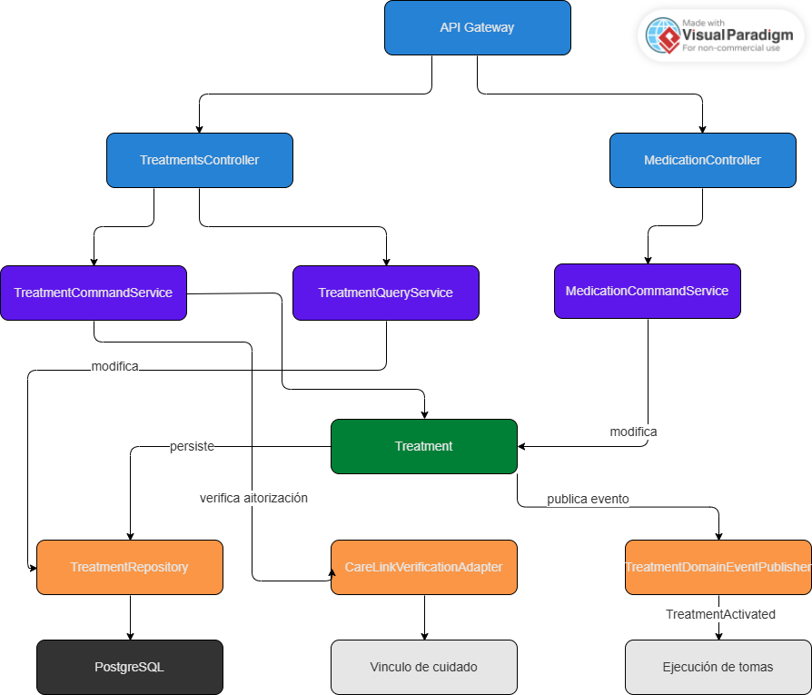

*Figura. Component Diagram (C4 Nivel 3) del Bounded Context Gestión del tratamiento.*

#### 2.6.5.6. Bounded Context Software Architecture Code Level Diagrams

##### 2.6.5.6.1. Bounded Context Domain Layer Class Diagrams

El diagrama de clases del Domain Layer muestra a `Treatment` como aggregate root en una relación de composición (1 a 0..*) con la entidad `Medication`, la cual a su vez compone los Value Objects `Dose`, `Frequency`, `IntakeTime` (0..*), `Instructions` y `ReminderConfig`. Se incluyen además la enumeración `TreatmentStatus`, la interfaz `ITreatmentRepository` (que gestiona la persistencia del agregado) y la interfaz `ICareLinkVerificationPort`, junto con `TreatmentFactory` como responsable de la creación de nuevos tratamientos.

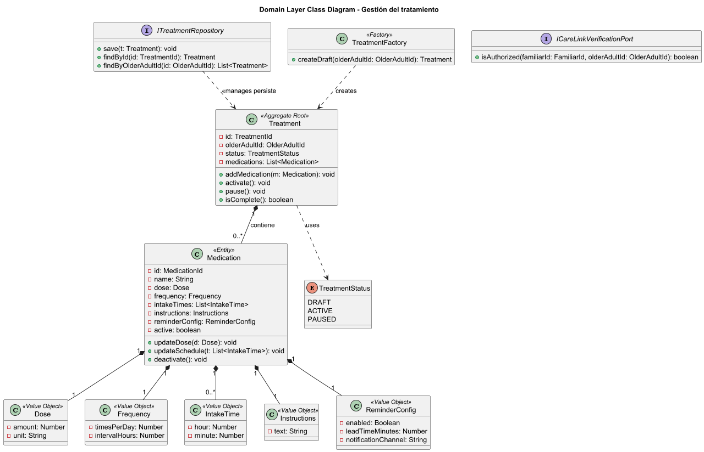

*Figura. Domain Layer Class Diagram del Bounded Context Gestión del tratamiento.*

##### 2.6.5.6.2. Bounded Context Database Design Diagram

Aunque toda la persistencia comparte la misma instancia de PostgreSQL (sección 2.5.3.2), las tablas de este Bounded Context no definen foreign keys físicas hacia tablas de otros módulos (por ejemplo, hacia el adulto mayor de Vínculo de cuidado); esa referencia se conserva únicamente como un identificador, para no acoplar los módulos a nivel de esquema.

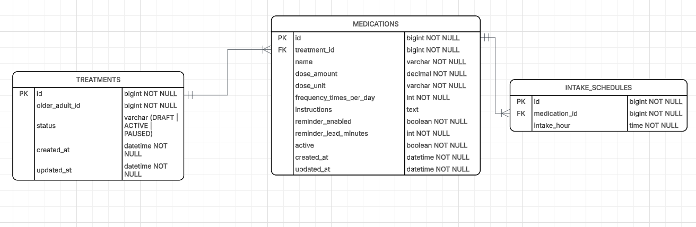

*Figura. Database Design Diagram del Bounded Context Gestión del tratamiento.*

**TREATMENTS**

| Columna | Descripción |
| --- | --- |
| id (PK) | Identificador único del tratamiento |
| older_adult_id | Identificador del adulto mayor propietario del tratamiento (referencia lógica al Bounded Context Vínculo de cuidado, sin FK física) |
| status | Estado del tratamiento: DRAFT, ACTIVE o PAUSED |
| created_at / updated_at | Fechas de auditoría |

**MEDICATIONS**

| Columna | Descripción |
| --- | --- |
| id (PK) | Identificador único del medicamento |
| treatment_id (FK → TREATMENTS.id) | Tratamiento al que pertenece el medicamento |
| name | Nombre del medicamento |
| dose_amount / dose_unit | Cantidad y unidad de la dosis |
| frequency_times_per_day | Número de tomas al día |
| instructions | Indicaciones de administración |
| reminder_enabled / reminder_lead_minutes | Configuración del recordatorio |
| active | Indica si el medicamento está activo |
| created_at / updated_at | Fechas de auditoría |

**INTAKE_SCHEDULES**

| Columna | Descripción |
| --- | --- |
| id (PK) | Identificador único del horario |
| medication_id (FK → MEDICATIONS.id) | Medicamento al que pertenece el horario |
| intake_hour | Hora programada de la toma |

Relaciones: TREATMENTS (1) - (N) MEDICATIONS; MEDICATIONS (1) - (N) INTAKE_SCHEDULES.

### 2.6.6. Bounded Context: Inventario y reposición

Inventario y reposición (**Inventory & Replenishment BC**) administra la disponibilidad física de los medicamentos definidos en Gestión del tratamiento y las acciones necesarias para mantener la continuidad del tratamiento del adulto mayor (ver Bounded Context Canvas, sección 2.5.1.3). Se implementa igualmente como un módulo dentro del backend único de Tata. Su responsabilidad inicia cuando se registra el stock de un medicamento y continúa detectando cuándo dicho stock se aproxima al umbral de reposición, hasta registrar una reposición y actualizar el stock disponible.

#### 2.6.6.1. Domain Layer

**Sub-capa Model - Aggregates:**

| Tipo | Nombre | Propósito | Atributos / Métodos principales | Relación con otros elementos |
| --- | --- | --- | --- | --- |
| Aggregate Root | Inventory | Mantener el stock disponible de un medicamento y decidir cuándo se encuentra en estado de stock bajo | `id`, `medicationId`, `remainingStock`, `replenishmentThreshold`, `batches: List<Batch>` - `registerBatch()`, `consumeUnit()`, `isLowStock()` | Referencia a Medication (Gestión del tratamiento) por identificador; contiene entidades Batch |
| Entity | Batch | Representar un lote de unidades incorporado en una reposición | `id`, `quantity`, `registeredAt` | Entidad hija de Inventory |

**Sub-capa Model - Value Objects:**

| Tipo | Nombre | Propósito | Atributos / Métodos principales | Relación con otros elementos |
| --- | --- | --- | --- | --- |
| Value Object | StockLevel | Encapsular la comparación entre el stock restante y el umbral de reposición | `remaining`, `threshold` - `isLow(): boolean` | Usado dentro de Inventory |

**Sub-capa Services y Repositories:**

| Tipo | Nombre | Propósito | Firma / Método principal | Relación con otros elementos |
| --- | --- | --- | --- | --- |
| Factory | InventoryFactory | Crear un nuevo Inventory en cero para un medicamento existente | `createEmpty(medicationId): Inventory` | Usado por RegisterInitialInventoryCommandHandler |
| Interface | IInventoryRepository | Contrato de persistencia para el agregado Inventory | `save(inventory)`, `findByMedicationId(id): Inventory` | Implementado en la capa Infrastructure |

#### 2.6.6.2. Interface Layer

**Sub-capa REST - Resources, Transform y Controllers:**

| Tipo | Nombre | Propósito |
| --- | --- | --- |
| Resource | InventoryResource | Representar el estado de inventario de un medicamento para el cliente |
| Resource | RegisterReplenishmentResource | Representar la petición para registrar una reposición |
| Assembler | InventoryResourceFromEntityAssembler | Convertir Inventory en InventoryResource |
| Assembler | RegisterReplenishmentCommandFromResourceAssembler | Convertir RegisterReplenishmentResource en RegisterReplenishmentCommand |
| Controller | InventoryController | Exponer endpoints para registrar inventario inicial, consultar stock y registrar reposiciones (US-40, US-41, US-43) |

**Sub-capa Domain Event Listeners:**

| Tipo | Nombre | Propósito |
| --- | --- | --- |
| Consumer | IntakeConfirmedEventConsumer | Escuchar, dentro del mismo proceso, el evento de dominio `IntakeConfirmed` publicado por Ejecución de tomas para descontar una unidad del stock |

El registro inicial del inventario (US-40) no se modela como reacción automática a un evento de Gestión del tratamiento, sino como una acción explícita del familiar sobre un medicamento ya existente, tal como lo describe la historia de usuario; por ello `InventoryController` la expone directamente como comando y no como Consumer.

#### 2.6.6.3. Application Layer

**Sub-capa Internal - CommandServices:**

| Tipo | Nombre | Propósito |
| --- | --- | --- |
| CommandHandler | RegisterInitialInventoryCommandHandler | Registrar la cantidad disponible inicial de un medicamento (US-40) |
| CommandHandler | RegisterReplenishmentCommandHandler | Registrar una reposición y el lote incorporado (US-43) |
| CommandHandler | ConsumeUnitCommandHandler | Descontar una unidad del stock tras una toma confirmada (invocado internamente) |

**Sub-capa Internal - QueryServices:**

| Tipo | Nombre | Propósito |
| --- | --- | --- |
| QueryHandler | GetRemainingStockQueryHandler | Consultar el stock restante y la estimación de días de disponibilidad (US-41) |

**Sub-capa Internal - EventServices:**

| Tipo | Nombre | Propósito |
| --- | --- | --- |
| EventHandler | IntakeConfirmedEventHandler | Traducir el evento consumido en un ConsumeUnitCommand |

**Sub-capa Internal - OutboundServices:**

| Tipo | Nombre | Propósito |
| --- | --- | --- |
| Service | IDomainEventPublisher | Puerto para publicar `LowStockDetected` (US-42), consumido por Seguimiento familiar para generar el aviso al familiar, y `ReplenishmentRegistered`, consumido por Ejecución de tomas para mantener actualizada la planificación de futuras tomas (sección 2.5.1.2, "Reposición y continuidad del tratamiento") |

#### 2.6.6.4. Infrastructure Layer

**Sub-capa Persistence (PostgreSQL):**

| Tipo | Nombre | Propósito |
| --- | --- | --- |
| Repository | InventoryRepository | Implementación de IInventoryRepository (Spring Data JPA); persiste Inventory junto con sus Batch en la base de datos PostgreSQL central |

**Sub-capa Domain Events:**

| Tipo | Nombre | Propósito |
| --- | --- | --- |
| Listener | IntakeConfirmedEventListener | Registra `IntakeConfirmedEventConsumer` como manejador del evento en memoria publicado por Ejecución de tomas (por ejemplo, mediante `@EventListener` de Spring) |
| Publisher | InventoryDomainEventPublisher | Implementación de IDomainEventPublisher; publica `LowStockDetected` (hacia Seguimiento familiar) y `ReplenishmentRegistered` (hacia Ejecución de tomas) dentro del mismo proceso |

#### 2.6.6.5. Bounded Context Software Architecture Component Level Diagrams

El diagrama representa la descomposición interna del módulo **Inventory & Replenishment BC** dentro del container Backend, mostrando cómo `InventoryController` recibe peticiones enrutadas por el API Gateway, cómo `IntakeConfirmedEventListener` activa el Consumer, el EventHandler y los Command Handlers de Application, cómo estos operan sobre el agregado `Inventory` (capa Domain) a través de `InventoryRepository`, y la publicación en memoria de `LowStockDetected` (hacia Seguimiento familiar) y `ReplenishmentRegistered` (hacia Ejecución de tomas).

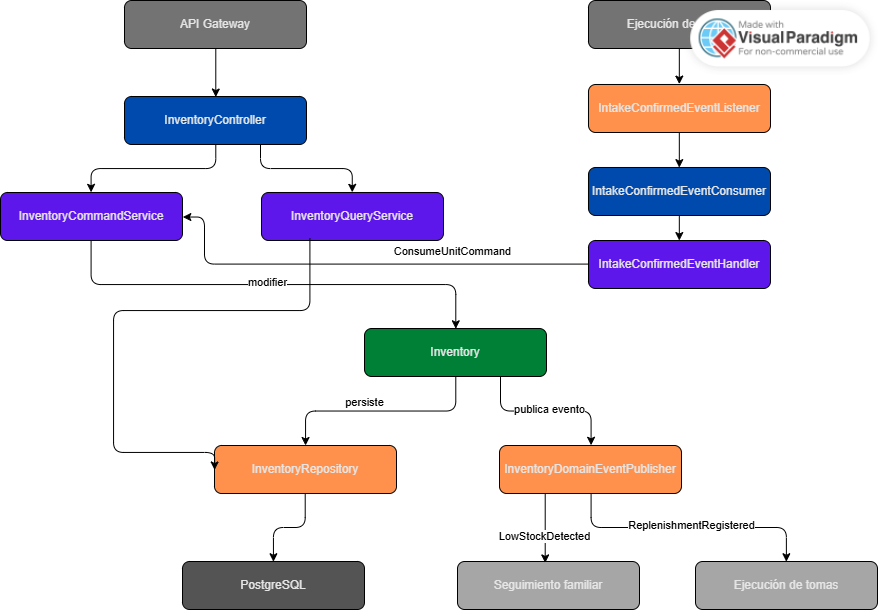

*Figura. Component Diagram (C4 Nivel 3) del Bounded Context Inventario y reposición.*

#### 2.6.6.6. Bounded Context Software Architecture Code Level Diagrams

##### 2.6.6.6.1. Bounded Context Domain Layer Class Diagrams

El diagrama de clases del Domain Layer muestra a `Inventory` como aggregate root en una relación de composición (1 a 0..*) con la entidad `Batch`, y su dependencia sobre el Value Object `StockLevel` para determinar el estado de stock bajo. Se incluyen también la interfaz `IInventoryRepository`, que gestiona la persistencia del agregado, y `InventoryFactory`, responsable de crear un nuevo registro de inventario en cero.

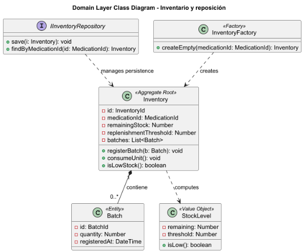

*Figura. Domain Layer Class Diagram del Bounded Context Inventario y reposición.*

##### 2.6.6.6.2. Bounded Context Database Design Diagram

Igual que en Gestión del tratamiento, `medication_id` se conserva como referencia lógica (sin FK física) hacia la tabla MEDICATIONS de ese Bounded Context, ya que ambos módulos comparten la misma instancia de PostgreSQL pero mantienen sus esquemas lógicamente separados.

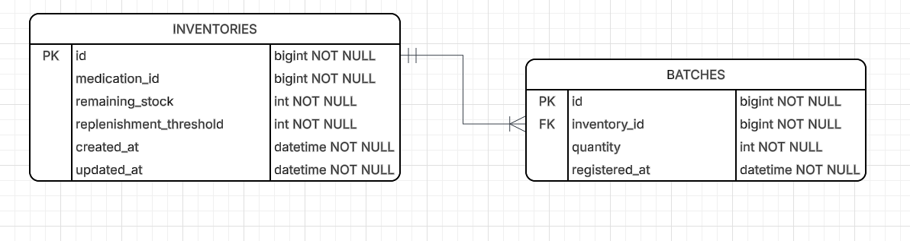

*Figura. Database Design Diagram del Bounded Context Inventario y reposición.*

**INVENTORIES**

| Columna | Descripción |
| --- | --- |
| id (PK) | Identificador único del registro de inventario |
| medication_id | Referencia lógica al medicamento en Gestión del tratamiento (sin FK física) |
| remaining_stock | Unidades disponibles actualmente |
| replenishment_threshold | Umbral mínimo que dispara el aviso de stock bajo |
| created_at / updated_at | Fechas de auditoría |

**BATCHES**

| Columna | Descripción |
| --- | --- |
| id (PK) | Identificador único del lote |
| inventory_id (FK → INVENTORIES.id) | Inventario al que pertenece el lote |
| quantity | Unidades incorporadas en el lote |
| registered_at | Fecha de registro de la reposición |

Relación: INVENTORIES (1) - (N) BATCHES.

### 2.6.7. Bounded Context: Seguimiento familiar

El Bounded Context **Seguimiento familiar** (**Family Monitoring BC**) consolida y presenta al familiar o cuidador la información necesaria para conocer el estado reciente del adulto mayor e intervenir cuando corresponda. Se implementa como un módulo dentro del backend único de Tata. Su responsabilidad no consiste en recalcular adherencia ni en decidir cuándo una toma se convierte en omisión; consume los resultados ya producidos por Ejecución de tomas, Omisión y escalamiento y Analítica de adherencia, y los hace accesibles al familiar mediante un resumen consolidado, un historial reciente, el detalle de alertas y la posibilidad de registrar notas de seguimiento (ver Bounded Context Canvas, sección 2.5.1.3).

#### 2.6.7.1. Domain Layer

**Sub-capa Model - Aggregates:**

| Tipo | Nombre | Propósito | Atributos / Métodos principales | Relación con otros elementos |
| --- | --- | --- | --- | --- |
| Aggregate Root | FamilyMonitor | Representar el seguimiento activo de un familiar sobre un adulto mayor y mantener las alertas pendientes y las notas registradas | `id`, `careLinkId`, `olderAdultId`, `familiarId`, `alerts: List<AlertSummary>`, `notes: List<CaregiverNote>` — `addAlert()`, `closeAlert()`, `addNote()` | Referencia al vínculo de cuidado por identificador (Vínculo de cuidado); contiene entidades AlertSummary y CaregiverNote |
| Entity | AlertSummary | Representar el estado de seguimiento de una alerta recibida desde Omisión y escalamiento | `id`, `intakeId`, `medicationName`, `scheduledAt`, `reason`, `status` (Open / Attended / Closed), `openedAt`, `closedAt` — `markAttended()`, `close()` | Entidad hija de FamilyMonitor; su estado es actualizado mediante US-31 |
| Entity | CaregiverNote | Representar una nota registrada por el familiar sobre una intervención realizada | `id`, `text`, `recordedAt`, `familiarId` | Entidad hija de FamilyMonitor; asociada a US-30 |

**Sub-capa Model - Value Objects:**

| Tipo | Nombre | Propósito | Atributos principales | Relación con otros elementos |
| --- | --- | --- | --- | --- |
| Value Object | OlderAdultStatus | Encapsular el estado reciente del adulto mayor: próxima toma y últimos resultados | `nextIntakeAt`, `lastIntakeStatus`, `hasOpenAlert` | Usado en las queries de resumen (US-25) |
| Value Object | IntakeSummary | Encapsular el resultado de una toma pasada para su presentación en el historial | `intakeId`, `medicationName`, `scheduledAt`, `status` (Confirmed / Late / Omitted) | Usado en el historial reciente (US-26) |
| Value Object | ContactChannel | Encapsular el canal de contacto disponible para comunicarse con el adulto mayor ante una alerta | `type` (phone / whatsapp), `value` | Usado en US-29 |

**Sub-capa Services y Repositories:**

| Tipo | Nombre | Propósito | Firma / Método principal | Relación con otros elementos |
| --- | --- | --- | --- | --- |
| Interface | IFamilyMonitorRepository | Contrato de persistencia para el agregado FamilyMonitor | `save(monitor)`, `findByCareLinkId(id): FamilyMonitor`, `findByOlderAdultId(id): FamilyMonitor` | Implementado en la capa Infrastructure |
| Interface | IIntakeHistoryPort | Puerto de dominio para recuperar el historial reciente de tomas del adulto mayor | `getRecentIntakes(olderAdultId, days): List<IntakeSummary>` | Implementado en Infrastructure; invoca al módulo Ejecución de tomas dentro del mismo proceso |
| Interface | IAdherenceSummaryPort | Puerto de dominio para recuperar los indicadores de adherencia calculados por Analítica de adherencia | `getWeeklySummary(olderAdultId): AdherenceSnapshot` | Implementado en Infrastructure; invoca al módulo Analítica de adherencia dentro del mismo proceso |

#### 2.6.7.2. Interface Layer

**Sub-capa REST - Resources:**

| Tipo | Nombre | Propósito |
| --- | --- | --- |
| Resource | OlderAdultStatusResource | Representar el estado reciente del adulto mayor para el cliente (US-25) |
| Resource | IntakeSummaryResource | Representar una entrada del historial reciente de tomas (US-26) |
| Resource | AlertSummaryResource | Representar el detalle de una alerta para el cliente (US-27) |
| Resource | CreateCaregiverNoteResource | Representar la petición para registrar una nota de seguimiento (US-30) |
| Resource | UpdateAlertStatusResource | Representar la petición para marcar una alerta como atendida o cerrada (US-31) |

**Sub-capa REST - Transform:**

| Tipo | Nombre | Propósito |
| --- | --- | --- |
| Assembler | OlderAdultStatusResourceFromEntityAssembler | Convertir OlderAdultStatus en OlderAdultStatusResource |
| Assembler | AlertSummaryResourceFromEntityAssembler | Convertir AlertSummary en AlertSummaryResource |
| Assembler | CreateCaregiverNoteCommandFromResourceAssembler | Convertir CreateCaregiverNoteResource en CreateCaregiverNoteCommand |
| Assembler | UpdateAlertStatusCommandFromResourceAssembler | Convertir UpdateAlertStatusResource en UpdateAlertStatusCommand |

**Sub-capa REST - Controllers:**

| Tipo | Nombre | Propósito |
| --- | --- | --- |
| Controller | FamilyMonitoringController | Exponer endpoints para consultar el estado reciente, el historial e iniciar contacto (US-25, US-26, US-29), enrutados desde el API Gateway hacia este módulo |
| Controller | AlertsController | Exponer endpoints para consultar el detalle y actualizar el seguimiento de alertas (US-27, US-31) |
| Controller | CaregiverNotesController | Exponer endpoint para registrar una nota de seguimiento (US-30) |

**Sub-capa Domain Event Listeners:**

| Tipo | Nombre | Propósito |
| --- | --- | --- |
| Consumer | IntakeOmittedEventConsumer | Escuchar el evento `IntakeOmitted` publicado por Omisión y escalamiento para crear una nueva AlertSummary en el FamilyMonitor correspondiente |
| Consumer | LowStockDetectedEventConsumer | Escuchar el evento `LowStockDetected` publicado por Inventario y reposición para incluir el aviso de stock bajo en el estado del adulto mayor |
| Consumer | AdherencePatternDetectedEventConsumer | Escuchar el evento `AdherencePatternDetected` publicado por Analítica de adherencia para actualizar los insights disponibles para el familiar |

#### 2.6.7.3. Application Layer

**Sub-capa Internal - CommandServices:**

| Tipo | Nombre | Propósito |
| --- | --- | --- |
| CommandHandler | CreateCaregiverNoteCommandHandler | Registrar una nota de seguimiento sobre una intervención realizada (US-30) |
| CommandHandler | MarkAlertAttendedCommandHandler | Registrar que el familiar atendió una alerta (US-31) |
| CommandHandler | CloseAlertCommandHandler | Cerrar una alerta resuelta sin eliminar su historial (US-31) |
| CommandHandler | RegisterAlertFromOmissionCommandHandler | Crear una AlertSummary en el FamilyMonitor al recibir el evento `IntakeOmitted` |

**Sub-capa Internal - QueryServices:**

| Tipo | Nombre | Propósito |
| --- | --- | --- |
| QueryHandler | GetOlderAdultStatusQueryHandler | Construir el resumen del estado reciente del adulto mayor (US-25); utiliza IIntakeHistoryPort y consulta las alertas abiertas del FamilyMonitor |
| QueryHandler | GetRecentIntakeHistoryQueryHandler | Recuperar el historial reciente de tomas mediante IIntakeHistoryPort (US-26) |
| QueryHandler | GetAlertDetailQueryHandler | Obtener el detalle de una alerta y sus acciones de seguimiento (US-27) |
| QueryHandler | GetContactChannelQueryHandler | Recuperar el canal de contacto disponible ante una alerta (US-29) |

**Sub-capa Internal - EventServices:**

| Tipo | Nombre | Propósito |
| --- | --- | --- |
| EventHandler | IntakeOmittedEventHandler | Traducir el evento consumido en un RegisterAlertFromOmissionCommand |
| EventHandler | LowStockDetectedEventHandler | Actualizar el flag de stock bajo en el estado del adulto mayor correspondiente |
| EventHandler | AdherencePatternDetectedEventHandler | Persistir el insight recibido para su presentación al familiar |

#### 2.6.7.4. Infrastructure Layer

**Sub-capa Persistence (PostgreSQL):**

| Tipo | Nombre | Propósito |
| --- | --- | --- |
| Repository | FamilyMonitorRepository | Implementación de IFamilyMonitorRepository (Spring Data JPA); persiste FamilyMonitor junto con AlertSummary y CaregiverNote en la base de datos PostgreSQL central |

**Sub-capa Module Adapters:**

| Tipo | Nombre | Propósito |
| --- | --- | --- |
| Adapter | IntakeHistoryAdapter | Implementación de IIntakeHistoryPort; invoca directamente, dentro del mismo proceso, la interfaz pública expuesta por el módulo Ejecución de tomas |
| Adapter | AdherenceSummaryAdapter | Implementación de IAdherenceSummaryPort; invoca directamente, dentro del mismo proceso, la interfaz pública expuesta por el módulo Analítica de adherencia |

**Sub-capa Domain Events:**

| Tipo | Nombre | Propósito |
| --- | --- | --- |
| Listener | IntakeOmittedEventListener | Registra IntakeOmittedEventConsumer como manejador del evento en memoria publicado por Omisión y escalamiento |
| Listener | LowStockDetectedEventListener | Registra LowStockDetectedEventConsumer como manejador del evento en memoria publicado por Inventario y reposición |
| Listener | AdherencePatternDetectedEventListener | Registra AdherencePatternDetectedEventConsumer como manejador del evento en memoria publicado por Analítica de adherencia |

#### 2.6.7.5. Bounded Context Software Architecture Component Level Diagrams

El diagrama representa la descomposición interna del módulo **Family Monitoring BC** dentro del container Backend, mostrando cómo `FamilyMonitoringController`, `AlertsController` y `CaregiverNotesController` reciben peticiones enrutadas por el API Gateway, cómo los Listeners activan los Consumer y EventHandlers al recibir eventos de Omisión y escalamiento, Inventario y reposición y Analítica de adherencia, y cómo los Query Handlers acceden a Ejecución de tomas y Analítica de adherencia mediante adaptadores en el mismo proceso. El agregado `FamilyMonitor` se persiste a través de `FamilyMonitorRepository`.

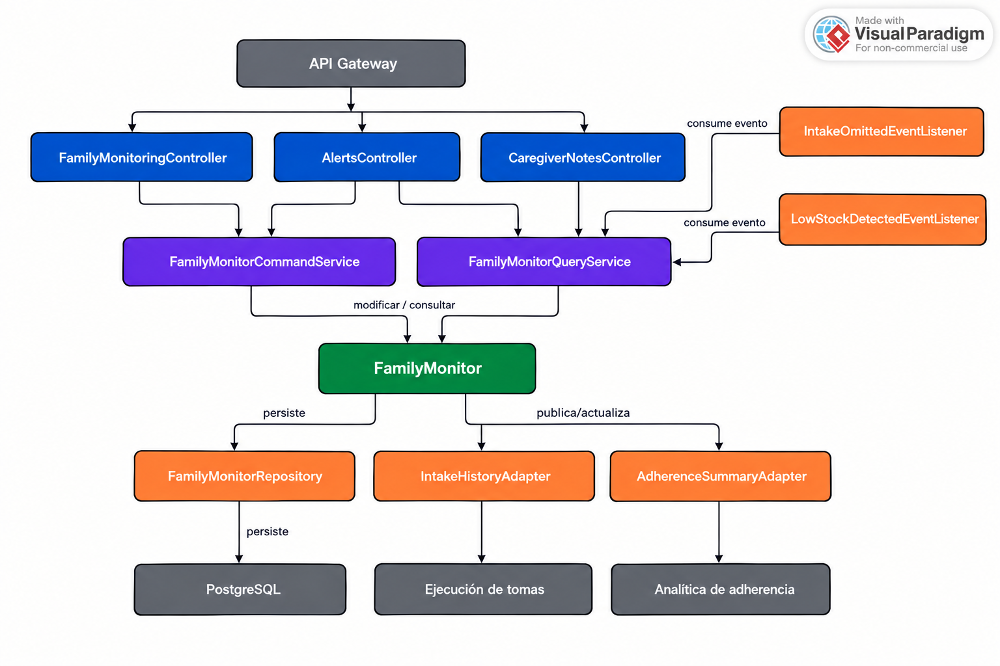

*Figura. Component Diagram (C4 Nivel 3) del Bounded Context Seguimiento familiar.*

#### 2.6.7.6. Bounded Context Software Architecture Code Level Diagrams

##### 2.6.7.6.1. Bounded Context Domain Layer Class Diagrams

El diagrama de clases del Domain Layer muestra a `FamilyMonitor` como aggregate root en relación de composición (1 a 0..*) con las entidades `AlertSummary` y `CaregiverNote`. Se incluyen los Value Objects `OlderAdultStatus`, `IntakeSummary` y `ContactChannel`, la interfaz `IFamilyMonitorRepository` que gestiona la persistencia del agregado, y las interfaces de puerto `IIntakeHistoryPort` e `IAdherenceSummaryPort` que mantienen la colaboración con otros módulos sin acoplar el dominio.

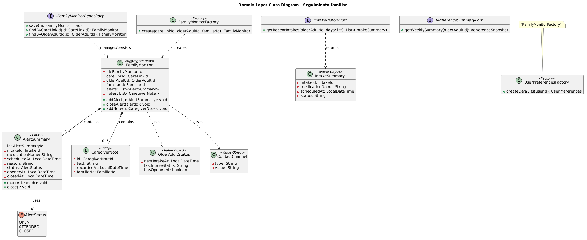

*Figura. Domain Layer Class Diagram del Bounded Context Seguimiento familiar.*

##### 2.6.7.6.2. Bounded Context Database Design Diagram

Las referencias a `care_link_id`, `older_adult_id` y `familiar_id` se conservan como identificadores lógicos sin FK físicas hacia los módulos Vínculo de cuidado e Identidad y suscripción, manteniendo el aislamiento de esquemas entre módulos.

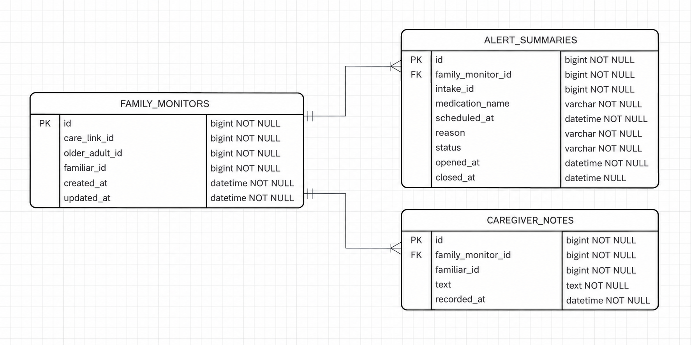

*Figura. Database Design Diagram del Bounded Context Seguimiento familiar.*

**FAMILY_MONITORS**

| Columna | Descripción |
| --- | --- |
| id (PK) | Identificador único del monitor familiar |
| care_link_id | Referencia lógica al vínculo de cuidado (sin FK física) |
| older_adult_id | Referencia lógica al adulto mayor (sin FK física) |
| familiar_id | Referencia lógica al familiar (sin FK física) |
| created_at / updated_at | Fechas de auditoría |

**ALERT_SUMMARIES**

| Columna | Descripción |
| --- | --- |
| id (PK) | Identificador único de la alerta |
| family_monitor_id (FK → FAMILY_MONITORS.id) | Monitor al que pertenece la alerta |
| intake_id | Referencia lógica a la toma omitida en Ejecución de tomas (sin FK física) |
| medication_name | Nombre del medicamento al momento de la alerta |
| scheduled_at | Horario programado de la toma omitida |
| reason | Motivo de la alerta |
| status | Estado: OPEN, ATTENDED o CLOSED |
| opened_at / closed_at | Fechas de apertura y cierre |

**CAREGIVER_NOTES**

| Columna | Descripción |
| --- | --- |
| id (PK) | Identificador único de la nota |
| family_monitor_id (FK → FAMILY_MONITORS.id) | Monitor al que pertenece la nota |
| familiar_id | Referencia lógica al familiar que registró la nota (sin FK física) |
| text | Contenido de la nota |
| recorded_at | Fecha de registro |

Relaciones: FAMILY_MONITORS (1) - (N) ALERT_SUMMARIES; FAMILY_MONITORS (1) - (N) CAREGIVER_NOTES.

---

### 2.6.8. Bounded Context: Accesibilidad y preferencias

El Bounded Context **Accesibilidad y preferencias** (**Accessibility & Preferences BC**) administra las configuraciones que permiten adaptar la experiencia de Tata a las necesidades de cada usuario. Actúa como un **Shared Kernel** acotado (sección 2.5.2): un conjunto pequeño y estable de conceptos —canal de notificación, horario de silencio y confirmación por voz— es referenciado directamente por otros módulos como Ejecución de tomas, Omisión y escalamiento y Seguimiento familiar, sin que estos deban reimplementar la lógica de preferencias. El contexto persiste configuraciones de tamaño de texto, contraste, reducción de movimiento, ayuda de lectura, confirmación por voz, horario de silencio y canales de notificación (ver Bounded Context Canvas, sección 2.5.1.3).

#### 2.6.8.1. Domain Layer

**Sub-capa Model - Aggregates:**

| Tipo | Nombre | Propósito | Atributos / Métodos principales | Relación con otros elementos |
| --- | --- | --- | --- | --- |
| Aggregate Root | UserPreferences | Mantener el conjunto de preferencias de accesibilidad e interacción de un usuario y garantizar su coherencia | `id`, `userId`, `textSize` (Small / Medium / Large / ExtraLarge), `highContrast: boolean`, `reducedMotion: boolean`, `readingAssistance: boolean`, `voiceConfirmationEnabled: boolean`, `quietHours: QuietHoursRange`, `notificationChannels: List<NotificationChannel>` — `updateTextSize()`, `enableHighContrast()`, `enableVoiceConfirmation()`, `setQuietHours()`, `updateChannels()` | Referencia al usuario por identificador (Identidad y suscripción); expone conceptos del Shared Kernel utilizados por otros BCs |

**Sub-capa Model - Value Objects:**

| Tipo | Nombre | Propósito | Atributos principales | Relación con otros elementos |
| --- | --- | --- | --- | --- |
| Value Object | QuietHoursRange | Encapsular el intervalo de tiempo durante el cual se suprimen notificaciones no críticas | `startHour`, `startMinute`, `endHour`, `endMinute` — `contains(hour, minute): boolean` | Usado en UserPreferences; consultado por Omisión y escalamiento y Seguimiento familiar al evaluar envíos de avisos |
| Value Object | NotificationChannel | Encapsular un canal de notificación habilitado por el usuario | `type` (push / sms / email), `enabled: boolean` | Usado en UserPreferences (colección); referenciado como parte del Shared Kernel por Ejecución de tomas y Omisión y escalamiento |
| Value Object | TextSizeLevel | Encapsular el nivel de tamaño de texto seleccionado por el usuario | `level` (Small / Medium / Large / ExtraLarge) | Usado en UserPreferences |

**Sub-capa Services y Repositories:**

| Tipo | Nombre | Propósito | Firma / Método principal | Relación con otros elementos |
| --- | --- | --- | --- | --- |
| Interface | IUserPreferencesRepository | Contrato de persistencia para el agregado UserPreferences | `save(preferences)`, `findByUserId(id): UserPreferences` | Implementado en la capa Infrastructure |
| Factory | UserPreferencesFactory | Crear un registro de preferencias con valores por defecto para un usuario recién registrado | `createDefaults(userId): UserPreferences` | Usado al reaccionar al evento `AccountEnabled` de Identidad y suscripción |

#### 2.6.8.2. Interface Layer

**Sub-capa REST - Resources:**

| Tipo | Nombre | Propósito |
| --- | --- | --- |
| Resource | UserPreferencesResource | Representar el conjunto de preferencias de un usuario para el cliente |
| Resource | UpdateTextSizeResource | Representar la petición para ajustar el tamaño de texto (US-35) |
| Resource | UpdateContrastResource | Representar la petición para activar o desactivar el alto contraste (US-36) |
| Resource | UpdateReducedMotionResource | Representar la petición para activar o desactivar la reducción de movimiento (US-37) |
| Resource | UpdateReadingAssistanceResource | Representar la petición para activar o desactivar la ayuda de lectura (US-38) |
| Resource | UpdateQuietHoursResource | Representar la petición para configurar el horario de silencio y los canales de notificación (US-39) |

**Sub-capa REST - Transform:**

| Tipo | Nombre | Propósito |
| --- | --- | --- |
| Assembler | UserPreferencesResourceFromEntityAssembler | Convertir UserPreferences en UserPreferencesResource |
| Assembler | UpdateTextSizeCommandFromResourceAssembler | Convertir UpdateTextSizeResource en UpdateTextSizeCommand |
| Assembler | UpdateQuietHoursCommandFromResourceAssembler | Convertir UpdateQuietHoursResource en UpdateQuietHoursCommand |

**Sub-capa REST - Controllers:**

| Tipo | Nombre | Propósito |
| --- | --- | --- |
| Controller | AccessibilityController | Exponer endpoints para consultar y actualizar las preferencias de accesibilidad del adulto mayor (US-35, US-36, US-37, US-38), enrutados desde el API Gateway hacia este módulo |
| Controller | NotificationPreferencesController | Exponer endpoints para configurar horario de silencio y canales de notificación del familiar (US-39) |

**Sub-capa Domain Event Listeners:**

| Tipo | Nombre | Propósito |
| --- | --- | --- |
| Consumer | AccountEnabledEventConsumer | Escuchar el evento `AccountEnabled` publicado por Identidad y suscripción para crear un registro de preferencias con valores por defecto para el nuevo usuario |

#### 2.6.8.3. Application Layer

**Sub-capa Internal - CommandServices:**

| Tipo | Nombre | Propósito |
| --- | --- | --- |
| CommandHandler | UpdateTextSizeCommandHandler | Ajustar el nivel de tamaño de texto del usuario (US-35) |
| CommandHandler | UpdateContrastCommandHandler | Activar o desactivar el alto contraste (US-36) |
| CommandHandler | UpdateReducedMotionCommandHandler | Activar o desactivar la reducción de movimiento (US-37) |
| CommandHandler | UpdateReadingAssistanceCommandHandler | Activar o desactivar la ayuda de lectura (US-38) |
| CommandHandler | UpdateVoiceConfirmationCommandHandler | Habilitar o deshabilitar la confirmación por voz (parte de US-06 en su configuración) |
| CommandHandler | UpdateQuietHoursCommandHandler | Configurar el horario de silencio (US-39) |
| CommandHandler | UpdateNotificationChannelsCommandHandler | Habilitar o deshabilitar canales de notificación (US-39) |
| CommandHandler | InitializeDefaultPreferencesCommandHandler | Crear las preferencias por defecto al registrarse un nuevo usuario; invocado por AccountEnabledEventHandler |

**Sub-capa Internal - QueryServices:**

| Tipo | Nombre | Propósito |
| --- | --- | --- |
| QueryHandler | GetUserPreferencesQueryHandler | Obtener el conjunto de preferencias de un usuario para presentarlo en la pantalla de configuración |

**Sub-capa Internal - EventServices:**

| Tipo | Nombre | Propósito |
| --- | --- | --- |
| EventHandler | AccountEnabledEventHandler | Traducir el evento consumido en un InitializeDefaultPreferencesCommand |

**Sub-capa Internal - OutboundServices:**

Este Bounded Context no publica eventos de dominio hacia otros módulos. Su rol como Shared Kernel implica que los demás contextos lo consultan de forma directa (a través de su interfaz pública en el mismo proceso) en lugar de reaccionar a eventos emitidos por él.

#### 2.6.8.4. Infrastructure Layer

**Sub-capa Persistence (PostgreSQL):**

| Tipo | Nombre | Propósito |
| --- | --- | --- |
| Repository | UserPreferencesRepository | Implementación de IUserPreferencesRepository (Spring Data JPA); persiste UserPreferences y su colección de NotificationChannel en la base de datos PostgreSQL central |

**Sub-capa Domain Events:**

| Tipo | Nombre | Propósito |
| --- | --- | --- |
| Listener | AccountEnabledEventListener | Registra AccountEnabledEventConsumer como manejador del evento en memoria publicado por Identidad y suscripción (por ejemplo, mediante `@EventListener` de Spring) |

#### 2.6.8.5. Bounded Context Software Architecture Component Level Diagrams

El diagrama representa la descomposición interna del módulo **Accessibility & Preferences BC** dentro del container Backend, mostrando cómo `AccessibilityController` y `NotificationPreferencesController` reciben peticiones enrutadas por el API Gateway, cómo `AccountEnabledEventListener` activa el Consumer y el EventHandler correspondiente, y cómo los Command/Query Handlers operan sobre el agregado `UserPreferences` a través de `UserPreferencesRepository`. Se muestra también la consulta directa que otros módulos (Ejecución de tomas, Omisión y escalamiento, Seguimiento familiar) realizan sobre la interfaz pública del BC como parte del Shared Kernel.

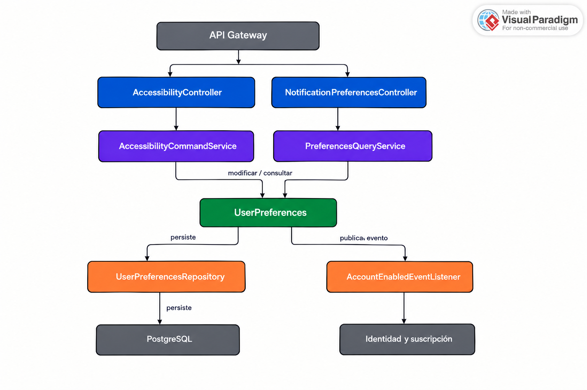

*Figura. Component Diagram (C4 Nivel 3) del Bounded Context Accesibilidad y preferencias.*

#### 2.6.8.6. Bounded Context Software Architecture Code Level Diagrams

##### 2.6.8.6.1. Bounded Context Domain Layer Class Diagrams

El diagrama de clases del Domain Layer muestra a `UserPreferences` como aggregate root, con dependencias de composición sobre los Value Objects `QuietHoursRange`, `NotificationChannel` (0..*) y `TextSizeLevel`, y la enumeración `TextSizeLevel`. Se incluyen la interfaz `IUserPreferencesRepository` que gestiona la persistencia del agregado y `UserPreferencesFactory` como responsable de la creación de preferencias por defecto.

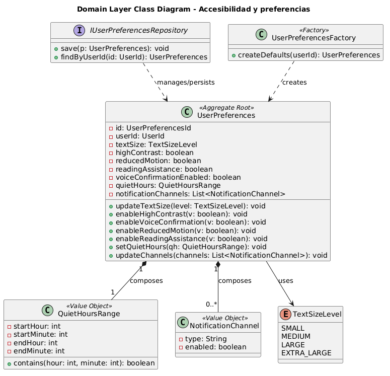

*Figura. Domain Layer Class Diagram del Bounded Context Accesibilidad y preferencias.*

##### 2.6.8.6.2. Bounded Context Database Design Diagram

La referencia a `user_id` se conserva como identificador lógico sin FK física hacia el módulo Identidad y suscripción, manteniendo el aislamiento de esquemas entre módulos.

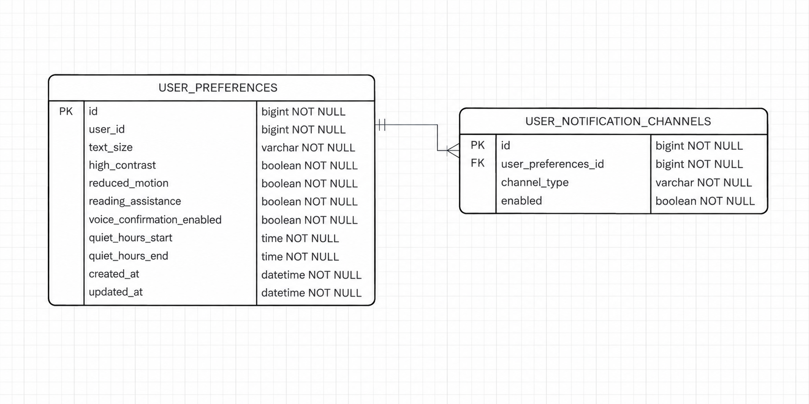

*Figura. Database Design Diagram del Bounded Context Accesibilidad y preferencias.*

**USER_PREFERENCES**

| Columna | Descripción |
| --- | --- |
| id (PK) | Identificador único del registro de preferencias |
| user_id | Referencia lógica al usuario en Identidad y suscripción (sin FK física) |
| text_size | Nivel de tamaño de texto: SMALL, MEDIUM, LARGE o EXTRA_LARGE |
| high_contrast | Indica si el alto contraste está habilitado |
| reduced_motion | Indica si la reducción de movimiento está habilitada |
| reading_assistance | Indica si la ayuda de lectura está habilitada |
| voice_confirmation_enabled | Indica si la confirmación por voz está habilitada |
| quiet_hours_start | Hora y minuto de inicio del horario de silencio |
| quiet_hours_end | Hora y minuto de fin del horario de silencio |
| created_at / updated_at | Fechas de auditoría |

**USER_NOTIFICATION_CHANNELS**

| Columna | Descripción |
| --- | --- |
| id (PK) | Identificador único del registro de canal |
| user_preferences_id (FK → USER_PREFERENCES.id) | Preferencias al que pertenece el canal |
| channel_type | Tipo de canal: push, sms o email |
| enabled | Indica si el canal está habilitado |

Relación: USER_PREFERENCES (1) - (N) USER_NOTIFICATION_CHANNELS.

### 2.6.9. Bounded Context: Omisión y escalamiento

El Bounded Context **Omisión y escalamiento** (**Omission & Escalation BC**) administra el flujo excepcional que se inicia cuando una toma permanece sin confirmación después de la ventana inicial definida por Ejecución de tomas. Se implementa como un módulo dentro del backend único de Tata y concentra las reglas relacionadas con el periodo de tolerancia, el recordatorio reforzado, el registro definitivo de la omisión, la generación de alertas y el escalamiento cuando la situación continúa sin resolverse.

Su responsabilidad comienza al recibir el evento `IntakeUnconfirmed` publicado por Ejecución de tomas. A partir de este evento se abre un `OmissionCase` en estado pendiente y se establece el `GracePeriod`. Si la toma es confirmada mientras la tolerancia continúa vigente, el caso se resuelve sin registrar una omisión. Si el periodo permitido finaliza sin confirmación, el contexto registra la omisión, genera la alerta correspondiente y publica los resultados necesarios para Analítica de adherencia y Seguimiento familiar. La entrega de recordatorios y alertas se realiza mediante un Anti-Corruption Layer hacia el servicio externo de notificaciones push, mientras que las preferencias de canal y horario se consultan desde Accesibilidad y preferencias mediante los conceptos compartidos definidos en el Shared Kernel.

#### 2.6.9.1. Domain Layer

**Sub-capa Model - Aggregates:**

| Tipo | Nombre | Propósito | Atributos / Métodos principales | Relación con otros elementos |
| --- | --- | --- | --- | --- |
| Aggregate Root | OmissionCase | Mantener el ciclo de vida de una toma no confirmada desde la apertura del periodo de tolerancia hasta su resolución, omisión, escalamiento o cierre | `id`, `intakeId`, `olderAdultId`, `status`, `gracePeriod`, `reinforcedReminderSentAt`, `omittedAt`, `alerts: List<CareAlert>`, `escalations: List<EscalationRecord>` - `markReminderSent()`, `resolve()`, `markOmitted()`, `addAlert()`, `escalate()`, `close()`, `isGraceExpired()` | Referencia la toma y al adulto mayor mediante identificadores lógicos; contiene CareAlert y EscalationRecord |
| Entity | CareAlert | Representar una alerta generada a partir de una omisión y conservar el resultado de su entrega | `id`, `status`, `generatedAt`, `sentAt`, `failureReason` - `markSent()`, `markFailed()` | Entidad hija de OmissionCase; su generación se comunica a Seguimiento familiar |
| Entity | EscalationRecord | Registrar cada incremento del nivel de atención aplicado a un caso de omisión | `id`, `level`, `reason`, `triggeredAt` | Entidad hija de OmissionCase; conserva el historial de escalamiento |

**Sub-capa Model - Value Objects:**

| Tipo | Nombre | Propósito | Atributos / Métodos principales | Relación con otros elementos |
| --- | --- | --- | --- | --- |
| Value Object | GracePeriod | Encapsular el intervalo adicional durante el cual una toma puede confirmarse antes de considerarse omitida | `startsAt`, `endsAt` - `isActive(now)`, `isExpired(now)` | Usado dentro de OmissionCase |
| Value Object | EscalationLevel | Encapsular el nivel de atención alcanzado por un caso | `value` - `next()` | Usado por OmissionCase y EscalationPolicy |
| Enumeration | OmissionCaseStatus | Representar el estado del caso | `PENDING`, `RESOLVED`, `OMITTED`, `ESCALATED`, `CLOSED` | Controla las transiciones de OmissionCase |
| Enumeration | AlertStatus | Representar el estado de entrega de una alerta | `GENERATED`, `SENT`, `FAILED` | Usado por CareAlert |

**Sub-capa Services y Repositories:**

| Tipo | Nombre | Propósito | Firma / Método principal | Relación con otros elementos |
| --- | --- | --- | --- | --- |
| Factory | OmissionCaseFactory | Crear un caso pendiente a partir de una toma no confirmada y el periodo de tolerancia configurado | `createPending(intakeId, olderAdultId, gracePeriod): OmissionCase` | Usado por OpenOmissionCaseCommandHandler |
| Domain Service | EscalationPolicy | Determinar si un caso debe incrementar su nivel de atención de acuerdo con su estado y el tiempo transcurrido | `shouldEscalate(omissionCase, now): boolean` | Consultado por EscalateOmissionCommandHandler |
| Interface | IOmissionCaseRepository | Contrato de persistencia del agregado OmissionCase | `save(case)`, `findByIntakeId(id): OmissionCase`, `findExpiredPending(now): List<OmissionCase>` | Implementado en Infrastructure |
| Interface | INotificationPreferencesPort | Recuperar las preferencias necesarias para decidir el canal y las restricciones de envío | `getPreferences(userId): NotificationPreferences` | Implementado en Infrastructure; consulta Accesibilidad y preferencias dentro del mismo proceso y reutiliza los conceptos compartidos del Shared Kernel |

#### 2.6.9.2. Interface Layer

**Sub-capa Domain Event Listeners:**

| Tipo | Nombre | Propósito |
| --- | --- | --- |
| Consumer | IntakeUnconfirmedEventConsumer | Escuchar el evento `IntakeUnconfirmed` publicado por Ejecución de tomas e iniciar el flujo de omisión |
| Consumer | IntakeConfirmedEventConsumer | Escuchar `IntakeConfirmed` para resolver un caso pendiente cuando la confirmación ocurre durante el periodo de tolerancia |

Este Bounded Context no requiere Controllers REST directos en la versión actual. El flujo principal es automático y se activa mediante eventos internos provenientes de Ejecución de tomas y mediante el proceso programado que evalúa los casos pendientes. Por ello, el API Gateway no necesita exponer una operación de usuario específica hacia este módulo.

#### 2.6.9.3. Application Layer

**Sub-capa Internal - CommandServices:**

| Tipo | Nombre | Propósito |
| --- | --- | --- |
| CommandHandler | OpenOmissionCaseCommandHandler | Crear un OmissionCase al recibir una toma no confirmada e iniciar el periodo de tolerancia (TS-05) |
| CommandHandler | SendReinforcedReminderCommandHandler | Solicitar un recordatorio reforzado mientras la toma permanece pendiente (US-22) |
| CommandHandler | ResolveOmissionCaseCommandHandler | Resolver el caso si Ejecución de tomas informa una confirmación válida durante la tolerancia (US-23) |
| CommandHandler | EvaluateGracePeriodCommandHandler | Evaluar de forma idempotente los casos cuyo periodo de tolerancia puede haber vencido (TS-05) |
| CommandHandler | RegisterOmissionCommandHandler | Marcar el caso como omitido cuando finaliza el periodo permitido sin confirmación (TS-05) |
| CommandHandler | GenerateCaregiverAlertCommandHandler | Crear la alerta del caso y solicitar su entrega al familiar o cuidador (TS-05, TS-06) |
| CommandHandler | EscalateOmissionCommandHandler | Incrementar el nivel de atención cuando EscalationPolicy determina que la situación debe escalar |
| CommandHandler | CloseOmissionCaseCommandHandler | Cerrar el caso después de completar las acciones previstas sin eliminar su historial |

**Sub-capa Internal - EventServices:**

| Tipo | Nombre | Propósito |
| --- | --- | --- |
| EventHandler | IntakeUnconfirmedEventHandler | Traducir `IntakeUnconfirmed` en la apertura de un caso y la programación del recordatorio reforzado |
| EventHandler | IntakeConfirmedEventHandler | Traducir `IntakeConfirmed` en la resolución del caso pendiente correspondiente |

**Sub-capa Internal - OutboundServices:**

| Tipo | Nombre | Propósito |
| --- | --- | --- |
| Service | INotificationPort | Puerto para solicitar el envío de recordatorios reforzados y alertas sin acoplar la aplicación al proveedor externo |
| Service | IDomainEventPublisher | Puerto para publicar dentro del mismo proceso los eventos `IntakeOmitted`, `CaregiverAlertGenerated` y `EscalationExecuted`; `IntakeOmitted` es consumido por Analítica de adherencia y Seguimiento familiar |

#### 2.6.9.4. Infrastructure Layer

**Sub-capa Persistence (PostgreSQL):**

| Tipo | Nombre | Propósito |
| --- | --- | --- |
| Repository | OmissionCaseRepository | Implementación de IOmissionCaseRepository mediante Spring Data JPA; persiste OmissionCase junto con CareAlert y EscalationRecord en la base de datos PostgreSQL central |

**Sub-capa Module Adapters:**

| Tipo | Nombre | Propósito |
| --- | --- | --- |
| Adapter | NotificationPreferencesAdapter | Implementación de INotificationPreferencesPort; consulta directamente la interfaz pública de Accesibilidad y preferencias dentro del mismo proceso y conserva los conceptos compartidos del Shared Kernel |

**Sub-capa External Services:**

| Tipo | Nombre | Propósito |
| --- | --- | --- |
| Adapter | PushNotificationAdapter | Implementación de INotificationPort; actúa como Anti-Corruption Layer frente al proveedor externo de notificaciones push y registra el resultado del envío sin interrumpir el proceso principal (TS-06) |

**Sub-capa Scheduled Processing:**

| Tipo | Nombre | Propósito |
| --- | --- | --- |
| Scheduler | OmissionEvaluationScheduler | Ejecutar periódicamente la evaluación de casos pendientes y activar EvaluateGracePeriodCommandHandler de forma idempotente (TS-05) |

**Sub-capa Domain Events:**

| Tipo | Nombre | Propósito |
| --- | --- | --- |
| Listener | IntakeUnconfirmedEventListener | Registra IntakeUnconfirmedEventConsumer como manejador del evento en memoria publicado por Ejecución de tomas |
| Listener | IntakeConfirmedEventListener | Registra IntakeConfirmedEventConsumer para resolver casos pendientes cuando una toma se confirma dentro de la tolerancia |
| Publisher | OmissionDomainEventPublisher | Implementación de IDomainEventPublisher mediante eventos de aplicación en memoria; publica `IntakeOmitted`, `CaregiverAlertGenerated` y `EscalationExecuted` para los módulos interesados |

#### 2.6.9.5. Bounded Context Software Architecture Component Level Diagrams

El diagrama representa la descomposición interna del módulo **Omission & Escalation BC** dentro del container Backend. `IntakeUnconfirmedEventListener` e `IntakeConfirmedEventListener` reciben los eventos publicados por Ejecución de tomas y activan sus Consumers y EventHandlers correspondientes. `OmissionEvaluationScheduler` ejecuta la evaluación periódica de los casos pendientes. Los Command Handlers operan sobre el agregado `OmissionCase` mediante `OmissionCaseRepository`, consultan las preferencias de notificación mediante `NotificationPreferencesAdapter`, solicitan los envíos a través de `PushNotificationAdapter` y publican en memoria `IntakeOmitted`, `CaregiverAlertGenerated` y `EscalationExecuted` para Analítica de adherencia y Seguimiento familiar.

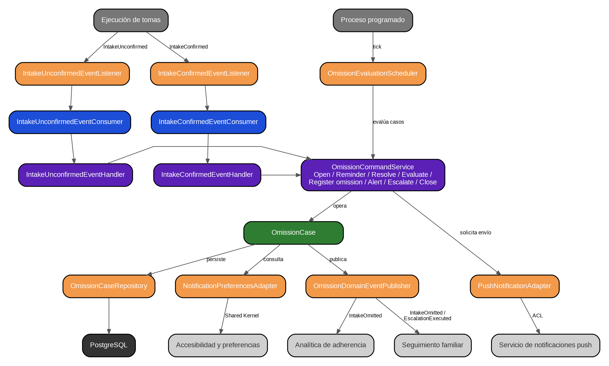

*Figura. Component Diagram (C4 Nivel 3) del Bounded Context Omisión y escalamiento.*

#### 2.6.9.6. Bounded Context Software Architecture Code Level Diagrams

##### 2.6.9.6.1. Bounded Context Domain Layer Class Diagrams

El diagrama de clases del Domain Layer muestra a `OmissionCase` como aggregate root en relaciones de composición (1 a 0..*) con las entidades `CareAlert` y `EscalationRecord`. El agregado utiliza los Value Objects `GracePeriod` y `EscalationLevel`, así como las enumeraciones `OmissionCaseStatus` y `AlertStatus`, para controlar sus transiciones. Se incluyen además `IOmissionCaseRepository`, `INotificationPreferencesPort`, `EscalationPolicy` y `OmissionCaseFactory`, manteniendo las reglas del dominio independientes de la persistencia y de los proveedores externos.

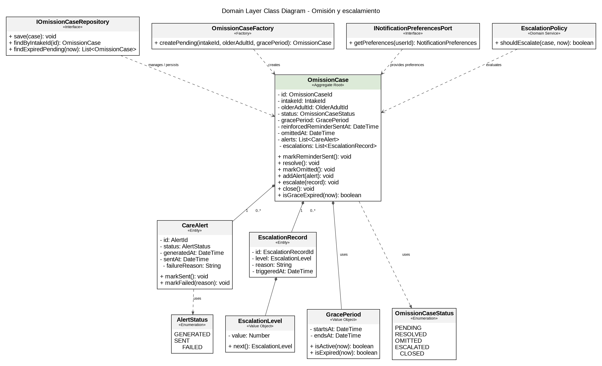

*Figura. Domain Layer Class Diagram del Bounded Context Omisión y escalamiento.*

##### 2.6.9.6.2. Bounded Context Database Design Diagram

Las referencias `intake_id` y `older_adult_id` se conservan como identificadores lógicos sin foreign keys físicas hacia Ejecución de tomas y Vínculo de cuidado. De esta manera, las tablas del Bounded Context mantienen el mismo criterio de aislamiento lógico aplicado por los demás módulos, aunque toda la solución utilice una misma instancia de PostgreSQL.

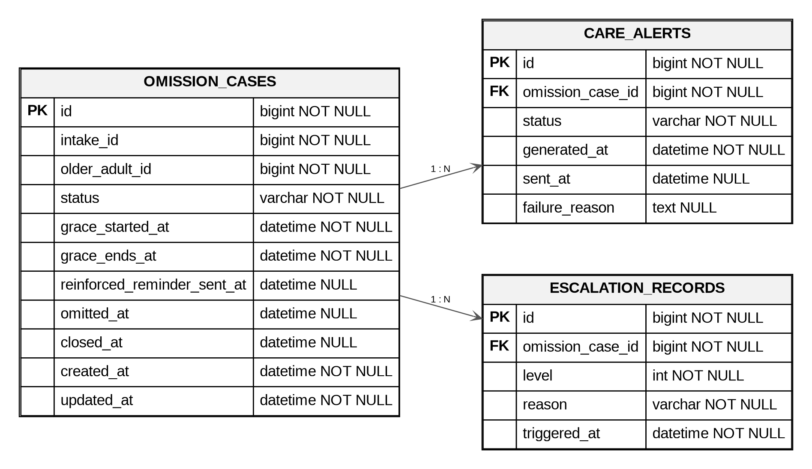

*Figura. Database Design Diagram del Bounded Context Omisión y escalamiento.*

**OMISSION_CASES**

| Columna | Descripción |
| --- | --- |
| id (PK) | Identificador único del caso de omisión |
| intake_id | Referencia lógica a la toma en Ejecución de tomas (sin FK física) |
| older_adult_id | Referencia lógica al adulto mayor (sin FK física) |
| status | Estado del caso: PENDING, RESOLVED, OMITTED, ESCALATED o CLOSED |
| grace_started_at / grace_ends_at | Inicio y fin del periodo de tolerancia |
| reinforced_reminder_sent_at | Fecha del recordatorio reforzado; nullable |
| omitted_at | Fecha en la que se confirmó la omisión; nullable |
| closed_at | Fecha de cierre del caso; nullable |
| created_at / updated_at | Fechas de auditoría |

**CARE_ALERTS**

| Columna | Descripción |
| --- | --- |
| id (PK) | Identificador único de la alerta |
| omission_case_id (FK → OMISSION_CASES.id) | Caso de omisión al que pertenece |
| status | Estado de entrega: GENERATED, SENT o FAILED |
| generated_at | Fecha de generación de la alerta |
| sent_at | Fecha de entrega al proveedor; nullable |
| failure_reason | Motivo del fallo de entrega cuando corresponda; nullable |

**ESCALATION_RECORDS**

| Columna | Descripción |
| --- | --- |
| id (PK) | Identificador único del registro de escalamiento |
| omission_case_id (FK → OMISSION_CASES.id) | Caso de omisión al que pertenece |
| level | Nivel de escalamiento aplicado |
| reason | Motivo que produjo el escalamiento |
| triggered_at | Fecha en la que se ejecutó el escalamiento |

Relaciones: OMISSION_CASES (1) - (N) CARE_ALERTS; OMISSION_CASES (1) - (N) ESCALATION_RECORDS.

